# Hotel Pricing System - Architecture Document

## 1. Introduction

This document describes the architecture of the Hotel Pricing System for AD&D Hotels. It presents the architectural decisions, components, and their relationships that together satisfy the functional and quality requirements of the system. The document follows the Attribute-Driven Design process and implements the C4 model for visualizing software architecture.

The document serves as a reference for all stakeholders involved in the development, maintenance, and evolution of the Hotel Pricing System. It provides a comprehensive view of the system, from its high-level context to its detailed components and their interactions.

## 2. Context Diagram

The context diagram below shows the Hotel Pricing System (HPS) and its interactions with external systems and users. The HPS is at the center of AD&D Hotels' IT infrastructure, interfacing with various systems including the Property Management System, Channel Management System, Commercial Analysis System, User Identity Service, and other systems. The diagram illustrates how the HPS receives price changes from end users and distributes prices to the other systems.

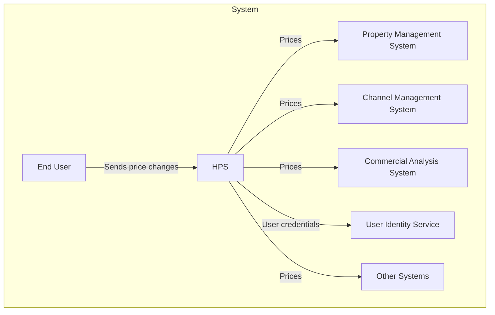
```mermaid
flowchart TD
    subgraph System
        EndUser[End User] -->|Sends price changes| HPS
        HPS -->|Prices| PropertyManagementSystem[Property Management System]
        HPS -->|Prices| ChannelManagementSystem[Channel Management System]
        HPS -->|Prices| CommercialAnalysisSystem[Commercial Analysis System]
        HPS -->|User credentials| UserIdentityService[User Identity Service]
        HPS -->|Prices| OtherSystems[Other Systems]
    end
```

## 3. Architectural Drivers

### User Stories

| ID | Description | Priority |
|----|-------------|----------|
| HPS-1 | Log In: A user provides credentials in a login window. The system checks these credentials against a user identity service and, if successful, provides access to the system. | Medium |
| HPS-2 | Change Prices: A user selects a specific hotel and dates to make price changes to base or fixed rates. All calculated rates are updated, and changes are pushed to the Channel Management System. | High |
| HPS-3 | Query Prices: A user or external system queries prices for a given hotel through the user interface or a query API. | High |
| HPS-4 | Manage Hotels: An administrator adds, changes, or modifies hotel information, including tax rates, available rates, and room types. | High |
| HPS-5 | Manage Rates: An administrator adds, changes, or modifies rates, including defining calculation business rules. | Medium |
| HPS-6 | Manage Users: An administrator changes permissions for a given user. | Medium |

### Quality Attribute Scenarios

| ID | Quality Attribute | Scenario | Priority |
|----|------------------|----------|----------|
| QA-1 | Performance | A base rate price is changed for a specific hotel and date during normal operation, the prices for all the rates and room types for the hotel are published (ready for query) in less than 100 ms. | High |
| QA-2 | Reliability | A user performs multiple price changes on a given hotel. 100% of the price changes are published (available for query) successfully and they are also received by the channel management system. | High |
| QA-3 | Availability | Pricing queries uptime SLA must be 99.9% outside of maintenance windows. | High |
| QA-4 | Scalability | The system will initially support a minimum of 100,000 price queries per day through its API and should be capable of handling up to 1,000,000 without decreasing average latency by more than 20%. | High |
| QA-5 | Security | A user logs into the system through the front-end. The credentials of the user are validated against the User Identity Service and, once logged in, they are presented with only the functions that they are authorized to use. | High |
| QA-6 | Modifiability | Support for a price query endpoint with a different protocol than REST (e.g. gRPC) is added to the system. The new endpoint does not require changes to be made to the core components of the system. | Medium |
| QA-7 | Deployability | The application is moved between non-production environments as part of the development process. No changes in the code are needed. | Medium |
| QA-8 | Monitorability | A system operator wishes to measure the performance and reliability of price publication during operation. The system provides a mechanism that allows 100% of these measures to be collected as needed. | Medium |
| QA-9 | Testability | 100% of the system and its elements should support integration testing independently of the external systems. | Medium |

### Constraints

| ID | Constraint |
|----|------------|
| CON-1 | Users must interact with the system through a web browser in different platforms Windows, OSX, and Linux, and different devices. |
| CON-2 | Manage users through cloud provider identity service and host resources in the cloud. |
| CON-3 | Code must be hosted on a proprietary Git-based platform that is already in use by other projects in the company. |
| CON-4 | The initial release of the system must be delivered in 6 months, but an initial version of the system (MVP) must be demonstrated to internal stakeholders in at most 2 months. |
| CON-5 | The system must interact initially with existing systems through REST APIs but may need to later support other protocols. |
| CON-6 | A cloud-native approach should be favored when designing the system. |

### Architectural Concerns

| ID | Concern |
|----|---------|
| CRN-1 | Establish an overall initial system structure. |
| CRN-2 | Leverage the team's knowledge about Java technologies and the Angular framework. |
| CRN-3 | Allocate work to members of the development team. |
| CRN-4 | Avoid introducing technical debt. |
| CRN-5 | Set up a continuous deployment infrastructure. |

## 4. Domain Model

The domain model below captures the core entities and their relationships in the Hotel Pricing System, based on the requirements specified in the Architectural Drivers document.

### Class Diagram

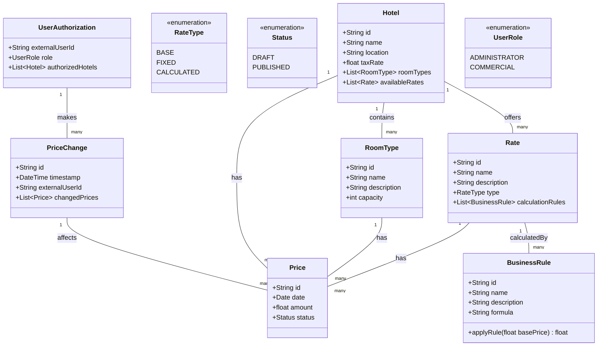
```mermaid
classDiagram
    class Hotel {
        +String id
        +String name
        +String location
        +float taxRate
        +List~RoomType~ roomTypes
        +List~Rate~ availableRates
    }
    
    class RoomType {
        +String id
        +String name
        +String description
        +int capacity
    }
    
    class Rate {
        +String id
        +String name
        +String description
        +RateType type
        +List~BusinessRule~ calculationRules
    }
    
    class RateType {
        <<enumeration>>
        BASE
        FIXED
        CALCULATED
    }
    
    class Price {
        +String id
        +Date date
        +float amount
        +Status status
    }
    
    class Status {
        <<enumeration>>
        DRAFT
        PUBLISHED
    }
    
    class BusinessRule {
        +String id
        +String name
        +String description
        +String formula
        +applyRule(float basePrice) float
    }
    
    class UserAuthorization {
        +String externalUserId
        +UserRole role
        +List~Hotel~ authorizedHotels
    }
    
    class UserRole {
        <<enumeration>>
        ADMINISTRATOR
        COMMERCIAL
    }
    
    class PriceChange {
        +String id
        +DateTime timestamp
        +String externalUserId
        +List~Price~ changedPrices
    }
    
    Hotel "1" -- "many" RoomType : contains
    Hotel "1" -- "many" Rate : offers
    Rate "1" -- "many" Price : has
    RoomType "1" -- "many" Price : has
    Hotel "1" -- "many" Price : has
    UserAuthorization "1" -- "many" PriceChange : makes
    PriceChange "1" -- "many" Price : affects
    Rate "1" -- "many" BusinessRule : calculatedBy
```

### Domain Model Description

| Entity | Description |
|--------|-------------|
| Hotel | Represents a hotel in the AD&D chain. Each hotel has a unique identifier, name, location, and tax rate. A hotel contains multiple room types and offers multiple rates. |
| RoomType | Represents a type of room available in a hotel (e.g., Single, Double, Suite). Each room type has a unique identifier, name, description, and capacity. |
| Rate | Represents a pricing scheme offered by a hotel. Rates can be of three types: BASE (the foundational rate), FIXED (a rate with a set price), or CALCULATED (a rate derived from a base rate using business rules). |
| RateType | An enumeration that defines the different types of rates (BASE, FIXED, CALCULATED). |
| Price | Represents the actual price for a specific rate, room type, and date. Prices have a status (DRAFT or PUBLISHED). |
| Status | An enumeration that defines the status of a price (DRAFT during simulation, PUBLISHED when finalized). |
| BusinessRule | Represents a rule used to calculate a price from a base rate. Contains a formula and a method to apply the rule. |
| UserAuthorization | Represents the local authorization data for a user managed by the cloud identity service. Contains a reference to the external user ID, the user's role in the system, and which hotels they are authorized to manage. |
| UserRole | An enumeration that defines the roles a user can have (ADMINISTRATOR or COMMERCIAL). |
| PriceChange | Represents a record of a price change operation, including which user made the change, when it was made, and which prices were affected. |

### Relationships

- A Hotel contains multiple RoomTypes and offers multiple Rates.
- Each Rate has multiple Prices associated with it.
- Each RoomType has multiple Prices associated with it.
- A Hotel has multiple Prices across its RoomTypes and Rates.
- UserAuthorization records make multiple PriceChanges over time.
- Each PriceChange affects multiple Prices.
- A Rate may be calculated using multiple BusinessRules.

### Note on Cloud-Native User Management

In accordance with constraints CON-2 and CON-6 from the Architectural Drivers document, this domain model assumes that user identity management is handled by a cloud provider identity service. The UserAuthorization entity does not store user credentials or profile information but rather maintains application-specific authorization data linked to external user identities. Authentication is delegated to the cloud identity service, while the application maintains only the necessary authorization information.

## 5. Container Diagram

The container diagram below represents the high-level structure of the Hotel Pricing System, showing the major containers (applications, data stores, etc.) that make up the system and their interactions. Each container is a separately deployable unit that executes code or stores data.

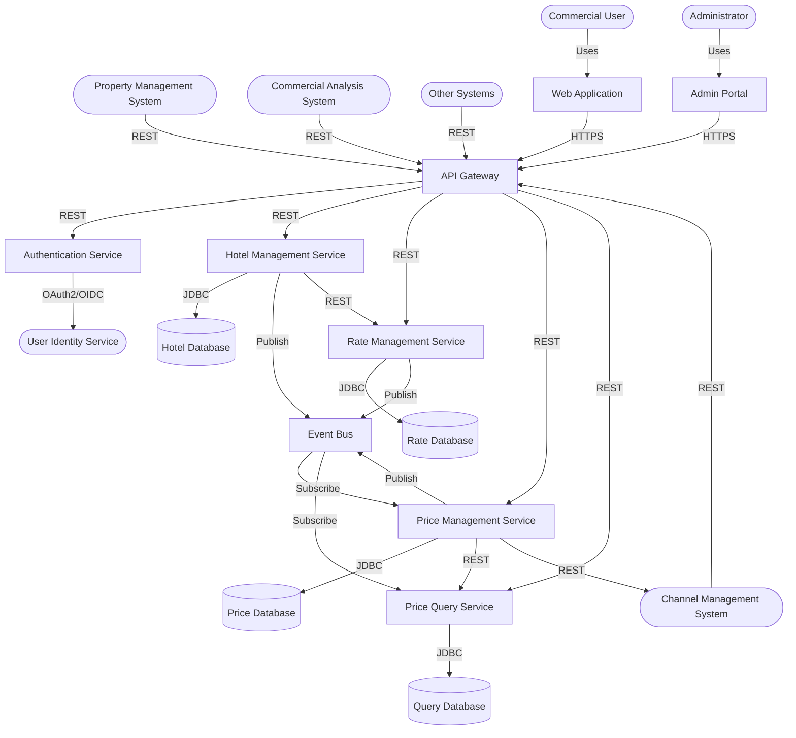
```mermaid
flowchart TD
    %% External systems and users
    User([Commercial User])
    Admin([Administrator])
    PMS([Property Management System])
    CMS([Channel Management System])
    CAS([Commercial Analysis System])
    IdS([User Identity Service])
    Other([Other Systems])
    
    %% Frontend applications
    WebApp[Web Application]
    AdminPortal[Admin Portal]
    
    %% API Gateway
    APIGateway[API Gateway]
    
    %% Backend services
    AuthService[Authentication Service]
    HotelService[Hotel Management Service]
    RateService[Rate Management Service]
    PriceService[Price Management Service]
    QueryService[Price Query Service]
    
    %% Event Bus
    EventBus[Event Bus]
    
    %% Databases
    HotelDB[(Hotel Database)]
    RateDB[(Rate Database)]
    PriceDB[(Price Database)]
    QueryDB[(Query Database)]
    
    %% User interactions
    User -->|Uses| WebApp
    Admin -->|Uses| AdminPortal
    
    %% Frontend to API Gateway
    WebApp -->|HTTPS| APIGateway
    AdminPortal -->|HTTPS| APIGateway
    
    %% External systems to API Gateway
    PMS -->|REST| APIGateway
    CMS -->|REST| APIGateway
    CAS -->|REST| APIGateway
    Other -->|REST| APIGateway
    
    %% API Gateway to Services
    APIGateway -->|REST| AuthService
    APIGateway -->|REST| HotelService
    APIGateway -->|REST| RateService
    APIGateway -->|REST| PriceService
    APIGateway -->|REST| QueryService
    
    %% Authentication
    AuthService -->|OAuth2/OIDC| IdS
    
    %% Services to Databases
    HotelService -->|JDBC| HotelDB
    RateService -->|JDBC| RateDB
    PriceService -->|JDBC| PriceDB
    QueryService -->|JDBC| QueryDB
    
    %% Event-driven communication
    HotelService -->|Publish| EventBus
    RateService -->|Publish| EventBus
    PriceService -->|Publish| EventBus
    
    EventBus -->|Subscribe| PriceService
    EventBus -->|Subscribe| QueryService
    
    %% Service-to-Service communication (when needed)
    PriceService -->|REST| QueryService
    HotelService -->|REST| RateService
    
    %% Publication to external systems
    PriceService -->|REST| CMS
```

### Container Responsibilities

| Container | Responsibilities |
|-----------|------------------|
| Web Application | - Provides user interface for commercial users<br>- Implements price change simulation and submission<br>- Displays price information<br>- Implements responsive design for different devices (CON-1) |
| Admin Portal | - Provides user interface for administrators<br>- Implements hotel and rate management<br>- Implements user management<br>- Implements monitoring dashboards |
| API Gateway | - Routes requests to appropriate backend services<br>- Implements authentication and authorization<br>- Handles rate limiting and request validation<br>- Provides a unified API for external systems |
| Authentication Service | - Integrates with cloud identity service (CON-2)<br>- Manages user authentication<br>- Handles token issuance and validation<br>- Manages user authorization data |
| Hotel Management Service | - Manages hotel information<br>- Handles hotel creation, update, and deletion<br>- Manages room types for hotels<br>- Publishes hotel-related events |
| Rate Management Service | - Manages rate types and business rules<br>- Handles rate creation, update, and deletion<br>- Provides calculation rules for derived rates<br>- Publishes rate-related events |
| Price Management Service | - Calculates prices based on base rates and business rules<br>- Handles price changes and simulations<br>- Maintains price history<br>- Publishes price-related events<br>- Sends price updates to external systems |
| Price Query Service | - Optimized for high-volume price queries<br>- Provides read-only access to price data<br>- Implements caching for performance<br>- Supports different query patterns |
| Event Bus | - Handles asynchronous communication between services<br>- Implements publish-subscribe pattern<br>- Ensures reliable message delivery<br>- Supports event sourcing for data consistency |
| Databases | - Store service-specific data<br>- Maintain data consistency<br>- Support transaction management<br>- Provide data persistence |

## 6. Component Diagrams

For each container identified in the Container Diagram that we will develop, we will include a subsection with a component diagram that details the internal design of the container. Each component diagram will be accompanied by a table that lists the components and their responsibilities.

### 6.1 Price Management Service

The Price Management Service is responsible for the core business functionality of calculating prices and publishing them to other systems. Following the Command Query Responsibility Segregation (CQRS) pattern, this service focuses on the command (write) operations for price management.

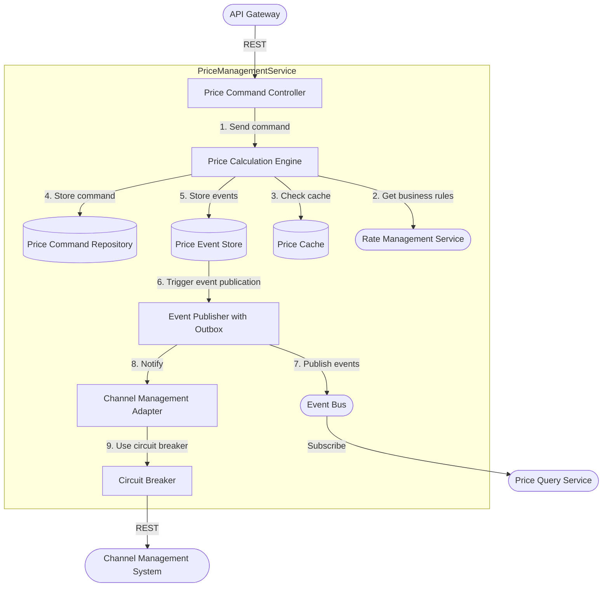
```mermaid
flowchart TD
    APIGateway([API Gateway]) -->|REST| PriceCommandController
    
    subgraph PriceManagementService
        PriceCommandController[Price Command Controller]
        PriceCalculationEngine[Price Calculation Engine]
        PriceCommandRepository[(Price Command Repository)]
        PriceEventStore[(Price Event Store)]
        EventPublisher[Event Publisher with Outbox]
        CircuitBreaker[Circuit Breaker]
        PriceCache[(Price Cache)]
        ChannelManagementAdapter[Channel Management Adapter]
        
        PriceCommandController -->|1. Send command| PriceCalculationEngine
        PriceCalculationEngine -->|2. Get business rules| RateService
        PriceCalculationEngine -->|3. Check cache| PriceCache
        PriceCalculationEngine -->|4. Store command| PriceCommandRepository
        PriceCalculationEngine -->|5. Store events| PriceEventStore
        PriceEventStore -->|6. Trigger event publication| EventPublisher
        EventPublisher -->|7. Publish events| EventBus
        EventPublisher -->|8. Notify| ChannelManagementAdapter
        ChannelManagementAdapter -->|9. Use circuit breaker| CircuitBreaker
    end
    
    RateService([Rate Management Service])
    EventBus([Event Bus])
    CMS([Channel Management System])
    
    CircuitBreaker -->|REST| CMS
    EventBus -->|Subscribe| QueryService([Price Query Service])
```

#### Component Responsibilities

| Component | Responsibilities |
|-----------|------------------|
| Price Command Controller | - Handles HTTP requests for price changes<br>- Validates input data<br>- Routes requests to the appropriate handlers<br>- Returns responses to clients |
| Price Calculation Engine | - Applies business rules to calculate derived prices<br>- Ensures calculations complete within 100ms (QA-1)<br>- Uses cached data when appropriate to improve performance<br>- Simulates price changes before they are applied |
| Price Command Repository | - Stores price change commands<br>- Maintains the current state of prices<br>- Provides transactional guarantees for command processing |
| Price Event Store | - Stores all price change events<br>- Supports event replay for recovery<br>- Enables audit capabilities |
| Event Publisher with Outbox | - Ensures atomic updates of domain state and event outbox<br>- Reliably delivers events to the Event Bus<br>- Provides exactly-once delivery semantics |
| Circuit Breaker | - Monitors calls to external systems<br>- Prevents cascading failures<br>- Provides fallback mechanisms when external systems are unavailable |
| Price Cache | - Caches frequently accessed pricing data<br>- Improves response time for price calculations<br>- Reduces database load |
| Channel Management Adapter | - Translates internal events to external REST API calls<br>- Handles retries and backoff strategies<br>- Ensures reliable delivery of price updates to the Channel Management System |

### 6.2 Price Query Service

The Price Query Service is responsible for handling all price query operations, optimized for high volume and availability. Following the CQRS pattern, this service focuses on the query (read) operations for price data. It supports multiple protocols through a protocol-agnostic service layer.

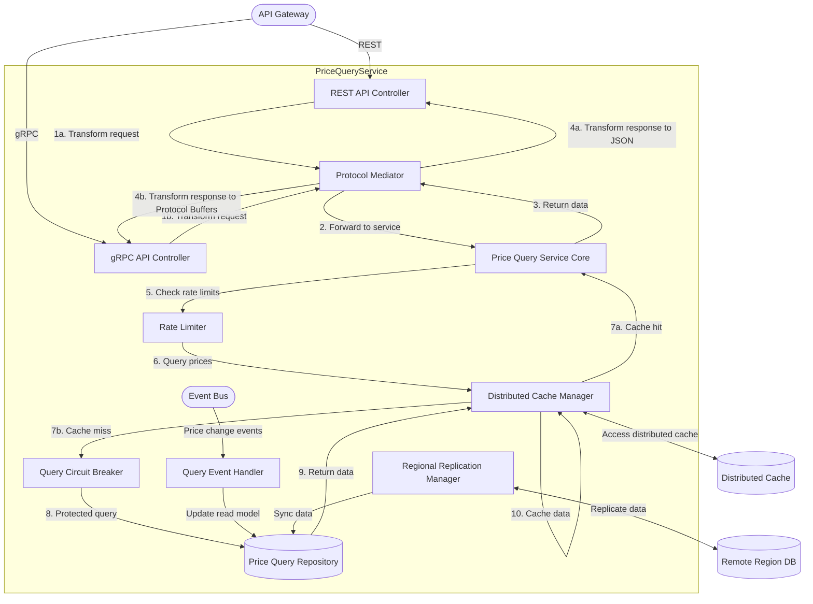
```mermaid
flowchart TD
    APIGateway([API Gateway]) -->|REST| RESTController
    APIGateway -->|gRPC| GRPCController
    
    subgraph PriceQueryService
        %% Protocol Adapters
        RESTController[REST API Controller]
        GRPCController[gRPC API Controller]
        ProtocolMediator[Protocol Mediator]
        
        %% Core Service Components
        PriceQueryServiceCore[Price Query Service Core]
        RateLimiter[Rate Limiter]
        QueryCircuitBreaker[Query Circuit Breaker]
        DistributedCacheManager[Distributed Cache Manager]
        PriceQueryRepository[(Price Query Repository)]
        QueryEventHandler[Query Event Handler]
        RegionalReplicationManager[Regional Replication Manager]
        
        %% Protocol adapter connections
        RESTController -->|1a. Transform request| ProtocolMediator
        GRPCController -->|1b. Transform request| ProtocolMediator
        ProtocolMediator -->|2. Forward to service| PriceQueryServiceCore
        PriceQueryServiceCore -->|3. Return data| ProtocolMediator
        ProtocolMediator -->|4a. Transform response to JSON| RESTController
        ProtocolMediator -->|4b. Transform response to Protocol Buffers| GRPCController
        
        %% Core service flow
        PriceQueryServiceCore -->|5. Check rate limits| RateLimiter
        RateLimiter -->|6. Query prices| DistributedCacheManager
        DistributedCacheManager -->|7a. Cache hit| PriceQueryServiceCore
        DistributedCacheManager -->|7b. Cache miss| QueryCircuitBreaker
        QueryCircuitBreaker -->|8. Protected query| PriceQueryRepository
        PriceQueryRepository -->|9. Return data| DistributedCacheManager
        DistributedCacheManager -->|10. Cache data| DistributedCacheManager
        EventBus -->|Price change events| QueryEventHandler
        QueryEventHandler -->|Update read model| PriceQueryRepository
        RegionalReplicationManager -->|Sync data| PriceQueryRepository
    end
    
    EventBus([Event Bus])
    RemoteRegion[(Remote Region DB)]
    DistributedCache[(Distributed Cache)]
    
    RegionalReplicationManager <-->|Replicate data| RemoteRegion
    DistributedCacheManager <-->|Access distributed cache| DistributedCache
```

#### Component Responsibilities

| Component | Responsibilities |
|-----------|------------------|
| REST API Controller | - Handles HTTP/REST requests for price queries<br>- Transforms REST/JSON requests to protocol-agnostic format<br>- Transforms internal responses to REST/JSON format<br>- Manages HTTP-specific concerns (headers, status codes)<br>- Implements REST API versioning |
| gRPC API Controller | - Handles gRPC requests for price queries<br>- Transforms Protocol Buffer messages to protocol-agnostic format<br>- Transforms internal responses to Protocol Buffer messages<br>- Manages gRPC-specific concerns (deadlines, metadata)<br>- Implements gRPC API versioning |
| Protocol Mediator | - Converts between protocol-specific and protocol-agnostic formats<br>- Isolates protocol concerns from core business logic<br>- Routes requests to the appropriate service methods<br>- Handles protocol-specific error mapping<br>- Enables addition of new protocols with minimal changes |
| Price Query Service Core | - Contains protocol-agnostic business logic for price queries<br>- Coordinates query execution workflow<br>- Handles authorization and validation<br>- Makes decisions about caching strategy<br>- Implements core query operations |
| Rate Limiter | - Enforces per-client rate limits<br>- Supports different limits for authenticated vs. unauthenticated clients<br>- Provides feedback on rate limit status<br>- Logs and monitors rate limit violations |
| Distributed Cache Manager | - Implements cache-aside pattern for price data<br>- Manages cache invalidation based on price change events<br>- Handles cache consistency across instances<br>- Implements tiered caching strategy |
| Query Circuit Breaker | - Monitors database health and response times<br>- Opens circuit when database is overloaded<br>- Provides fallback mechanisms for queries when circuit is open<br>- Manages graceful recovery when database health improves |
| Price Query Repository | - Provides optimized read model access<br>- Implements efficient query patterns for different scenarios<br>- Supports complex filtering and sorting operations<br>- Uses denormalized data structures for performance |
| Query Event Handler | - Subscribes to price change events from the Event Bus<br>- Updates the read model based on price changes<br>- Maintains consistency between write and read models<br>- Handles event replay for recovery scenarios |
| Regional Replication Manager | - Coordinates data replication across regions<br>- Monitors replication lag and health<br>- Implements conflict resolution strategies<br>- Supports failover and fallback between regions |

### 6.3 Hotel Management Service

The Hotel Management Service is responsible for managing hotel information, including tax rates, available rates, and room types. It implements domain-driven design principles to handle the complexity of hotel management.

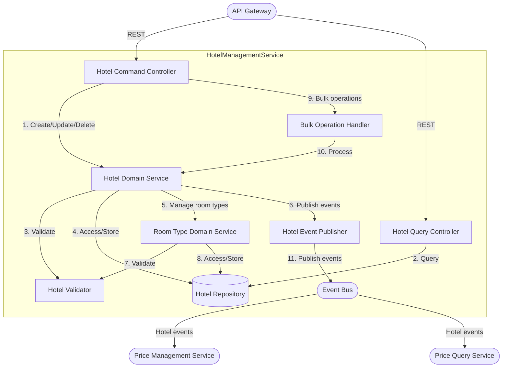
```mermaid
flowchart TD
    APIGateway([API Gateway]) -->|REST| HotelCommandController
    APIGateway -->|REST| HotelQueryController
    
    subgraph HotelManagementService
        HotelCommandController[Hotel Command Controller]
        HotelQueryController[Hotel Query Controller]
        HotelDomainService[Hotel Domain Service]
        RoomTypeDomainService[Room Type Domain Service]
        HotelValidator[Hotel Validator]
        HotelRepository[(Hotel Repository)]
        HotelEventPublisher[Hotel Event Publisher]
        BulkOperationHandler[Bulk Operation Handler]
        
        HotelCommandController -->|1. Create/Update/Delete| HotelDomainService
        HotelQueryController -->|2. Query| HotelRepository
        
        HotelDomainService -->|3. Validate| HotelValidator
        HotelDomainService -->|4. Access/Store| HotelRepository
        HotelDomainService -->|5. Manage room types| RoomTypeDomainService
        HotelDomainService -->|6. Publish events| HotelEventPublisher
        
        RoomTypeDomainService -->|7. Validate| HotelValidator
        RoomTypeDomainService -->|8. Access/Store| HotelRepository
        
        HotelCommandController -->|9. Bulk operations| BulkOperationHandler
        BulkOperationHandler -->|10. Process| HotelDomainService
        
        HotelEventPublisher -->|11. Publish events| EventBus
    end
    
    EventBus([Event Bus])
    
    EventBus -->|Hotel events| PriceService([Price Management Service])
    EventBus -->|Hotel events| QueryService([Price Query Service])
```

#### Component Responsibilities

| Component | Responsibilities |
|-----------|------------------|
| Hotel Command Controller | - Handles HTTP requests for hotel creation, update, and deletion<br>- Validates input data format<br>- Routes requests to the appropriate domain services<br>- Returns responses to clients<br>- Supports optimistic concurrency control |
| Hotel Query Controller | - Handles HTTP requests for retrieving hotel information<br>- Supports filtering, sorting, and pagination<br>- Returns appropriately formatted responses<br>- Implements versioned API endpoints |
| Hotel Domain Service | - Implements core business logic for hotel management<br>- Enforces business rules and constraints<br>- Coordinates with other domain services<br>- Maintains data consistency |
| Room Type Domain Service | - Implements business logic for room type management<br>- Enforces room type constraints and relationships<br>- Validates room type data integrity<br>- Ensures consistency between room types and hotels |
| Hotel Validator | - Validates hotel data against business rules<br>- Performs schema validation<br>- Checks for data integrity constraints<br>- Returns detailed validation errors |
| Hotel Repository | - Provides data access methods for hotel entities<br>- Implements optimistic concurrency control<br>- Supports efficient querying<br>- Manages database transactions |
| Hotel Event Publisher | - Creates and publishes events for hotel changes<br>- Ensures event data completeness<br>- Handles event delivery confirmation<br>- Implements retry logic for failed event publishing |
| Bulk Operation Handler | - Processes batch operations on multiple hotels<br>- Optimizes database access for bulk operations<br>- Provides transaction management for batch operations<br>- Handles partial failures gracefully |

### 6.4 Rate Management Service

The Rate Management Service is responsible for managing rates and the business rules that govern how prices are calculated. It implements a rule engine to provide flexibility in defining calculation rules.

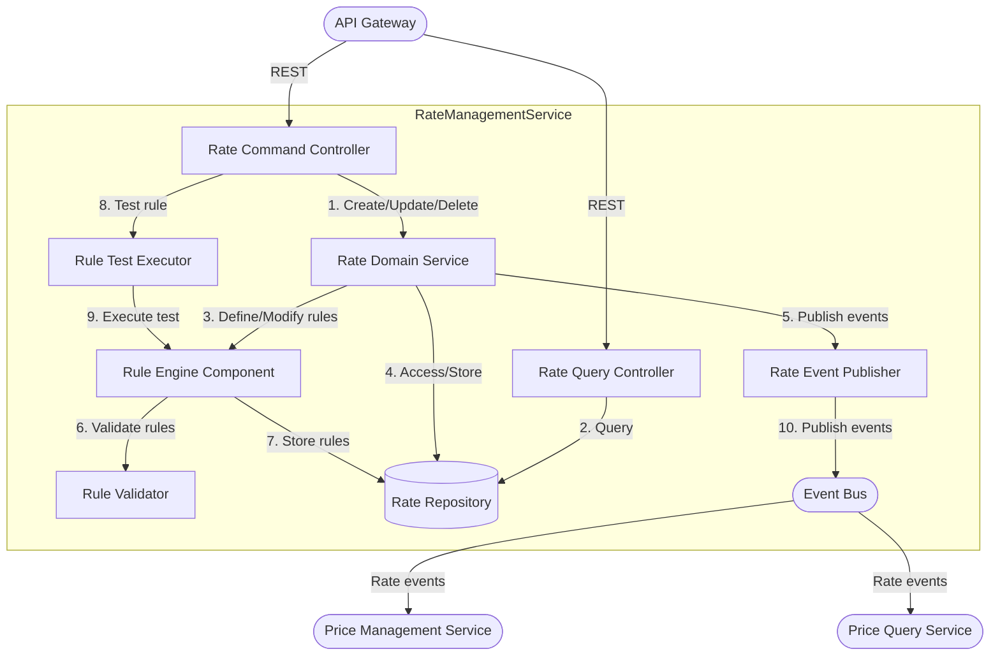
```mermaid
flowchart TD
    APIGateway([API Gateway]) -->|REST| RateCommandController
    APIGateway -->|REST| RateQueryController
    
    subgraph RateManagementService
        RateCommandController[Rate Command Controller]
        RateQueryController[Rate Query Controller]
        RateDomainService[Rate Domain Service]
        RuleEngineComponent[Rule Engine Component]
        RuleValidator[Rule Validator]
        RuleTestExecutor[Rule Test Executor]
        RateRepository[(Rate Repository)]
        RateEventPublisher[Rate Event Publisher]
        
        RateCommandController -->|1. Create/Update/Delete| RateDomainService
        RateQueryController -->|2. Query| RateRepository
        
        RateDomainService -->|3. Define/Modify rules| RuleEngineComponent
        RateDomainService -->|4. Access/Store| RateRepository
        RateDomainService -->|5. Publish events| RateEventPublisher
        
        RuleEngineComponent -->|6. Validate rules| RuleValidator
        RuleEngineComponent -->|7. Store rules| RateRepository
        
        RateCommandController -->|8. Test rule| RuleTestExecutor
        RuleTestExecutor -->|9. Execute test| RuleEngineComponent
        
        RateEventPublisher -->|10. Publish events| EventBus
    end
    
    EventBus([Event Bus])
    
    EventBus -->|Rate events| PriceService([Price Management Service])
    EventBus -->|Rate events| QueryService([Price Query Service])
```

#### Component Responsibilities

| Component | Responsibilities |
|-----------|------------------|
| Rate Command Controller | - Handles HTTP requests for rate creation, update, and deletion<br>- Validates input data format<br>- Routes requests to the appropriate domain services<br>- Returns responses to clients<br>- Supports optimistic concurrency control |
| Rate Query Controller | - Handles HTTP requests for retrieving rate information<br>- Supports filtering, sorting, and pagination<br>- Returns appropriately formatted responses<br>- Implements versioned API endpoints |
| Rate Domain Service | - Implements core business logic for rate management<br>- Enforces business rules and constraints<br>- Coordinates with other domain services<br>- Maintains data consistency |
| Rule Engine Component | - Provides DSL (Domain Specific Language) for defining calculation rules<br>- Compiles rule definitions into executable form<br>- Executes rules for price calculations<br>- Manages rule versioning |
| Rule Validator | - Validates rule syntax and semantics<br>- Checks for logical errors in rule definitions<br>- Verifies rule compatibility with existing system<br>- Returns detailed validation errors |
| Rule Test Executor | - Executes rules against sample data<br>- Compares rule execution results with expected outcomes<br>- Identifies potential issues in rules<br>- Provides debugging information |
| Rate Repository | - Provides data access methods for rate entities<br>- Implements optimistic concurrency control<br>- Supports efficient querying<br>- Manages database transactions |
| Rate Event Publisher | - Creates and publishes events for rate changes<br>- Ensures event data completeness<br>- Handles event delivery confirmation<br>- Implements retry logic for failed event publishing |

### 6.5 Authentication Service

The Authentication Service is responsible for user authentication, authorization, and integration with the cloud provider's identity service. It implements OAuth 2.0/OIDC protocols and JWT-based token management.

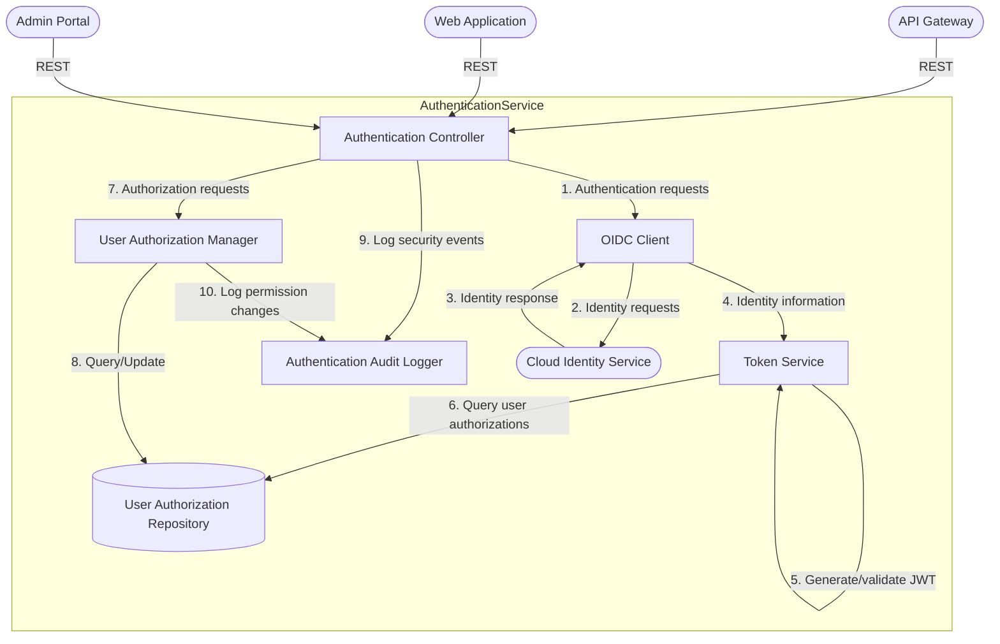
```mermaid
flowchart TD
    APIGateway([API Gateway]) -->|REST| AuthController
    
    subgraph AuthenticationService
        AuthController[Authentication Controller]
        OIDCClient[OIDC Client]
        TokenService[Token Service]
        UserAuthorizationRepo[(User Authorization Repository)]
        UserAuthorizationManager[User Authorization Manager]
        AuditLogger[Authentication Audit Logger]
        
        AuthController -->|1. Authentication requests| OIDCClient
        OIDCClient -->|2. Identity requests| CloudIdS[Cloud Identity Service]
        CloudIdS -->|3. Identity response| OIDCClient
        OIDCClient -->|4. Identity information| TokenService
        TokenService -->|5. Generate/validate JWT| TokenService
        TokenService -->|6. Query user authorizations| UserAuthorizationRepo
        
        AuthController -->|7. Authorization requests| UserAuthorizationManager
        UserAuthorizationManager -->|8. Query/Update| UserAuthorizationRepo
        
        AuthController -->|9. Log security events| AuditLogger
        UserAuthorizationManager -->|10. Log permission changes| AuditLogger
    end
    
    WebApp([Web Application]) -->|REST| AuthController
    AdminPortal([Admin Portal]) -->|REST| AuthController
    CloudIdS([Cloud Identity Service])
```

#### Component Responsibilities

| Component | Responsibilities |
|-----------|------------------|
| Authentication Controller | - Handles HTTP requests for authentication and authorization<br>- Routes requests to appropriate services<br>- Implements the authentication API<br>- Returns appropriate responses and error handling |
| OIDC Client | - Integrates with the cloud provider's identity service<br>- Implements OAuth 2.0/OIDC flows<br>- Manages identity tokens<br>- Handles authentication redirection |
| Token Service | - Generates and validates JWT tokens<br>- Manages token signatures and encryption<br>- Handles token refresh and expiration<br>- Maintains token blacklist for revoked tokens |
| User Authorization Repository | - Stores user authorization data<br>- Maps external identities to internal permissions<br>- Maintains user-hotel authorization mappings<br>- Supports efficient permission queries |
| User Authorization Manager | - Implements business logic for permission management<br>- Enforces RBAC policies<br>- Provides user management operations<br>- Validates permission changes |
| Authentication Audit Logger | - Records all security-related events<br>- Maintains audit trail for compliance<br>- Provides audit query capabilities<br>- Detects suspicious activities |

### 6.6 API Gateway Components

The API Gateway serves as the entry point for all client requests and includes security, protocol translation, and monitoring capabilities. It provides a unified interface for clients while routing requests to the appropriate backend services.

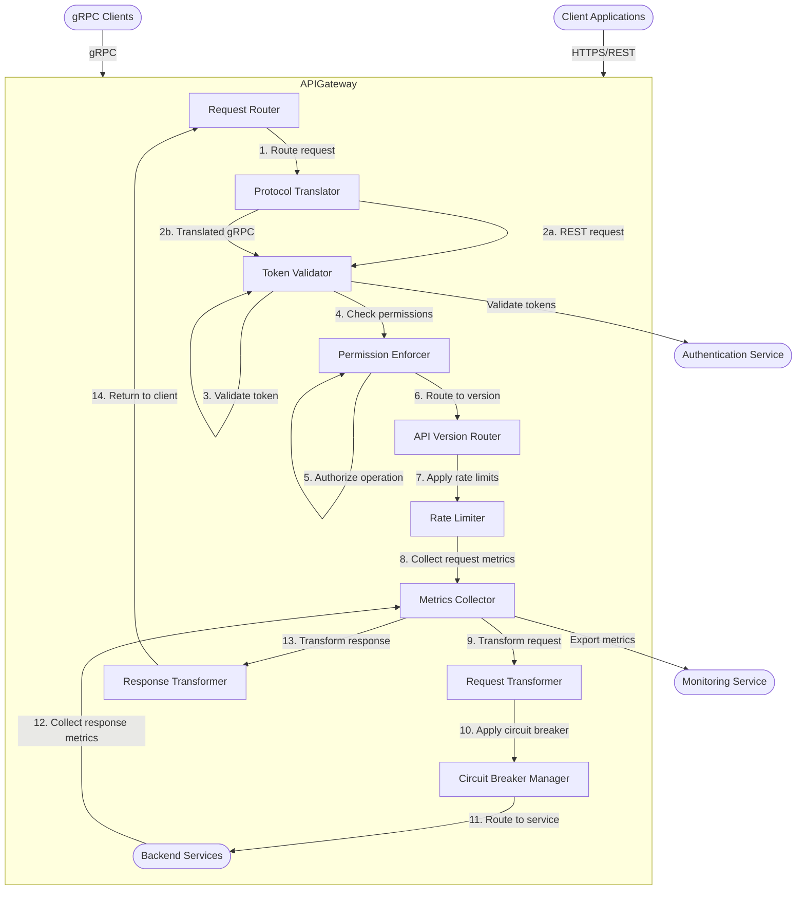
```mermaid
flowchart TD
    Client([Client Applications]) -->|HTTPS/REST| APIGateway
    GRPCClient([gRPC Clients]) -->|gRPC| APIGateway
    
    subgraph APIGateway
        RouterComponent[Request Router]
        AuthValidator[Token Validator]
        PermissionEnforcer[Permission Enforcer]
        ProtocolTranslator[Protocol Translator]
        VersionRouter[API Version Router]
        RequestTransformer[Request Transformer]
        ResponseTransformer[Response Transformer]
        RateLimiter[Rate Limiter]
        MetricsCollector[Metrics Collector]
        CircuitBreakerManager[Circuit Breaker Manager]
        
        RouterComponent -->|1. Route request| ProtocolTranslator
        ProtocolTranslator -->|2a. REST request| AuthValidator
        ProtocolTranslator -->|2b. Translated gRPC| AuthValidator
        
        AuthValidator -->|3. Validate token| AuthValidator
        AuthValidator -->|4. Check permissions| PermissionEnforcer
        PermissionEnforcer -->|5. Authorize operation| PermissionEnforcer
        
        PermissionEnforcer -->|6. Route to version| VersionRouter
        VersionRouter -->|7. Apply rate limits| RateLimiter
        
        RateLimiter -->|8. Collect request metrics| MetricsCollector
        MetricsCollector -->|9. Transform request| RequestTransformer
        
        RequestTransformer -->|10. Apply circuit breaker| CircuitBreakerManager
        CircuitBreakerManager -->|11. Route to service| BackendServices
        
        BackendServices -->|12. Collect response metrics| MetricsCollector
        MetricsCollector -->|13. Transform response| ResponseTransformer
        ResponseTransformer -->|14. Return to client| RouterComponent
    end
    
    AuthService([Authentication Service])
    BackendServices([Backend Services])
    MonitoringService([Monitoring Service])
    
    AuthValidator -->|Validate tokens| AuthService
    MetricsCollector -->|Export metrics| MonitoringService
```

#### Component Responsibilities

| Component | Responsibilities |
|-----------|------------------|
| Request Router | - Routes requests to appropriate backend services<br>- Orchestrates the request processing pipeline<br>- Handles error conditions<br>- Implements service discovery |
| Protocol Translator | - Translates between different protocols (REST, gRPC)<br>- Handles serialization and deserialization<br>- Maps between REST and gRPC endpoints<br>- Preserves metadata across protocol translations |
| API Version Router | - Routes requests to the appropriate API version<br>- Supports multiple versions of the same API<br>- Implements API versioning strategies<br>- Handles version deprecation notifications |
| Token Validator | - Verifies JWT token signatures<br>- Checks token expiration and validity<br>- Extracts user identity and roles<br>- Validates tokens with the Authentication Service |
| Permission Enforcer | - Enforces authorization policies<br>- Checks user permissions against requested resources<br>- Implements role-based access control<br>- Blocks unauthorized requests |
| Request Transformer | - Transforms incoming requests for backend services<br>- Adds security context to requests<br>- Sanitizes inputs<br>- Handles request protocol conversion |
| Response Transformer | - Transforms outgoing responses<br>- Filters sensitive information<br>- Formats responses based on client needs<br>- Implements HATEOAS for RESTful APIs |
| Rate Limiter | - Enforces rate limits by client and endpoint<br>- Prevents DoS attacks<br>- Provides feedback on rate limit status<br>- Implements tiered rate limits by user type |
| Metrics Collector | - Collects performance metrics for requests and responses<br>- Tracks latency, error rates, and throughput<br>- Exports metrics to the Monitoring Service<br>- Provides real-time monitoring data |
| Circuit Breaker Manager | - Manages circuit breakers for backend services<br>- Prevents cascading failures<br>- Implements fallback strategies<br>- Collects health data for services |

### 6.7 Monitoring Infrastructure

The Monitoring Infrastructure provides comprehensive metrics collection, analysis, and alerting capabilities for the entire system. It uses OpenTelemetry as the foundation for collecting metrics, traces, and logs.

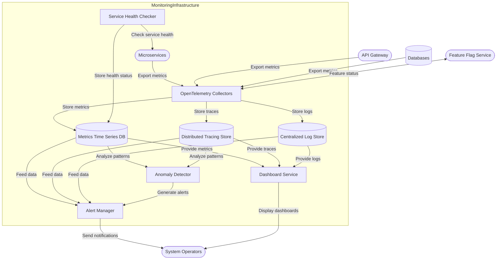
```mermaid
flowchart TD
    Services([Microservices]) -->|Export metrics| Collectors
    APIGateway([API Gateway]) -->|Export metrics| Collectors
    Databases[(Databases)] -->|Export metrics| Collectors
    
    subgraph MonitoringInfrastructure
        Collectors[OpenTelemetry Collectors]
        MetricsStore[(Metrics Time Series DB)]
        TracingStore[(Distributed Tracing Store)]
        LogStore[(Centralized Log Store)]
        AlertManager[Alert Manager]
        DashboardService[Dashboard Service]
        ServiceHealthChecker[Service Health Checker]
        AnomalyDetector[Anomaly Detector]
        
        Collectors -->|Store metrics| MetricsStore
        Collectors -->|Store traces| TracingStore
        Collectors -->|Store logs| LogStore
        
        MetricsStore -->|Feed data| AlertManager
        TracingStore -->|Feed data| AlertManager
        LogStore -->|Feed data| AlertManager
        
        MetricsStore -->|Provide metrics| DashboardService
        TracingStore -->|Provide traces| DashboardService
        LogStore -->|Provide logs| DashboardService
        
        ServiceHealthChecker -->|Check service health| Services
        ServiceHealthChecker -->|Store health status| MetricsStore
        
        MetricsStore -->|Analyze patterns| AnomalyDetector
        TracingStore -->|Analyze patterns| AnomalyDetector
        AnomalyDetector -->|Generate alerts| AlertManager
    end
    
    AlertManager -->|Send notifications| Operators([System Operators])
    DashboardService -->|Display dashboards| Operators
    
    FeatureFlag([Feature Flag Service]) <-->|Feature status| Collectors
```

#### Component Responsibilities

| Component | Responsibilities |
|-----------|------------------|
| OpenTelemetry Collectors | - Collect metrics, traces, and logs from services<br>- Process and transform telemetry data<br>- Export data to appropriate storage backends<br>- Handle batching and buffering of telemetry data |
| Metrics Time Series DB | - Store time-series metrics data<br>- Support efficient querying of metrics<br>- Implement data retention policies<br>- Support aggregation and statistical analysis |
| Distributed Tracing Store | - Store distributed trace data<br>- Link related spans across services<br>- Support trace visualization and analysis<br>- Implement sampling strategies for high-volume systems |
| Centralized Log Store | - Store structured logs from all services<br>- Support log querying and filtering<br>- Implement log retention policies<br>- Provide log analysis capabilities |
| Alert Manager | - Define and manage alerting rules<br>- Detect threshold violations and anomalies<br>- Send notifications through multiple channels<br>- Handle alert grouping and deduplication |
| Dashboard Service | - Visualize metrics, traces, and logs<br>- Provide customizable dashboards for different user roles<br>- Support real-time updates of monitoring data<br>- Enable drill-down analysis of issues |
| Service Health Checker | - Proactively monitor service health<br>- Perform synthetic transactions to verify functionality<br>- Track service availability and performance<br>- Detect service degradation before it affects users |
| Anomaly Detector | - Identify abnormal patterns in metrics and traces<br>- Use machine learning for anomaly detection<br>- Detect potential issues before they become critical<br>- Reduce false positives through correlation analysis |
| Feature Flag Service | - Manage feature flags for all services<br>- Provide centralized control of feature rollout<br>- Support A/B testing and gradual rollout<br>- Track feature usage metrics |


### 6.8 Testing Infrastructure

The Testing Infrastructure provides tools and frameworks for comprehensive testing of all system components independently of external dependencies. It supports unit testing, integration testing, contract testing, and end-to-end testing.

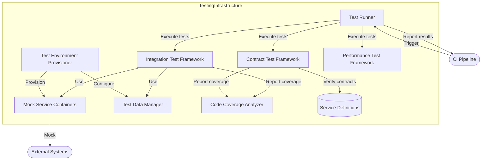
```mermaid
flowchart TD
    subgraph TestingInfrastructure
        TestRunner[Test Runner]
        MockServices[Mock Service Containers]
        TestDataManager[Test Data Manager]
        ContractTestFramework[Contract Test Framework]
        TestEnvProvisioner[Test Environment Provisioner]
        CodeCoverageAnalyzer[Code Coverage Analyzer]
        IntegrationTestFramework[Integration Test Framework]
        PerformanceTestFramework[Performance Test Framework]
        
        TestRunner -->|Execute tests| IntegrationTestFramework
        TestRunner -->|Execute tests| ContractTestFramework
        TestRunner -->|Execute tests| PerformanceTestFramework
        
        IntegrationTestFramework -->|Use| MockServices
        IntegrationTestFramework -->|Use| TestDataManager
        
        ContractTestFramework -->|Verify contracts| ServiceDefinitions[(Service Definitions)]
        
        TestEnvProvisioner -->|Provision| MockServices
        TestEnvProvisioner -->|Configure| TestDataManager
        
        IntegrationTestFramework -->|Report coverage| CodeCoverageAnalyzer
        ContractTestFramework -->|Report coverage| CodeCoverageAnalyzer
    end
    
    MockServices -->|Mock| ExternalSystems([External Systems])
    CI([CI Pipeline]) -->|Trigger| TestRunner
    TestRunner -->|Report results| CI
```

#### Component Responsibilities

| Component | Responsibilities |
|-----------|------------------|
| Test Runner | - Orchestrates test execution across different frameworks<br>- Manages test environment lifecycle<br>- Collects and aggregates test results<br>- Integrates with CI/CD pipelines |
| Mock Services | - Provides containerized mock implementations of external systems<br>- Simulates expected behavior of external dependencies<br>- Supports configurable response scenarios<br>- Enables testing without actual external systems |
| Test Data Manager | - Manages test data generation and cleanup<br>- Provides consistent test data across test runs<br>- Supports data seeding for different test scenarios<br>- Ensures test data isolation between parallel test runs |
| Contract Test Framework | - Verifies service API contracts<br>- Tests compatibility between service consumers and providers<br>- Validates request and response formats<br>- Enables independent service evolution |
| Test Environment Provisioner | - Dynamically creates isolated test environments<br>- Configures environment dependencies<br>- Manages environment lifecycle<br>- Supports parallel test execution |
| Code Coverage Analyzer | - Measures code coverage of tests<br>- Identifies untested code paths<br>- Provides coverage reports for different test types<br>- Enforces coverage thresholds |
| Integration Test Framework | - Tests interactions between system components<br>- Validates end-to-end workflows<br>- Verifies component composition<br>- Uses mock services for external dependencies |
| Performance Test Framework | - Measures system performance under load<br>- Identifies performance bottlenecks<br>- Tests system scalability<br>- Validates performance SLAs |

#### Mock Service Implementations

The testing infrastructure includes mock implementations of all external systems:

1. **Mock Channel Management System**:
   - Simulates the Channel Management System API
   - Provides configurable responses for different test scenarios
   - Logs all interactions for verification
   - Supports fault injection for resilience testing

2. **Mock Property Management System**:
   - Simulates the Property Management System API
   - Provides realistic data responses based on test configuration
   - Supports different response latencies for performance testing
   - Allows programmatic configuration during test setup

3. **Mock Cloud Identity Service**:
   - Simulates authentication flows and token issuance
   - Provides configurable user identities and permissions
   - Supports different authentication scenarios
   - Enables testing of authorization logic

#### Test Container Infrastructure

The test infrastructure leverages TestContainers to:

1. **Provide isolated database instances**:
   - Spin up database containers for each test run
   - Initialize schema and seed test data
   - Ensure complete isolation between test runs
   - Support for multiple database types (PostgreSQL, Redis, MongoDB)

2. **Simulate infrastructure components**:
   - Run Kafka containers for event-driven testing
   - Provide Redis instances for distributed cache testing
   - Support service discovery testing

3. **Enable integration testing**:
   - Containerize application components for true integration testing
   - Define test compositions using Docker Compose
   - Support dynamic port allocation and service discovery

#### Contract Testing Approach

The Contract Testing Framework supports:

1. **Consumer-Driven Contracts**:
   - Consumers define expectations of provider services
   - Providers verify they meet all consumer expectations
   - Contracts versioned alongside code
   - Automated verification in CI pipeline

2. **API Schema Validation**:
   - Validate requests/responses against OpenAPI/Swagger schemas
   - Verify Protocol Buffer compatibility
   - Ensure backward compatibility of API changes
   - Support API evolution while maintaining compatibility

#### Test Data Management

The Test Data Manager provides:

1. **Deterministic test data generation**:
   - Create consistent test datasets based on test requirements
   - Support different data profiles for different test scenarios
   - Generate realistic data using domain-specific generators
   - Enable idempotent test execution

2. **Database state management**:
   - Reset database state between tests
   - Support transaction-based test isolation
   - Provide database snapshots for efficient state reset
   - Enable parallel test execution with data isolation

#### Integration with CI/CD Pipeline

The Testing Infrastructure integrates with CI/CD processes:

1. **Automated test execution**:
   - Run tests automatically on code changes
   - Execute different test suites based on change impact
   - Parallelize test execution for faster feedback
   - Fail builds on test failures or coverage drops

2. **Test result reporting**:
   - Generate detailed test reports
   - Track test trends over time
   - Provide insights on test quality and coverage
   - Alert on recurring test failures

## 7. Sequence Diagrams

### HPS-1: Log In

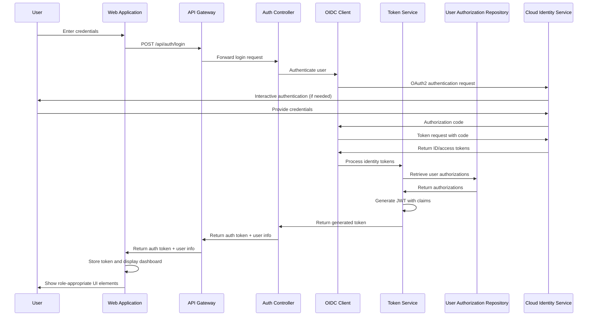
```mermaid
sequenceDiagram
    participant User as User
    participant WebApp as Web Application
    participant APIGateway as API Gateway
    participant AuthController as Auth Controller
    participant OIDCClient as OIDC Client
    participant TokenService as Token Service
    participant UserAuthRepo as User Authorization Repository
    participant CloudIdS as Cloud Identity Service
    
    User->>WebApp: Enter credentials
    WebApp->>APIGateway: POST /api/auth/login
    APIGateway->>AuthController: Forward login request
    AuthController->>OIDCClient: Authenticate user
    
    OIDCClient->>CloudIdS: OAuth2 authentication request
    CloudIdS->>User: Interactive authentication (if needed)
    User->>CloudIdS: Provide credentials
    CloudIdS->>OIDCClient: Authorization code
    
    OIDCClient->>CloudIdS: Token request with code
    CloudIdS->>OIDCClient: Return ID/access tokens
    
    OIDCClient->>TokenService: Process identity tokens
    TokenService->>UserAuthRepo: Retrieve user authorizations
    UserAuthRepo->>TokenService: Return authorizations
    
    TokenService->>TokenService: Generate JWT with claims
    TokenService->>AuthController: Return generated token
    
    AuthController->>APIGateway: Return auth token + user info
    APIGateway->>WebApp: Return auth token + user info
    WebApp->>WebApp: Store token and display dashboard
    WebApp->>User: Show role-appropriate UI elements
```

This sequence diagram illustrates the authentication flow when a user logs into the system. It shows how user credentials are validated against the Cloud Identity Service through an OAuth2/OIDC flow, resulting in the generation of a JWT token with appropriate authorization claims. The process includes interactive authentication if needed, retrieval of user-specific permissions from the authorization repository, and finally returning the token to the client application which displays role-appropriate UI elements.

### HPS-2: Change Prices

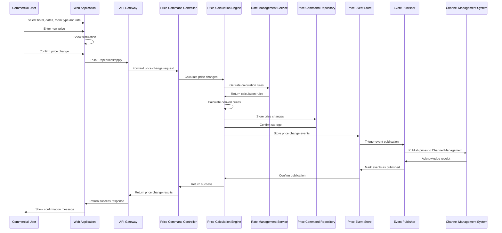
```mermaid
sequenceDiagram
    participant User as Commercial User
    participant WebApp as Web Application
    participant APIGateway as API Gateway
    participant PriceController as Price Command Controller
    participant PriceEngine as Price Calculation Engine
    participant RateService as Rate Management Service
    participant PriceRepo as Price Command Repository
    participant EventStore as Price Event Store
    participant Publisher as Event Publisher
    participant CMS as Channel Management System
    
    User->>WebApp: Select hotel, dates, room type and rate
    User->>WebApp: Enter new price
    WebApp->>WebApp: Show simulation
    User->>WebApp: Confirm price change
    WebApp->>APIGateway: POST /api/prices/apply
    APIGateway->>PriceController: Forward price change request
    
    PriceController->>PriceEngine: Calculate price changes
    PriceEngine->>RateService: Get rate calculation rules
    RateService->>PriceEngine: Return calculation rules
    
    PriceEngine->>PriceEngine: Calculate derived prices
    PriceEngine->>PriceRepo: Store price changes
    PriceRepo->>PriceEngine: Confirm storage
    
    PriceEngine->>EventStore: Store price change events
    EventStore->>Publisher: Trigger event publication
    Publisher->>CMS: Publish prices to Channel Management
    CMS->>Publisher: Acknowledge receipt
    
    Publisher->>EventStore: Mark events as published
    EventStore->>PriceEngine: Confirm publication
    PriceEngine->>PriceController: Return success
    
    PriceController->>APIGateway: Return price change results
    APIGateway->>WebApp: Return success response
    WebApp->>User: Show confirmation message
```

This sequence diagram depicts the price change process, demonstrating how a commercial user changes prices for a specific hotel, room type, and rate. The diagram shows the full workflow from user selection and confirmation through to the system calculating derived prices, persisting the changes, and publishing them to external systems via the Channel Management System. The process includes retrieving business rules from the Rate Service, calculating prices, storing the changes in the database, and reliably publishing events to notify other parts of the system about the price changes.

### HPS-3: Query Prices

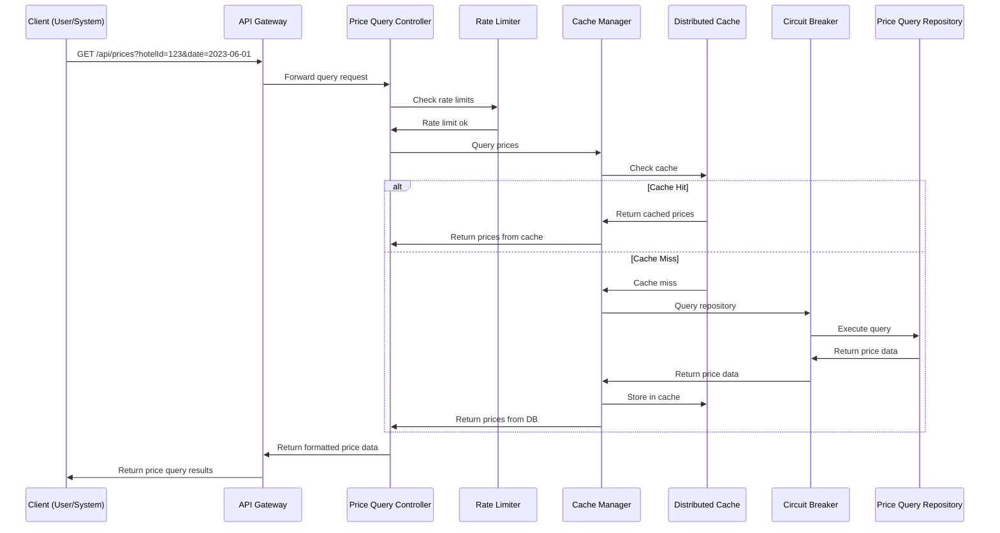
```mermaid
sequenceDiagram
    participant Client as Client (User/System)
    participant APIGateway as API Gateway
    participant QueryController as Price Query Controller
    participant RateLimiter as Rate Limiter
    participant CacheManager as Cache Manager
    participant Cache as Distributed Cache
    participant CircuitBreaker as Circuit Breaker
    participant QueryRepo as Price Query Repository
    
    Client->>APIGateway: GET /api/prices?hotelId=123&date=2023-06-01
    APIGateway->>QueryController: Forward query request
    
    QueryController->>RateLimiter: Check rate limits
    RateLimiter->>QueryController: Rate limit ok
    
    QueryController->>CacheManager: Query prices
    CacheManager->>Cache: Check cache
    
    alt Cache Hit
        Cache->>CacheManager: Return cached prices
        CacheManager->>QueryController: Return prices from cache
    else Cache Miss
        Cache->>CacheManager: Cache miss
        CacheManager->>CircuitBreaker: Query repository
        CircuitBreaker->>QueryRepo: Execute query
        QueryRepo->>CircuitBreaker: Return price data
        CircuitBreaker->>CacheManager: Return price data
        CacheManager->>Cache: Store in cache
        CacheManager->>QueryController: Return prices from DB
    end
    
    QueryController->>APIGateway: Return formatted price data
    APIGateway->>Client: Return price query results
```

This sequence diagram illustrates the price query process, showing how the system efficiently handles high-volume price queries. It demonstrates the optimized query path with caching to minimize database load and improve response times. The diagram includes rate limiting to protect the system from excessive requests, distributed caching for performance, and circuit breaking to prevent cascade failures when the database is under stress. The sequence shows both the cache hit path (fast response from cache) and cache miss path (database query with subsequent cache update).

### HPS-4: Manage Hotels

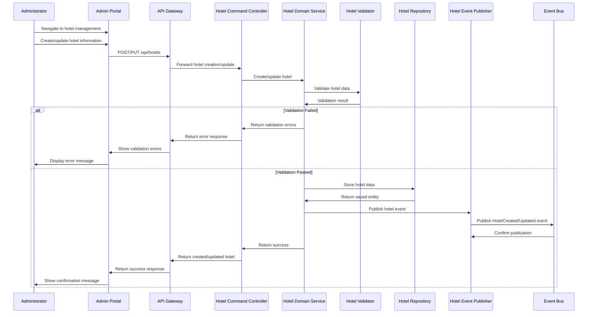
```mermaid
sequenceDiagram
    participant Admin as Administrator
    participant AdminPortal as Admin Portal
    participant APIGateway as API Gateway
    participant HotelController as Hotel Command Controller
    participant HotelService as Hotel Domain Service
    participant Validator as Hotel Validator
    participant HotelRepo as Hotel Repository
    participant EventPublisher as Hotel Event Publisher
    participant EventBus as Event Bus
    
    Admin->>AdminPortal: Navigate to hotel management
    Admin->>AdminPortal: Create/update hotel information
    AdminPortal->>APIGateway: POST/PUT /api/hotels
    APIGateway->>HotelController: Forward hotel creation/update
    
    HotelController->>HotelService: Create/update hotel
    HotelService->>Validator: Validate hotel data
    Validator->>HotelService: Validation result
    
    alt Validation Failed
        HotelService->>HotelController: Return validation errors
        HotelController->>APIGateway: Return error response
        APIGateway->>AdminPortal: Show validation errors
        AdminPortal->>Admin: Display error message
    else Validation Passed
        HotelService->>HotelRepo: Store hotel data
        HotelRepo->>HotelService: Return saved entity
        
        HotelService->>EventPublisher: Publish hotel event
        EventPublisher->>EventBus: Publish HotelCreated/Updated event
        EventBus->>EventPublisher: Confirm publication
        
        HotelService->>HotelController: Return success
        HotelController->>APIGateway: Return created/updated hotel
        APIGateway->>AdminPortal: Return success response
        AdminPortal->>Admin: Show confirmation message
    end
```

This sequence diagram shows the hotel management process, detailing how administrators can create or update hotel information through the admin portal. The diagram illustrates the domain-driven design principles employed, with clear separation of concerns between validation, domain logic, data persistence, and event publication. It demonstrates the validation workflow with both failure and success paths, emphasizing data integrity through validation before persistence. When a hotel is successfully created or updated, events are published to notify other parts of the system, maintaining data consistency across services.

### HPS-5: Manage Rates

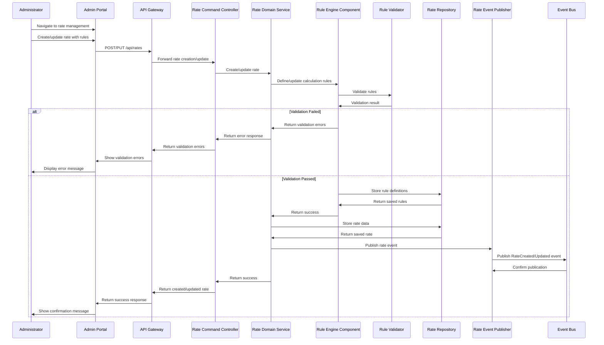
```mermaid
sequenceDiagram
    participant Admin as Administrator
    participant AdminPortal as Admin Portal
    participant APIGateway as API Gateway
    participant RateController as Rate Command Controller
    participant RateService as Rate Domain Service
    participant RuleEngine as Rule Engine Component
    participant Validator as Rule Validator
    participant RateRepo as Rate Repository
    participant EventPublisher as Rate Event Publisher
    participant EventBus as Event Bus
    
    Admin->>AdminPortal: Navigate to rate management
    Admin->>AdminPortal: Create/update rate with rules
    AdminPortal->>APIGateway: POST/PUT /api/rates
    APIGateway->>RateController: Forward rate creation/update
    
    RateController->>RateService: Create/update rate
    RateService->>RuleEngine: Define/update calculation rules
    RuleEngine->>Validator: Validate rules
    Validator->>RuleEngine: Validation result
    
    alt Validation Failed
        RuleEngine->>RateService: Return validation errors
        RateService->>RateController: Return error response
        RateController->>APIGateway: Return validation errors
        APIGateway->>AdminPortal: Show validation errors
        AdminPortal->>Admin: Display error message
    else Validation Passed
        RuleEngine->>RateRepo: Store rule definitions
        RateRepo->>RuleEngine: Return saved rules
        RuleEngine->>RateService: Return success
        
        RateService->>RateRepo: Store rate data
        RateRepo->>RateService: Return saved rate
        
        RateService->>EventPublisher: Publish rate event
        EventPublisher->>EventBus: Publish RateCreated/Updated event
        EventBus->>EventPublisher: Confirm publication
        
        RateService->>RateController: Return success
        RateController->>APIGateway: Return created/updated rate
        APIGateway->>AdminPortal: Return success response
        AdminPortal->>Admin: Show confirmation message
    end
```

This sequence diagram depicts the rate management process, showing how administrators create or update rate information and associated calculation rules. The diagram emphasizes the specialized rule engine component that handles the complexities of rate calculation definitions. It illustrates the validation of business rules before they're applied to the system, ensuring that only valid rules are stored. Like hotel management, this process follows domain-driven design principles with clear separation between validation, rule processing, data persistence, and event publication to maintain system-wide consistency.

### HPS-6: Manage Users

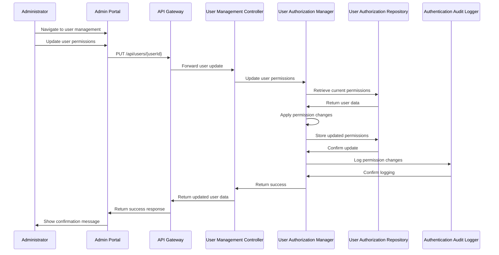
```mermaid
sequenceDiagram
    participant Admin as Administrator
    participant AdminPortal as Admin Portal
    participant APIGateway as API Gateway
    participant UserController as User Management Controller
    participant AuthManager as User Authorization Manager
    participant UserRepo as User Authorization Repository
    participant AuditLogger as Authentication Audit Logger
    
    Admin->>AdminPortal: Navigate to user management
    Admin->>AdminPortal: Update user permissions
    AdminPortal->>APIGateway: PUT /api/users/{userId}
    APIGateway->>UserController: Forward user update
    
    UserController->>AuthManager: Update user permissions
    AuthManager->>UserRepo: Retrieve current permissions
    UserRepo->>AuthManager: Return user data
    
    AuthManager->>AuthManager: Apply permission changes
    AuthManager->>UserRepo: Store updated permissions
    UserRepo->>AuthManager: Confirm update
    
    AuthManager->>AuditLogger: Log permission changes
    AuditLogger->>AuthManager: Confirm logging
    
    AuthManager->>UserController: Return success
    UserController->>APIGateway: Return updated user data
    APIGateway->>AdminPortal: Return success response
    AdminPortal->>Admin: Show confirmation message
```

This sequence diagram illustrates the user management process, showing how administrators modify user permissions within the system. The diagram highlights the separation between the cloud identity service (which handles authentication) and the system's authorization management (which controls what users can access). It demonstrates the importance of audit logging for security-related changes, providing a traceable record of permission modifications. The process ensures that user permission changes are properly stored, validated, and logged for compliance and security purposes.

### QA-1: Performance (Price Calculation)

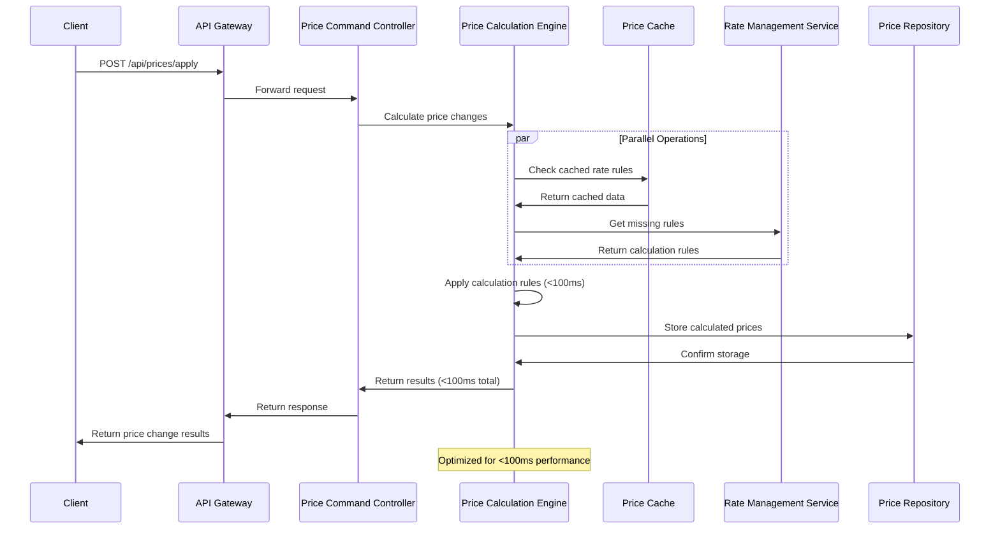
```mermaid
sequenceDiagram
    participant Client as Client
    participant APIGateway as API Gateway
    participant PriceController as Price Command Controller
    participant PriceEngine as Price Calculation Engine
    participant Cache as Price Cache
    participant RateService as Rate Management Service
    participant PriceRepo as Price Repository
    
    Client->>APIGateway: POST /api/prices/apply
    APIGateway->>PriceController: Forward request
    
    PriceController->>PriceEngine: Calculate price changes
    
    par Parallel Operations
        PriceEngine->>Cache: Check cached rate rules
        Cache->>PriceEngine: Return cached data
        
        PriceEngine->>RateService: Get missing rules
        RateService->>PriceEngine: Return calculation rules
    end
    
    PriceEngine->>PriceEngine: Apply calculation rules (<100ms)
    PriceEngine->>PriceRepo: Store calculated prices
    PriceRepo->>PriceEngine: Confirm storage
    
    PriceEngine->>PriceController: Return results (<100ms total)
    PriceController->>APIGateway: Return response
    APIGateway->>Client: Return price change results
    
    note over PriceEngine: Optimized for <100ms performance
```

This sequence diagram focuses on the performance aspect of price calculation, illustrating how the system meets the requirement to calculate all derived prices within 100ms. It shows performance optimization techniques including parallel operations to retrieve cached rule data and fetch missing rules simultaneously, efficient calculation algorithms, and optimized database access. The diagram specifically notes the performance constraint with timing annotations, emphasizing that the entire calculation process from request to response must complete within the 100ms threshold to satisfy the performance requirement.

### QA-2: Reliability (Price Publication)

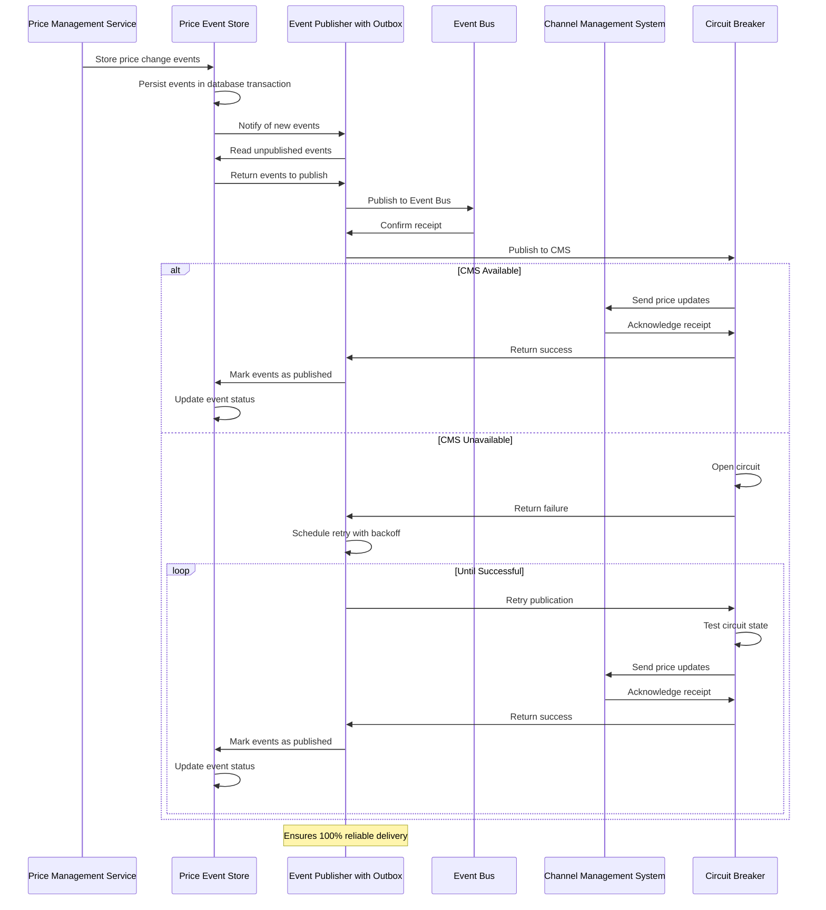
```mermaid
sequenceDiagram
    participant PriceService as Price Management Service
    participant EventStore as Price Event Store
    participant Publisher as Event Publisher with Outbox
    participant EventBus as Event Bus
    participant CMS as Channel Management System
    participant CircuitBreaker as Circuit Breaker
    
    PriceService->>EventStore: Store price change events
    EventStore->>EventStore: Persist events in database transaction
    EventStore->>Publisher: Notify of new events
    
    Publisher->>EventStore: Read unpublished events
    EventStore->>Publisher: Return events to publish
    
    Publisher->>EventBus: Publish to Event Bus
    EventBus->>Publisher: Confirm receipt
    
    Publisher->>CircuitBreaker: Publish to CMS
    
    alt CMS Available
        CircuitBreaker->>CMS: Send price updates
        CMS->>CircuitBreaker: Acknowledge receipt
        CircuitBreaker->>Publisher: Return success
        Publisher->>EventStore: Mark events as published
        EventStore->>EventStore: Update event status
    else CMS Unavailable
        CircuitBreaker->>CircuitBreaker: Open circuit
        CircuitBreaker->>Publisher: Return failure
        Publisher->>Publisher: Schedule retry with backoff
        
        loop Until Successful
            Publisher->>CircuitBreaker: Retry publication
            CircuitBreaker->>CircuitBreaker: Test circuit state
            CircuitBreaker->>CMS: Send price updates
            CMS->>CircuitBreaker: Acknowledge receipt
            CircuitBreaker->>Publisher: Return success
            Publisher->>EventStore: Mark events as published
            EventStore->>EventStore: Update event status
        end
    end
    
    note over Publisher: Ensures 100% reliable delivery
```

This sequence diagram addresses the reliability requirement for price publication, illustrating how the system ensures that 100% of price changes are successfully published to both internal systems and the Channel Management System. It demonstrates the outbox pattern for reliable event delivery, where events are first stored in the database before being published, ensuring consistency between the database state and published events. The diagram also shows resilience patterns including circuit breaking and retry with exponential backoff when external systems are unavailable, guaranteeing eventual consistency and successful delivery even in the face of temporary failures.

### QA-3: Availability (Price Queries)

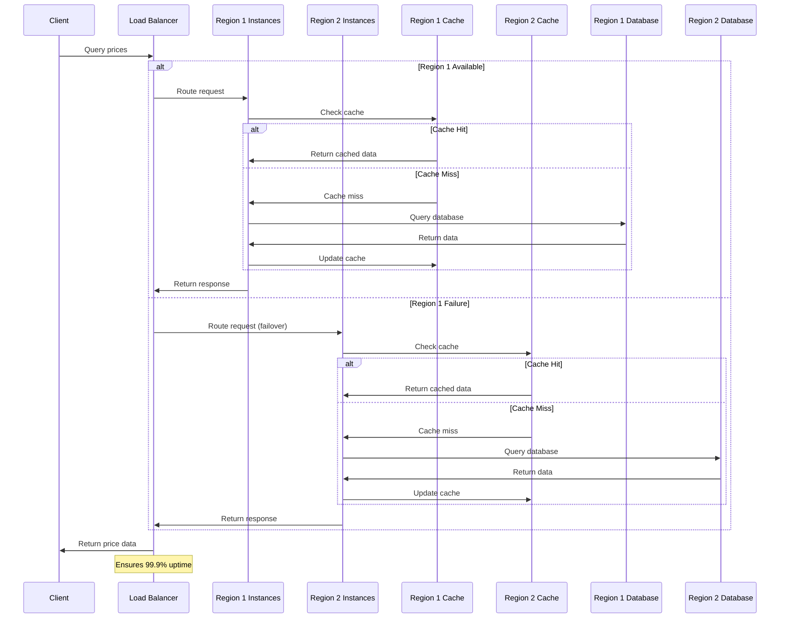
```mermaid
sequenceDiagram
    participant Client as Client
    participant LoadBalancer as Load Balancer
    participant Region1 as Region 1 Instances
    participant Region2 as Region 2 Instances
    participant Cache1 as Region 1 Cache
    participant Cache2 as Region 2 Cache
    participant DB1 as Region 1 Database
    participant DB2 as Region 2 Database
    
    Client->>LoadBalancer: Query prices
    
    alt Region 1 Available
        LoadBalancer->>Region1: Route request
        Region1->>Cache1: Check cache
        
        alt Cache Hit
            Cache1->>Region1: Return cached data
        else Cache Miss
            Cache1->>Region1: Cache miss
            Region1->>DB1: Query database
            DB1->>Region1: Return data
            Region1->>Cache1: Update cache
        end
        
        Region1->>LoadBalancer: Return response
    else Region 1 Failure
        LoadBalancer->>Region2: Route request (failover)
        Region2->>Cache2: Check cache
        
        alt Cache Hit
            Cache2->>Region2: Return cached data
        else Cache Miss
            Cache2->>Region2: Cache miss
            Region2->>DB2: Query database
            DB2->>Region2: Return data
            Region2->>Cache2: Update cache
        end
        
        Region2->>LoadBalancer: Return response
    end
    
    LoadBalancer->>Client: Return price data
    
    note over LoadBalancer: Ensures 99.9% uptime
```

This sequence diagram focuses on the availability requirement for price queries, illustrating how the system achieves 99.9% uptime through multi-region deployment and automated failover. It demonstrates the load balancing and failover mechanisms that route requests to healthy regions when failures occur. The diagram shows both the normal flow through Region 1 and the failover path to Region 2 when Region 1 is unavailable. Each region has its own caching layer and database, ensuring continued operation even if an entire region fails. This redundant architecture combined with automated health checks and failover enables the system to meet the 99.9% availability SLA for price queries.

### QA-4: Scalability (Price Queries)

```mermaid
sequenceDiagram
    participant Clients as Clients (100K-1M/day)
    participant APIGateway as API Gateway (Auto-scaling)
    participant QueryService as Price Query Service (Auto-scaling)
    participant CacheCluster as Distributed Cache Cluster
    participant ReadReplicas as Database Read Replicas
    
    Clients->>APIGateway: Price queries
    APIGateway->>APIGateway: Rate limiting & load distribution
    
    par Multiple Parallel Requests
        APIGateway->>QueryService: Forward queries
        QueryService->>CacheCluster: Query cache
        
        alt Cache Hit (80-90% of queries)
            CacheCluster->>QueryService: Return cached data
        else Cache Miss
            CacheCluster->>QueryService: Cache miss
            QueryService->>ReadReplicas: Query database
            ReadReplicas->>QueryService: Return data
            QueryService->>CacheCluster: Update cache
        end
        
        QueryService->>APIGateway: Return responses
    end
    
    APIGateway->>Clients: Return price data
    
    note over APIGateway: Auto-scales based on traffic
    note over QueryService: Horizontally scales to handle 1M queries/day
```

This sequence diagram addresses the scalability requirement for price queries, showing how the system scales to handle from 100,000 to 1,000,000 queries per day without significant performance degradation. It illustrates horizontal scaling capabilities through auto-scaling components at both the API Gateway and Price Query Service layers. The diagram demonstrates parallelization of request handling, caching strategies that reduce database load (with an estimated 80-90% cache hit rate), and read replicas for database scaling. These combined strategies ensure the system can scale elastically based on traffic patterns while maintaining consistent performance levels even as query volume increases by an order of magnitude.

### QA-5: Security

```mermaid
sequenceDiagram
    participant User as User
    participant WebApp as Web Application
    participant APIGateway as API Gateway
    participant AuthService as Authentication Service
    participant IdS as Identity Service
    participant Services as Backend Services
    
    User->>WebApp: Log in
    WebApp->>APIGateway: Authentication request
    APIGateway->>AuthService: Forward authentication
    AuthService->>IdS: Validate credentials
    IdS->>AuthService: Return identity and roles
    
    AuthService->>AuthService: Generate JWT with claims
    AuthService->>APIGateway: Return JWT token
    APIGateway->>WebApp: Return JWT token
    WebApp->>WebApp: Store JWT token
    
    User->>WebApp: Access functionality
    WebApp->>WebApp: Show/hide UI based on permissions
    
    User->>WebApp: Make API request
    WebApp->>APIGateway: API request with JWT
    APIGateway->>APIGateway: Validate token
    APIGateway->>APIGateway: Check permissions
    
    alt Authorized
        APIGateway->>Services: Forward request with auth context
        Services->>Services: Apply fine-grained access control
        Services->>APIGateway: Return response
        APIGateway->>WebApp: Return authorized response
        WebApp->>User: Show results
    else Unauthorized
        APIGateway->>WebApp: Return 403 Forbidden
        WebApp->>User: Show access denied message
    end
```

This sequence diagram addresses the security requirement, showing how the system implements comprehensive authentication and authorization to ensure users can only access functions they are authorized to use. It illustrates the integration with the Cloud Identity Service for authentication, JWT token generation with authorization claims, and centralized permission enforcement at the API Gateway. The diagram demonstrates both UI-level security (showing/hiding UI elements based on permissions) and API-level security (validating tokens and checking permissions for each request). It shows both the authorized and unauthorized paths, emphasizing that security is enforced at multiple levels throughout the system.

### QA-6: Modifiability (Protocol Support)

```mermaid
sequenceDiagram
    participant Client as gRPC Client
    participant APIGateway as API Gateway
    participant ProtocolTranslator as Protocol Translator
    participant PriceService as Price Query Service
    participant RESTClient as REST Client
    participant GRPCAdapter as gRPC Adapter
    participant RESTAdapter as REST Adapter
    participant CoreService as Core Service Logic
    
    Client->>APIGateway: gRPC Request
    APIGateway->>ProtocolTranslator: Forward gRPC request
    ProtocolTranslator->>PriceService: Forward to appropriate handler
    
    par Multiple Protocol Support
        RESTClient->>APIGateway: REST Request
        APIGateway->>ProtocolTranslator: Forward REST request
        ProtocolTranslator->>PriceService: Forward to appropriate handler
        
        PriceService->>RESTAdapter: REST request
        RESTAdapter->>CoreService: Transform to internal format
        
        PriceService->>GRPCAdapter: gRPC request
        GRPCAdapter->>CoreService: Transform to internal format
    end
    
    CoreService->>CoreService: Process request (protocol-agnostic)
    CoreService->>GRPCAdapter: Return result
    GRPCAdapter->>PriceService: Transform to gRPC response
    
    PriceService->>ProtocolTranslator: Return gRPC response
    ProtocolTranslator->>APIGateway: Forward response
    APIGateway->>Client: Return gRPC response
    
    note over CoreService: No changes needed to core components
    note over PriceService: Protocol adapters isolate core logic
```

This sequence diagram addresses the modifiability requirement for supporting different protocols, demonstrating how the system can add a new protocol (gRPC) without modifying core components. It illustrates the protocol adapter pattern with clear separation between protocol-specific handling and core business logic. The diagram shows parallel paths for different protocols (REST and gRPC), with protocol adapters transforming protocol-specific requests into a protocol-agnostic internal format. This architecture enables adding new protocols by implementing new adapters without changing the core service logic, satisfying the requirement that "the new endpoint does not require changes to be made to the core components of the system."

### QA-7: Deployability

```mermaid
sequenceDiagram
    participant DevTeam as Development Team
    participant GitRepo as Git Repository
    participant CI as CI Pipeline
    participant Registry as Container Registry
    participant CD as CD Pipeline
    participant Config as Configuration Repository
    participant K8s as Kubernetes Clusters
    
    DevTeam->>GitRepo: Push code changes
    GitRepo->>CI: Trigger build
    
    CI->>CI: Build and test
    CI->>CI: Create container images
    CI->>Registry: Push container images
    Registry->>CI: Confirm image storage
    
    CI->>CD: Trigger deployment
    CD->>Config: Get environment configuration
    Config->>CD: Return configuration
    
    CD->>K8s: Deploy to target environment
    K8s->>K8s: Apply Kubernetes manifests
    K8s->>CD: Deployment complete
    
    CD->>CD: Run smoke tests
    CD->>DevTeam: Notify deployment status
    
    note over Config: Environment-specific configuration
    note over CD: No code changes between environments
```

This sequence diagram illustrates the deployability aspect of the system, showing how the application can be moved between environments without code changes. It demonstrates the CI/CD pipeline that automates the build, test, and deployment processes, ensuring consistent deployments across environments. The diagram highlights the separation of code from configuration through a dedicated configuration repository, allowing environment-specific settings to be applied without modifying application code. This infrastructure-as-code approach with containerization enables the system to be deployed consistently to any environment (development, testing, staging, production) without requiring code changes.

### QA-8: Monitorability

```mermaid
sequenceDiagram
    participant Services as Microservices
    participant OTel as OpenTelemetry SDK
    participant Collectors as OpenTelemetry Collectors
    participant MetricsDB as Metrics Database
    participant TracingDB as Distributed Tracing Database
    participant LogDB as Log Database
    participant AlertMgr as Alert Manager
    participant Dashboard as Monitoring Dashboard
    participant Operator as System Operator
    
    Services->>OTel: Generate metrics, traces, and logs
    OTel->>Collectors: Export telemetry data
    
    Collectors->>MetricsDB: Store metrics
    Collectors->>TracingDB: Store traces
    Collectors->>LogDB: Store logs
    
    MetricsDB->>AlertMgr: Feed metrics data
    TracingDB->>AlertMgr: Feed trace data
    LogDB->>AlertMgr: Feed log data
    
    MetricsDB->>Dashboard: Provide metrics for visualization
    TracingDB->>Dashboard: Provide traces for visualization
    LogDB->>Dashboard: Provide logs for visualization
    
    AlertMgr->>Operator: Send notifications
    Dashboard->>Operator: Display monitoring data
    
    note over Services: Comprehensive instrumentation
    note over Collectors: Collects 100% of required measures
```

This sequence diagram addresses the monitorability requirement, showing how the system collects performance and reliability metrics, particularly for price publication. It illustrates the comprehensive monitoring infrastructure based on OpenTelemetry, which provides consistent instrumentation across all services. The diagram demonstrates how metrics, traces, and logs are collected, stored, and made available for visualization and alerting. This monitoring infrastructure enables system operators to observe 100% of the required measures, identifying performance bottlenecks, tracking reliability issues, and receiving alerts when problems occur, satisfying the requirement that "the system provides a mechanism that allows 100% of these measures to be collected as needed."

### QA-9: Testability

```mermaid
sequenceDiagram
    participant DevTeam as Development Team
    participant TestRunner as Test Runner
    participant TestConfig as Test Configuration
    participant ContainerOrch as Container Orchestrator
    participant MockCMS as Mock CMS
    participant MockPMS as Mock PMS
    participant MockIdS as Mock Identity Service
    participant TestDB as Test Databases
    participant SUT as System Under Test
    participant ContractTests as Contract Tests
    
    DevTeam->>TestRunner: Initiate integration tests
    TestRunner->>TestConfig: Load test configuration
    TestConfig->>TestRunner: Return configuration
    
    TestRunner->>ContainerOrch: Provision test environment
    
    par Mock Services Initialization
        ContainerOrch->>MockCMS: Start mock Channel Management System
        ContainerOrch->>MockPMS: Start mock Property Management System
        ContainerOrch->>MockIdS: Start mock Identity Service
        ContainerOrch->>TestDB: Initialize test databases
    end
    
    ContainerOrch->>SUT: Deploy system components with test configuration
    
    TestRunner->>MockCMS: Configure expected behaviors
    TestRunner->>MockPMS: Configure expected behaviors
    TestRunner->>MockIdS: Configure test identities
    
    TestRunner->>ContractTests: Verify service contracts
    ContractTests->>SUT: Run contract validation
    ContractTests->>TestRunner: Contract verification results
    
    TestRunner->>SUT: Execute integration test scenarios
    
    SUT->>MockCMS: Interact with mocked API
    MockCMS->>SUT: Return predefined responses
    
    SUT->>MockPMS: Query mock property data
    MockPMS->>SUT: Return mock property data
    
    SUT->>MockIdS: Authenticate test users
    MockIdS->>SUT: Return mock tokens
    
    SUT->>TestDB: Store and retrieve test data
    TestDB->>SUT: Return test data
    
    SUT->>TestRunner: Return integration test results
    TestRunner->>ContainerOrch: Tear down test environment
    TestRunner->>DevTeam: Report comprehensive test results
    
    note over MockCMS, MockPMS, MockIdS: Complete simulation of external dependencies
    note over SUT: 100% of system components tested independently
    note over TestRunner: End-to-end validation without external dependencies
```

This sequence diagram addresses the testability requirement, showing how the system supports integration testing independently of external systems. It illustrates the comprehensive testing infrastructure with containerized mock implementations of all external dependencies (Channel Management System, Property Management System, Identity Service). The diagram demonstrates the full testing workflow from provisioning the test environment with Docker and TestContainers to configuring mock behaviors, executing tests, and validating results. Contract testing ensures service compatibility without requiring live external systems. This infrastructure enables 100% of the system to be tested independently of external dependencies, with realistic but controlled test scenarios that verify system behavior in isolation.

## 8. Interfaces

This section will include details about interfaces and contracts between components and with external systems.

### 8.1 Price Management Service Interfaces

#### 8.1.1 Price Command API

| Endpoint | Method | Description | Request Body | Response |
|----------|--------|-------------|--------------|----------|
| `/api/prices/simulate` | POST | Simulates price changes without applying them | ```json { "hotelId": "string", "dates": ["YYYY-MM-DD"], "roomTypeId": "string", "rateId": "string", "newPrice": number }``` | ```json { "simulatedPrices": [ { "date": "YYYY-MM-DD", "roomTypeId": "string", "rateId": "string", "currentPrice": number, "newPrice": number } ] }``` |
| `/api/prices/apply` | POST | Applies price changes and publishes them | ```json { "hotelId": "string", "dates": ["YYYY-MM-DD"], "roomTypeId": "string", "rateId": "string", "newPrice": number, "reason": "string" }``` | ```json { "status": "success", "changeId": "string", "appliedPrices": [ { "date": "YYYY-MM-DD", "roomTypeId": "string", "rateId": "string", "newPrice": number } ] }``` |
| `/api/prices/history/{hotelId}` | GET | Retrieves the history of price changes for a hotel | N/A | ```json { "priceChanges": [ { "changeId": "string", "timestamp": "ISO-8601", "userId": "string", "hotelId": "string", "changedPrices": [ { "date": "YYYY-MM-DD", "roomTypeId": "string", "rateId": "string", "oldPrice": number, "newPrice": number } ] } ] }``` |

#### 8.1.2 Channel Management System Integration API

| Endpoint | Method | Description | Request Body | Response |
|----------|--------|-------------|--------------|----------|
| `/api/channels/prices` | POST | Sends price updates to the Channel Management System | ```json { "hotelId": "string", "prices": [ { "date": "YYYY-MM-DD", "roomTypeId": "string", "rateId": "string", "price": number } ] }``` | ```json { "status": "success", "receivedAt": "ISO-8601" }``` |

### 8.2 Price Query Service Interfaces

#### 8.2.1 Price Query API

| Endpoint | Method | Description | Request Parameters | Response |
|----------|--------|-------------|-------------------|----------|
| `/api/v1/prices` | GET | Returns prices based on query parameters | `hotelId`: Hotel identifier<br>`date`: Specific date (YYYY-MM-DD)<br>`roomTypeId`: Room type identifier<br>`rateId`: Rate identifier<br>`page`: Page number (default: 1)<br>`pageSize`: Page size (default: 20) | ```json { "prices": [ { "hotelId": "string", "date": "YYYY-MM-DD", "roomTypeId": "string", "rateId": "string", "price": number, "currency": "string" } ], "pagination": { "page": number, "pageSize": number, "totalCount": number, "totalPages": number } }``` |
| `/api/v1/prices/hotels/{hotelId}/dates/{fromDate}/{toDate}` | GET | Returns prices for a hotel within a date range | `hotelId`: Hotel identifier<br>`fromDate`: Start date (YYYY-MM-DD)<br>`toDate`: End date (YYYY-MM-DD)<br>`roomTypeId`: Optional room type filter<br>`rateId`: Optional rate filter | ```json { "hotelId": "string", "fromDate": "YYYY-MM-DD", "toDate": "YYYY-MM-DD", "prices": [ { "date": "YYYY-MM-DD", "roomTypeId": "string", "roomTypeName": "string", "rates": [ { "rateId": "string", "rateName": "string", "price": number, "currency": "string" } ] } ] }``` |
| `/api/v1/prices/rates/{rateId}` | GET | Returns prices for a specific rate across hotels | `rateId`: Rate identifier<br>`date`: Optional specific date<br>`hotelIds`: Optional comma-separated list of hotel IDs | ```json { "rateId": "string", "rateName": "string", "prices": [ { "hotelId": "string", "hotelName": "string", "date": "YYYY-MM-DD", "roomTypeId": "string", "roomTypeName": "string", "price": number, "currency": "string" } ] }``` |

#### 8.2.2 Rate Limiting Headers

| Header | Description |
|--------|-------------|
| `X-RateLimit-Limit` | The maximum number of requests allowed in the current time window |
| `X-RateLimit-Remaining` | The number of requests remaining in the current time window |
| `X-RateLimit-Reset` | The time at which the current rate limit window resets in UTC epoch seconds |
| `Retry-After` | When rate limit is exceeded, this header indicates when to retry the request |

### 8.3 Hotel Management Service Interfaces

#### 8.3.1 Hotel Command API

| Endpoint | Method | Description | Request Body | Response |
|----------|--------|-------------|--------------|----------|
| `/api/v1/hotels` | POST | Creates a new hotel | ```json { "name": "string", "location": "string", "taxRate": number }``` | ```json { "id": "string", "name": "string", "location": "string", "taxRate": number, "createdAt": "ISO-8601" }``` |
| `/api/v1/hotels/{hotelId}` | PUT | Updates an existing hotel | ```json { "name": "string", "location": "string", "taxRate": number, "version": number }``` | ```json { "id": "string", "name": "string", "location": "string", "taxRate": number, "version": number, "updatedAt": "ISO-8601" }``` |
| `/api/v1/hotels/{hotelId}` | DELETE | Deletes a hotel | N/A | ```json { "status": "success", "message": "Hotel deleted successfully" }``` |
| `/api/v1/hotels/{hotelId}/room-types` | POST | Adds a room type to a hotel | ```json { "name": "string", "description": "string", "capacity": number }``` | ```json { "id": "string", "hotelId": "string", "name": "string", "description": "string", "capacity": number, "createdAt": "ISO-8601" }``` |
| `/api/v1/hotels/{hotelId}/room-types/{roomTypeId}` | PUT | Updates a room type | ```json { "name": "string", "description": "string", "capacity": number, "version": number }``` | ```json { "id": "string", "hotelId": "string", "name": "string", "description": "string", "capacity": number, "version": number, "updatedAt": "ISO-8601" }``` |
| `/api/v1/hotels/{hotelId}/room-types/{roomTypeId}` | DELETE | Deletes a room type | N/A | ```json { "status": "success", "message": "Room type deleted successfully" }``` |
| `/api/v1/hotels/bulk` | POST | Performs bulk operations on hotels | ```json { "operations": [ { "type": "CREATE", "hotel": { "name": "string", "location": "string", "taxRate": number } }, { "type": "UPDATE", "hotelId": "string", "hotel": { "name": "string", "location": "string", "taxRate": number, "version": number } } ] }``` | ```json { "results": [ { "status": "success", "operation": "CREATE", "hotelId": "string" }, { "status": "error", "operation": "UPDATE", "hotelId": "string", "error": "string" } ] }``` |

#### 8.3.2 Hotel Query API

| Endpoint | Method | Description | Request Parameters | Response |
|----------|--------|-------------|-------------------|----------|
| `/api/v1/hotels` | GET | Returns a list of hotels | `page`: Page number (default: 1)<br>`size`: Page size (default: 20)<br>`sort`: Sort field (default: name)<br>`order`: Sort direction (asc/desc)<br>`filter`: Filter criteria | ```json { "hotels": [ { "id": "string", "name": "string", "location": "string", "taxRate": number, "version": number, "createdAt": "ISO-8601", "updatedAt": "ISO-8601" } ], "pagination": { "page": number, "size": number, "totalElements": number, "totalPages": number } }``` |
| `/api/v1/hotels/{hotelId}` | GET | Returns details of a specific hotel | N/A | ```json { "id": "string", "name": "string", "location": "string", "taxRate": number, "version": number, "createdAt": "ISO-8601", "updatedAt": "ISO-8601", "roomTypes": [ { "id": "string", "name": "string", "description": "string", "capacity": number } ], "availableRates": [ { "id": "string", "name": "string", "description": "string", "type": "BASE" } ] }``` |
| `/api/v1/hotels/{hotelId}/room-types` | GET | Returns room types for a hotel | `page`: Page number (default: 1)<br>`size`: Page size (default: 20) | ```json { "roomTypes": [ { "id": "string", "hotelId": "string", "name": "string", "description": "string", "capacity": number, "version": number, "createdAt": "ISO-8601", "updatedAt": "ISO-8601" } ], "pagination": { "page": number, "size": number, "totalElements": number, "totalPages": number } }``` |
| `/api/v1/hotels/{hotelId}/room-types/{roomTypeId}` | GET | Returns details of a specific room type | N/A | ```json { "id": "string", "hotelId": "string", "name": "string", "description": "string", "capacity": number, "version": number, "createdAt": "ISO-8601", "updatedAt": "ISO-8601" }``` |
| `/api/v1/hotels/{hotelId}/summary` | GET | Returns a summary of a hotel | N/A | ```json { "id": "string", "name": "string", "location": "string", "roomTypeCount": number, "rateCount": number }``` |

### 8.4 Rate Management Service Interfaces

#### 8.4.1 Rate Command API

| Endpoint | Method | Description | Request Body | Response |
|----------|--------|-------------|--------------|----------|
| `/api/v1/rates` | POST | Creates a new rate | ```json { "name": "string", "description": "string", "type": "BASE" }``` | ```json { "id": "string", "name": "string", "description": "string", "type": "BASE", "createdAt": "ISO-8601" }``` |
| `/api/v1/rates/{rateId}` | PUT | Updates an existing rate | ```json { "name": "string", "description": "string", "type": "CALCULATED", "version": number }``` | ```json { "id": "string", "name": "string", "description": "string", "type": "CALCULATED", "version": number, "updatedAt": "ISO-8601" }``` |
| `/api/v1/rates/{rateId}` | DELETE | Deletes a rate | N/A | ```json { "status": "success", "message": "Rate deleted successfully" }``` |
| `/api/v1/rates/{rateId}/rules` | POST | Adds a business rule to a rate | ```json { "name": "string", "description": "string", "formula": "basePrice * 1.2" }``` | ```json { "id": "string", "rateId": "string", "name": "string", "description": "string", "formula": "basePrice * 1.2", "createdAt": "ISO-8601" }``` |
| `/api/v1/rates/{rateId}/rules/{ruleId}` | PUT | Updates a business rule | ```json { "name": "string", "description": "string", "formula": "basePrice * 1.25", "version": number }``` | ```json { "id": "string", "rateId": "string", "name": "string", "description": "string", "formula": "basePrice * 1.25", "version": number, "updatedAt": "ISO-8601" }``` |
| `/api/v1/rates/{rateId}/rules/{ruleId}` | DELETE | Deletes a business rule | N/A | ```json { "status": "success", "message": "Business rule deleted successfully" }``` |
| `/api/v1/rates/{rateId}/rules/{ruleId}/test` | POST | Tests a business rule with sample data | ```json { "testData": [ { "basePrice": 100.0 }, { "basePrice": 200.0 } ] }``` | ```json { "testResults": [ { "input": { "basePrice": 100.0 }, "output": 125.0 }, { "input": { "basePrice": 200.0 }, "output": 250.0 } ] }``` |

#### 8.4.2 Rate Query API

| Endpoint | Method | Description | Request Parameters | Response |
|----------|--------|-------------|-------------------|----------|
| `/api/v1/rates` | GET | Returns a list of rates | `page`: Page number (default: 1)<br>`size`: Page size (default: 20)<br>`type`: Filter by rate type | ```json { "rates": [ { "id": "string", "name": "string", "description": "string", "type": "BASE", "version": number, "createdAt": "ISO-8601", "updatedAt": "ISO-8601" } ], "pagination": { "page": number, "size": number, "totalElements": number, "totalPages": number } }``` |
| `/api/v1/rates/{rateId}` | GET | Returns details of a specific rate | N/A | ```json { "id": "string", "name": "string", "description": "string", "type": "CALCULATED", "version": number, "createdAt": "ISO-8601", "updatedAt": "ISO-8601", "calculationRules": [ { "id": "string", "name": "string", "description": "string", "formula": "basePrice * 1.25", "version": number } ] }``` |
| `/api/v1/rates/{rateId}/rules` | GET | Returns business rules for a rate | `page`: Page number (default: 1)<br>`size`: Page size (default: 20) | ```json { "rules": [ { "id": "string", "rateId": "string", "name": "string", "description": "string", "formula": "basePrice * 1.25", "version": number, "createdAt": "ISO-8601", "updatedAt": "ISO-8601" } ], "pagination": { "page": number, "size": number, "totalElements": number, "totalPages": number } }``` |
| `/api/v1/rates/{rateId}/rules/{ruleId}` | GET | Returns details of a specific business rule | N/A | ```json { "id": "string", "rateId": "string", "name": "string", "description": "string", "formula": "basePrice * 1.25", "version": number, "createdAt": "ISO-8601", "updatedAt": "ISO-8601" }``` |
| `/api/v1/rates/types` | GET | Returns available rate types | N/A | ```json { "rateTypes": [ "BASE", "FIXED", "CALCULATED" ] }``` |

### 8.5 Authentication Service Interfaces

#### 8.5.1 Authentication API

| Endpoint | Method | Description | Request Body | Response |
|----------|--------|-------------|--------------|----------|
| `/api/auth/login` | POST | Authenticates a user with credentials | ```json { "username": "string", "password": "string" }``` | ```json { "token": "string", "user": { "id": "string", "name": "string", "email": "string", "role": "string", "authorizedHotels": ["string"] } }``` |
| `/api/auth/refresh` | POST | Refreshes an authentication token | ```json { "refreshToken": "string" }``` | ```json { "token": "string", "refreshToken": "string" }``` |
| `/api/auth/validate` | POST | Validates a token and returns permissions | ```json { "token": "string", "resource": "string", "action": "string" }``` | ```json { "valid": boolean, "permissions": { "allowed": boolean, "scope": ["string"] } }``` |
| `/api/auth/logout` | POST | Invalidates a user's session | ```json { "token": "string" }``` | ```json { "success": boolean }``` |

### 8.6 User Management Service Interfaces

#### 8.6.1 User Management API

| Endpoint | Method | Description | Request Body | Response |
|----------|--------|-------------|--------------|----------|
| `/api/users` | GET | Returns a list of users with their roles | N/A | ```json { "users": [ { "id": "string", "name": "string", "email": "string", "role": "string", "lastLogin": "ISO-8601" } ] }``` |
| `/api/users/{userId}` | GET | Returns details of a specific user | N/A | ```json { "id": "string", "name": "string", "email": "string", "role": "string", "authorizedHotels": ["string"], "permissions": ["string"], "lastLogin": "ISO-8601" }``` |
| `/api/users/{userId}` | PUT | Updates user permissions | ```json { "role": "string", "authorizedHotels": ["string"], "permissions": ["string"] }``` | ```json { "id": "string", "name": "string", "role": "string", "authorizedHotels": ["string"], "permissions": ["string"] }``` |
| `/api/roles` | GET | Returns available roles | N/A | ```json { "roles": [ { "id": "string", "name": "string", "defaultPermissions": ["string"] } ] }``` |
| `/api/audit/security` | GET | Returns security audit log entries | Query params: `userId`, `action`, `from`, `to`, `limit` | ```json { "logs": [ { "timestamp": "ISO-8601", "userId": "string", "action": "string", "resource": "string", "result": "SUCCESS/FAILURE", "ipAddress": "string" } ] }``` |

#### 8.6.2 Frontend BFF Interfaces

##### Web Application BFF API

| Endpoint | Method | Description | Request Parameters | Response |
|----------|--------|-------------|-------------------|----------|
| `/bff/web/me` | GET | Returns current user profile | N/A | ```json { "user": { "name": "string", "role": "string", "authorizedHotels": ["string"] }, "menu": [ { "id": "string", "label": "string", "path": "string", "permitted": boolean } ] }``` |
| `/bff/web/hotels` | GET | Returns hotels with authorization status | N/A | ```json { "hotels": [ { "id": "string", "name": "string", "authorized": boolean } ] }``` |

### 8.9 Testing Infrastructure Interfaces

The Testing Infrastructure provides the following interfaces:

| Interface | Description | Format | Provided By | Consumed By |
|-----------|-------------|--------|-------------|-------------|
| Test Runner API | API for triggering test execution and retrieving results | `{ "testSuites": ["unit", "integration", "contract"], "environment": "development", "parallelism": 4, "filters": { "tags": ["api", "critical"], "modules": ["price-query-service"] } }` | Test Runner | CI/CD Pipeline, Development Tools |
| Mock Service API | API for configuring mock service behavior | `{ "service": "channel-management", "scenarios": [ { "request": { "path": "/api/channels/123", "method": "GET" }, "response": { "status": 200, "body": { "id": "123", "name": "Booking.com" }, "headers": { "Content-Type": "application/json" } }, "delay": 50 } ] }` | Mock Services | Integration Tests, Contract Tests |
| Test Data API | API for managing test data | `{ "dataset": "pricing-tests", "entities": { "hotels": 5, "rates": 10, "rules": 3 }, "profile": "standard", "seed": 12345 }` | Test Data Manager | All Test Frameworks |
| Contract Repository API | API for managing service contracts | `{ "service": "price-query-service", "version": "1.2.0", "consumers": ["web-app", "mobile-app"], "contract": { "operations": [ { "name": "getPriceByDate", "request": { "schema": "..." }, "response": { "schema": "..." } } ] } }` | Contract Test Framework | Service Implementations, Consumers |

##### Admin Portal BFF API

| Endpoint | Method | Description | Request Parameters | Response |
|----------|--------|-------------|-------------------|----------|
| `/bff/admin/dashboard` | GET | Returns admin dashboard data | N/A | ```json { "userCount": number, "recentLogins": number, "securityAlerts": number, "usersByRole": { "ADMIN": number, "COMMERCIAL": number } }``` |
| `/bff/admin/users/permissions` | GET | Returns user permissions matrix | N/A | ```json { "permissions": [ { "name": "string", "description": "string", "adminDefault": boolean, "commercialDefault": boolean } ] }``` |

## 9. Event Definitions

The Hotel Pricing System uses event-driven architecture for communication between services. This section defines the events that flow through the system's Event Bus, their structure, and their purpose. These events enable loose coupling between services, facilitate eventual consistency, and support the system's reliability and scalability requirements.

### 9.1 Price Management Events

These events are published by the Price Management Service to notify other services about price changes and their status.

| Event | Description | Data Payload | Publishers | Subscribers |
|-------|-------------|--------------|-----------|-------------|
| `PriceChangeRequested` | Indicates a request to change prices | ```json { "requestId": "string", "timestamp": "ISO-8601", "userId": "string", "hotelId": "string", "requestedPrices": [ { "date": "YYYY-MM-DD", "roomTypeId": "string", "rateId": "string", "newPrice": number } ] }``` | Price Command Controller | Price Calculation Engine |
| `PriceChangeSimulated` | Contains the results of a price change simulation | ```json { "simulationId": "string", "timestamp": "ISO-8601", "userId": "string", "hotelId": "string", "simulatedPrices": [ { "date": "YYYY-MM-DD", "roomTypeId": "string", "rateId": "string", "currentPrice": number, "newPrice": number } ] }``` | Price Calculation Engine | Price Command Controller |
| `PriceChangeApplied` | Indicates that price changes have been successfully applied | ```json { "changeId": "string", "timestamp": "ISO-8601", "userId": "string", "hotelId": "string", "appliedPrices": [ { "date": "YYYY-MM-DD", "roomTypeId": "string", "rateId": "string", "oldPrice": number, "newPrice": number } ] }``` | Price Calculation Engine | Price Query Service, Other Internal Services |
| `PriceChangePublished` | Indicates that price changes have been published to external systems | ```json { "changeId": "string", "timestamp": "ISO-8601", "externalSystemId": "string", "publishStatus": "SUCCESS/FAILURE", "publishedAt": "ISO-8601" }``` | Channel Management Adapter | Price Management Service, Monitoring Systems |

### 9.2 Hotel Management Events

These events are published by the Hotel Management Service to notify other services about changes to hotel information, including room types.

| Event | Description | Data Payload | Publishers | Subscribers |
|-------|-------------|--------------|-----------|-------------|
| `HotelCreated` | Published when a new hotel is created | ```json { "hotelId": "string", "timestamp": "ISO-8601", "userId": "string", "hotel": { "id": "string", "name": "string", "location": "string", "taxRate": number } }``` | Hotel Event Publisher | Price Management Service, Price Query Service |
| `HotelUpdated` | Published when a hotel is updated | ```json { "hotelId": "string", "timestamp": "ISO-8601", "userId": "string", "hotel": { "id": "string", "name": "string", "location": "string", "taxRate": number }, "changes": [ { "field": "string", "oldValue": "any", "newValue": "any" } ] }``` | Hotel Event Publisher | Price Management Service, Price Query Service |
| `HotelDeleted` | Published when a hotel is deleted | ```json { "hotelId": "string", "timestamp": "ISO-8601", "userId": "string" }``` | Hotel Event Publisher | Price Management Service, Price Query Service |
| `RoomTypeCreated` | Published when a new room type is created | ```json { "roomTypeId": "string", "hotelId": "string", "timestamp": "ISO-8601", "userId": "string", "roomType": { "id": "string", "name": "string", "description": "string", "capacity": number } }``` | Hotel Event Publisher | Price Management Service, Price Query Service |
| `RoomTypeUpdated` | Published when a room type is updated | ```json { "roomTypeId": "string", "hotelId": "string", "timestamp": "ISO-8601", "userId": "string", "roomType": { "id": "string", "name": "string", "description": "string", "capacity": number }, "changes": [ { "field": "string", "oldValue": "any", "newValue": "any" } ] }``` | Hotel Event Publisher | Price Management Service, Price Query Service |
| `RoomTypeDeleted` | Published when a room type is deleted | ```json { "roomTypeId": "string", "hotelId": "string", "timestamp": "ISO-8601", "userId": "string" }``` | Hotel Event Publisher | Price Management Service, Price Query Service |

### 9.3 Rate Management Events

These events are published by the Rate Management Service to notify other services about changes to rates and calculation rules.

| Event | Description | Data Payload | Publishers | Subscribers |
|-------|-------------|--------------|-----------|-------------|
| `RateCreated` | Published when a new rate is created | ```json { "rateId": "string", "timestamp": "ISO-8601", "userId": "string", "rate": { "id": "string", "name": "string", "description": "string", "type": "BASE/FIXED/CALCULATED" } }``` | Rate Event Publisher | Price Management Service, Price Query Service |
| `RateUpdated` | Published when a rate is updated | ```json { "rateId": "string", "timestamp": "ISO-8601", "userId": "string", "rate": { "id": "string", "name": "string", "description": "string", "type": "BASE/FIXED/CALCULATED" }, "changes": [ { "field": "string", "oldValue": "any", "newValue": "any" } ] }``` | Rate Event Publisher | Price Management Service, Price Query Service |
| `RateDeleted` | Published when a rate is deleted | ```json { "rateId": "string", "timestamp": "ISO-8601", "userId": "string" }``` | Rate Event Publisher | Price Management Service, Price Query Service |
| `RuleCreated` | Published when a new rule is created | ```json { "ruleId": "string", "rateId": "string", "timestamp": "ISO-8601", "userId": "string", "rule": { "id": "string", "name": "string", "description": "string", "formula": "string" } }``` | Rate Event Publisher | Price Management Service, Price Query Service |
| `RuleUpdated` | Published when a rule is updated | ```json { "ruleId": "string", "rateId": "string", "timestamp": "ISO-8601", "userId": "string", "rule": { "id": "string", "name": "string", "description": "string", "formula": "string" }, "changes": [ { "field": "string", "oldValue": "any", "newValue": "any" } ] }``` | Rate Event Publisher | Price Management Service, Price Query Service |
| `RuleDeleted` | Published when a rule is deleted | ```json { "ruleId": "string", "rateId": "string", "timestamp": "ISO-8601", "userId": "string" }``` | Rate Event Publisher | Price Management Service, Price Query Service |

### 9.4 Event Handling Patterns

The Hotel Pricing System implements several patterns to ensure reliable event handling:

#### 9.4.1 Outbox Pattern

The Outbox Pattern is used to ensure reliable event publication. When a service needs to update its database and publish an event, it:

1. Updates its database and writes the event to an "outbox" table in the same transaction
2. A separate process reads from the outbox table and publishes events to the Event Bus
3. After successful publication, events are marked as processed in the outbox

This pattern guarantees that events are always published, even if the Event Bus is temporarily unavailable, and prevents data inconsistencies between the database state and published events.

#### 9.4.2 Event Replay

The system supports event replay for recovery scenarios:

1. Each service maintains an event store with a complete history of domain events
2. In case of data corruption or service recovery, events can be replayed to reconstruct the current state
3. Event consumers implement idempotent event handling to ensure correct behavior during replay

#### 9.4.3 Event Versioning

To support system evolution while maintaining compatibility:

1. Events include a version field to indicate their schema version
2. Event consumers are designed to handle multiple versions of the same event
3. When event schemas change, publishers continue to support older versions for a transition period

## 10. Design Decisions

This section describes the relevant design decisions that resulted in the current architecture.

| Driver | Decision | Rationale | Discarded Alternatives |
|--------|----------|-----------|------------------------|
| CRN-1: Establish an overall initial system structure | Adopt microservices architecture with domain-driven boundaries | - Provides clear separation of concerns<br>- Aligns services with business domains<br>- Enables independent scaling and deployment<br>- Supports system evolution | - Monolithic architecture: Would limit independent scaling and deployment<br>- Layered architecture: Would not provide sufficient decoupling between components |
| CON-6: Cloud-native approach | Deploy all components as containers managed by Kubernetes | - Enables cloud-native capabilities<br>- Provides consistent deployment across environments<br>- Supports automated scaling and resilience<br>- Aligns with modern cloud practices | - VM-based deployment: More resource-intensive and slower to provision<br>- Serverless-only: Limited control for core components and potential vendor lock-in |
| CON-2: Cloud resource hosting and identity service | Use cloud provider's identity service with custom authorization | - Leverages managed service for authentication<br>- Reduces security implementation complexity<br>- Provides enterprise-grade security features<br>- Supports single sign-on capabilities | - Custom identity implementation: Would require more development effort and ongoing maintenance<br>- Third-party identity provider: Would add unnecessary complexity |
| CRN-5: Set up continuous deployment infrastructure | Implement CI/CD pipeline with environment promotion | - Automates build, test, and deployment processes<br>- Ensures consistent deployment across environments<br>- Supports testing and validation at each stage<br>- Enables rapid, reliable releases | - Manual deployments: Error-prone and time-consuming<br>- Single-environment pipeline: Would not support proper testing and validation |
| QA-7: Deployability | Use Infrastructure as Code and containerization | - Provides reproducible environments<br>- Ensures consistency across deployments<br>- Supports automated environment setup<br>- Enables version control of infrastructure | - Manual configuration: Error-prone and difficult to replicate<br>- Environment-specific configurations: Would require code changes between environments |
| HPS-2: Change Prices & QA-1: Performance | Implement Command Query Responsibility Segregation (CQRS) | - Separates write operations (price changes) from read operations (price queries)<br>- Optimizes performance for both operations<br>- Allows independent scaling of write and read services | - Traditional CRUD approach: Would not provide the same level of performance optimization for both write and read operations |
| HPS-2: Change Prices & QA-2: Reliability | Implement Event Sourcing | - Maintains a complete history of price changes<br>- Provides audit capabilities<br>- Enables reliable event publication<br>- Facilitates replay of events for recovery scenarios | - State-based persistence only: Would lose history of changes and make auditing more difficult |
| QA-2: Reliability | Implement Outbox Pattern | - Ensures reliable event publication<br>- Guarantees exactly-once delivery semantics<br>- Prevents data inconsistencies | - Direct message publication: Could lead to lost events or inconsistencies between data and events |
| QA-2: Reliability | Implement Circuit Breaker Pattern | - Prevents cascading failures when interacting with external systems<br>- Improves system resilience<br>- Enables graceful degradation | - Direct integration without fault tolerance: Would lead to failures when external systems are unavailable |
| QA-1: Performance | Implement Cache-Aside Pattern | - Improves performance of price calculations<br>- Reduces database load<br>- Speeds up frequent operations | - No caching: Would lead to redundant calculations and increased load on databases |
| CON-5: REST API integration | Implement Asynchronous REST Integration | - Decouples the system from external systems<br>- Improves reliability<br>- Meets the REST API integration requirement | - Synchronous integration: Would create tight coupling and impact reliability |
| HPS-3: Query Prices & QA-4: Scalability | Implement Read Model Optimization | - Tailors data model specifically for query operations<br>- Improves query performance by denormalizing data<br>- Supports the high query volume required | - Normalized data models: Would require joins that reduce query performance<br>- Shared database with write model: Would create contention between read and write operations |
| QA-3: Availability | Implement Multi-Region Deployment | - Provides high availability through geographic redundancy<br>- Reduces latency for geographically distributed users<br>- Enables disaster recovery capabilities | - Single-region deployment: Would not provide sufficient availability guarantees<br>- Global database: Higher complexity and potential consistency issues |
| HPS-3: Query Prices & QA-4: Scalability | Implement Distributed Caching | - Dramatically reduces database load for frequent queries<br>- Improves response times for common queries<br>- Scales horizontally to handle increasing load | - Local caching only: Would not scale across multiple instances<br>- No caching: Would put excessive load on the database |
| QA-4: Scalability | Implement Horizontal Scaling | - Allows adding more instances to handle increased load<br>- Supports the scalability requirement<br>- Enables elastic scaling based on demand | - Vertical scaling: More expensive and has upper limits<br>- Fixed capacity: Would not accommodate traffic growth |
| HPS-3: Query Prices | Implement API Versioning | - Allows evolution of the API without breaking existing clients<br>- Supports long-term maintainability<br>- Enables gradual adoption of API changes | - No versioning: Would risk breaking changes for integrated systems<br>- Separate endpoints: Would increase maintenance burden |
| QA-3: Availability & QA-4: Scalability | Implement Rate Limiting | - Protects the system from excessive query loads<br>- Prevents resource exhaustion from malicious or misconfigured clients<br>- Ensures fair resource allocation | - No rate limiting: Would risk system overload from individual clients<br>- IP-based blocking: Too coarse-grained and can block legitimate users |
| HPS-4: Manage Hotels | Implement Domain-Driven Design patterns | - Captures complex hotel management business rules<br>- Provides a clear separation between domain logic and infrastructure<br>- Creates a ubiquitous language for the domain<br>- Supports evolving business requirements | - Anemic domain model: Would move business logic to services, leading to less cohesive code<br>- Transaction script: Would not handle complex business logic well |
| HPS-4: Manage Hotels | Separate command and query controllers | - Specializes endpoints for their specific use cases<br>- Improves API documentation and usability<br>- Enables fine-grained security controls<br>- Supports different performance optimizations | - Combined controllers: Would create more complex controllers handling multiple concerns<br>- GraphQL-only API: Higher implementation complexity for a relatively stable domain |
| HPS-4: Manage Hotels | Implement optimistic concurrency control | - Prevents data conflicts in concurrent operations<br>- Avoids database locking<br>- Provides better user experience for conflict resolution<br>- Works well with distributed systems | - Pessimistic locking: Would reduce throughput and create potential deadlocks<br>- Last-write-wins: Risk of data loss in concurrent updates |
| HPS-5: Manage Rates | Implement rule engine for calculation rules | - Provides flexibility in defining business rules<br>- Allows non-technical users to modify rules<br>- Supports complex calculation scenarios<br>- Enables rule testing and validation | - Hardcoded calculation logic: Difficult to modify and maintain<br>- External rules engine: Added complexity and integration overhead |
| HPS-5: Manage Rates | Test execution environment for rules | - Enables validation of rules before applying them<br>- Reduces risk of calculation errors<br>- Improves user confidence in rule changes<br>- Provides debugging capabilities | - Production-only validation: Risk of calculation errors affecting real data<br>- Manual testing: Time-consuming and error-prone |
| QA-2: Reliability | Implement bulk operation handling | - Optimizes database access for batch operations<br>- Provides transaction integrity for multiple changes<br>- Handles partial failures gracefully<br>- Improves performance for large-scale operations | - Individual operations: Higher overhead and risk of partial completion<br>- Asynchronous processing: Added complexity for immediate feedback requirements |
| QA-9: Testability | Implement comprehensive validation | - Catches errors early in the request lifecycle<br>- Provides detailed error feedback<br>- Enforces data integrity rules<br>- Simplifies downstream processing | - Minimal validation: Risk of corrupt data<br>- Database constraint-only validation: Poor user experience with generic errors |
| HPS-1: Log In & QA-5: Security | Implement OAuth 2.0/OpenID Connect | - Industry standard secure authentication protocol<br>- Seamless integration with cloud identity providers<br>- Supports various authentication flows<br>- Provides identity federation capabilities | - Custom authentication protocol: Security risks and maintenance burden<br>- Basic authentication: Insufficient security for sensitive operations |
| QA-5: Security | Implement JWT-based token management | - Enables stateless authentication<br>- Contains built-in expiration mechanism<br>- Can include authorization claims<br>- Cryptographically secure | - Session-based authentication: Scalability challenges in distributed systems<br>- API keys only: Limited security and no identity information |
| QA-5: Security | Implement Role-Based Access Control (RBAC) | - Simplifies permission management through role assignment<br>- Aligns with organizational structure<br>- Reduces complexity of authorization logic<br>- Standard approach well understood by developers | - Attribute-Based Access Control (ABAC): Added complexity not justified for current requirements<br>- Direct permission assignment: Difficult to maintain at scale |
| CON-1: Multi-platform web interface | Implement Responsive Web Design | - Single codebase supporting multiple device types<br>- Consistent user experience across platforms<br>- Reduced development and maintenance effort<br>- Industry standard approach | - Native mobile applications: Higher development cost and maintenance burden<br>- Separate web applications: Duplication of effort and inconsistent experiences |
| HPS-6: Manage Users | Centralized permission management | - Single interface for all permission management<br>- Consistent application of security policies<br>- Comprehensive audit logging<br>- Clear separation of concerns | - Distributed permission management: Inconsistent security enforcement<br>- Service-embedded permission management: Duplication and synchronization issues |
| QA-5: Security | Implement Security Audit Logging | - Records all security-related events<br>- Supports compliance requirements<br>- Enables security incident investigation<br>- Provides intrusion detection capabilities | - Application-level logging only: Insufficient detail for security analysis<br>- No dedicated security logging: Difficult to monitor and respond to security events |
| QA-5: Security | API Gateway Security Enforcement | - Centralizes authentication and authorization<br>- Consistent security policy enforcement<br>- Reduces duplication of security code<br>- Simplifies backend services | - Service-level security enforcement: Inconsistent implementation and potential gaps<br>- No gateway-level security: Increased complexity in each service |
| QA-6: Modifiability | Enhanced Layered Architecture with Protocol Adapters | - Extends existing layered architecture with protocol-agnostic service layer<br>- Provides clean separation between protocol-specific code and core business logic<br>- Enables support for multiple protocols without modifying core logic<br>- Maintains architectural consistency with rest of the system | - Hexagonal Architecture: Would introduce inconsistency with existing architecture and potential technical debt<br>- Microkernel Architecture: Excessive complexity for the needed protocol flexibility |
| QA-8: Monitorability | Implement OpenTelemetry for comprehensive monitoring | - Industry standard for observability<br>- Provides consistent instrumentation across services<br>- Supports metrics, traces, and logs in a unified way<br>- Offers wide ecosystem of integrations<br>- Vendor-neutral solution reduces lock-in | - Custom monitoring solution: Higher maintenance burden without standard tooling<br>- Vendor-specific monitoring: Would create vendor lock-in and limit flexibility |
| QA-9: Testability | Implement TestContainers for integration testing | - Enables realistic testing with containerized dependencies<br>- Provides consistent, isolated test environments<br>- Supports testing against actual service implementations<br>- Integrates well with CI/CD pipelines | - Manual test environment setup: Error-prone and difficult to reproduce<br>- Mocks-only approach: Wouldn't provide realistic testing against actual dependency behavior |
| QA-6: Modifiability | Implement Protocol Buffers with gRPC | - Defines schema-driven contracts usable across protocols<br>- Provides high-performance binary serialization<br>- Supports both REST (via transcoding) and gRPC<br>- Enables strict API contracts with validation | - GraphQL: Added complexity without significant advantage for current use cases<br>- Custom protocol implementation: Higher maintenance burden and lack of ecosystem support |
| QA-6: Modifiability & QA-8: Monitorability | Enhanced API Gateway with Protocol Translation | - Centralizes cross-cutting concerns like protocol translation<br>- Simplifies backend services by handling protocol details at the gateway<br>- Provides consistent monitoring and security enforcement<br>- Less complex than a full service mesh solution | - Service Mesh: Excessive complexity and operational overhead for the scale of the system<br>- Direct client-to-service communication: Would duplicate protocol handling in each service |
| CRN-4: Avoid technical debt | Implement Contract Testing | - Ensures API compatibility between service producers and consumers<br>- Catches breaking changes before deployment<br>- Enables independent service evolution<br>- Provides documentation of service interfaces | - End-to-end testing only: More brittle and slower<br>- Manual API verification: Error-prone and inconsistent |
| CRN-4: Avoid technical debt | Implement Feature Flags | - Enables gradual rollout of new features<br>- Supports A/B testing capabilities<br>- Allows feature enabling/disabling without deployment<br>- Reduces risk when introducing changes | - Feature branches with long-lived code: Increases merge conflicts and integration issues<br>- All-or-nothing deployments: Higher risk when introducing new features |
| QA-8: Monitorability | Implement Structured Logging with correlation IDs | - Provides machine-readable, consistent log format<br>- Enables efficient log analysis and search<br>- Correlation IDs allow tracking requests across services<br>- Improves troubleshooting capabilities | - Unstructured logging: Difficult to parse and analyze<br>- Service-specific logging formats: Inconsistent analysis and increased cognitive load |
| QA-8: Monitorability & QA-2: Reliability | Implement Circuit Breaker Pattern | - Prevents cascading failures when external services fail<br>- Provides monitoring points for service health<br>- Enables graceful degradation under load<br>- Automatically recovers when dependent services stabilize | - Retry-only approach: Could exacerbate problems during outages<br>- Direct service calls: No protection against cascading failures |
| QA-6: Modifiability | Implement API Versioning Strategy | - Allows evolution of APIs without breaking clients<br>- Maintains backward compatibility<br>- Enables phased adoption of API changes<br>- Provides clear deprecation path for obsolete APIs | - Breaking changes: Would disrupt existing integrations<br>- Separate endpoints for versions: More complex to maintain and document |