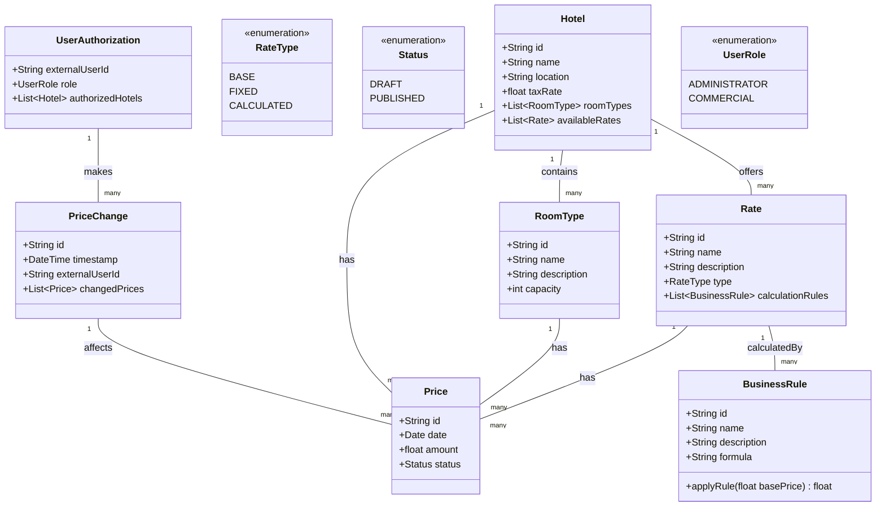

# Hotel Pricing System - Domain Model

This document presents the domain model for the Hotel Pricing System. The model captures the core entities and their relationships based on the requirements specified in the Architectural Drivers document.

## Class Diagram

## Domain Model Description

| Entity | Description |
|--------|-------------|
| Hotel | Represents a hotel in the AD&D chain. Each hotel has a unique identifier, name, location, and tax rate. A hotel contains multiple room types and offers multiple rates. |
| RoomType | Represents a type of room available in a hotel (e.g., Single, Double, Suite). Each room type has a unique identifier, name, description, and capacity. |
| Rate | Represents a pricing scheme offered by a hotel. Rates can be of three types: BASE (the foundational rate), FIXED (a rate with a set price), or CALCULATED (a rate derived from a base rate using business rules). |
| RateType | An enumeration that defines the different types of rates (BASE, FIXED, CALCULATED). |
| Price | Represents the actual price for a specific rate, room type, and date. Prices have a status (DRAFT or PUBLISHED). |
| Status | An enumeration that defines the status of a price (DRAFT during simulation, PUBLISHED when finalized). |
| BusinessRule | Represents a rule used to calculate a price from a base rate. Contains a formula and a method to apply the rule. |
| UserAuthorization | Represents the local authorization data for a user managed by the cloud identity service. Contains a reference to the external user ID, the user's role in the system, and which hotels they are authorized to manage. |
| UserRole | An enumeration that defines the roles a user can have (ADMINISTRATOR or COMMERCIAL). |
| PriceChange | Represents a record of a price change operation, including which user made the change, when it was made, and which prices were affected. |

## Relationships

- A Hotel contains multiple RoomTypes and offers multiple Rates.
- Each Rate has multiple Prices associated with it.
- Each RoomType has multiple Prices associated with it.
- A Hotel has multiple Prices across its RoomTypes and Rates.
- UserAuthorization records make multiple PriceChanges over time.
- Each PriceChange affects multiple Prices.
- A Rate may be calculated using multiple BusinessRules.

## Note on Cloud-Native User Management

In accordance with constraints CON-2 and CON-6 from the Architectural Drivers document, this domain model assumes that user identity management is handled by a cloud provider identity service. The UserAuthorization entity does not store user credentials or profile information but rather maintains application-specific authorization data linked to external user identities. Authentication is delegated to the cloud identity service, while the application maintains only the necessary authorization information. 