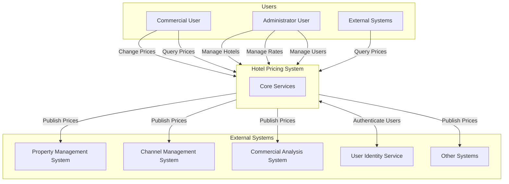
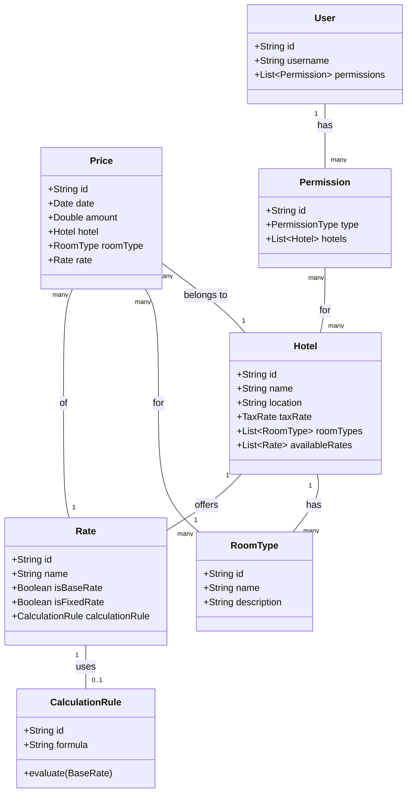
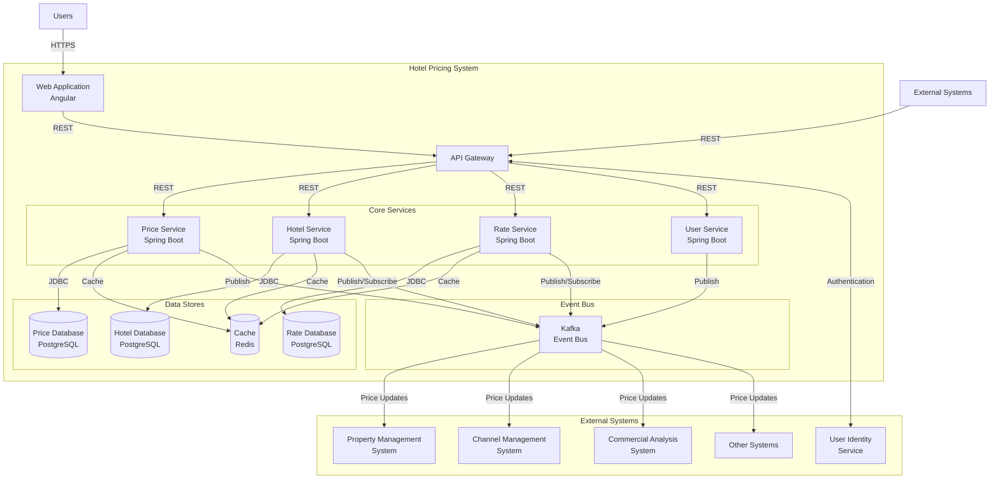
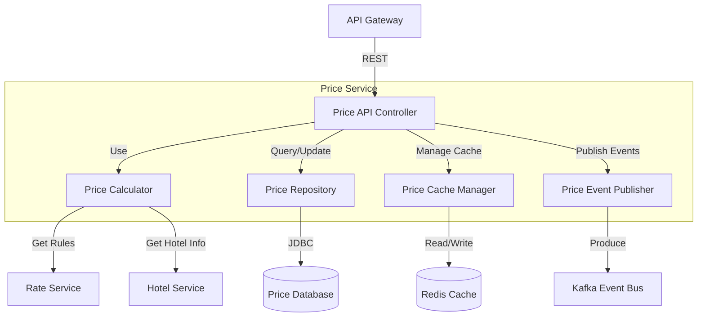
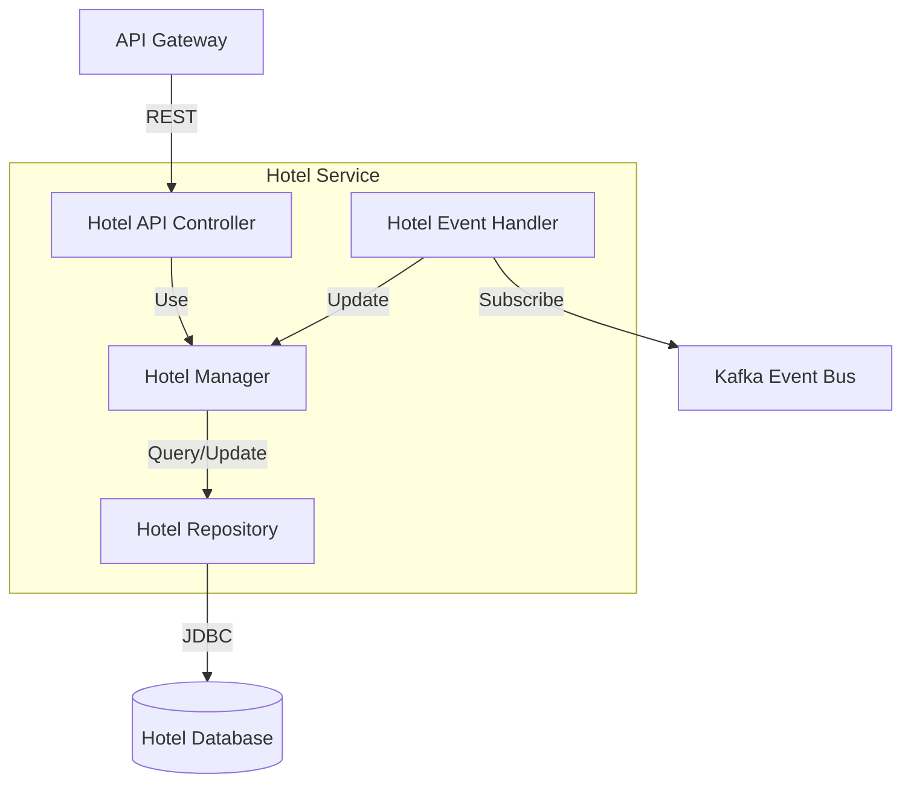
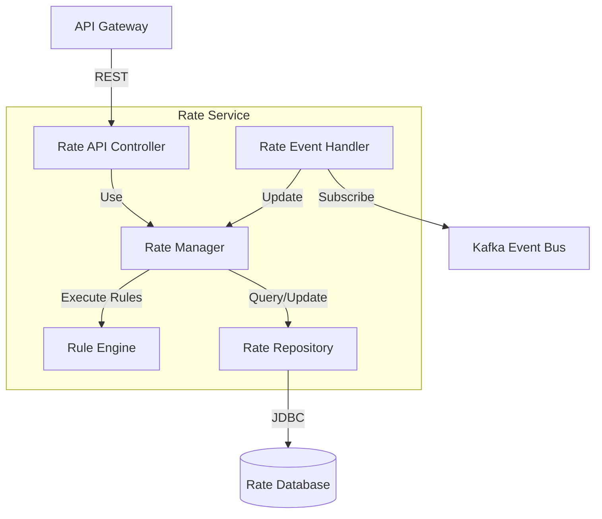
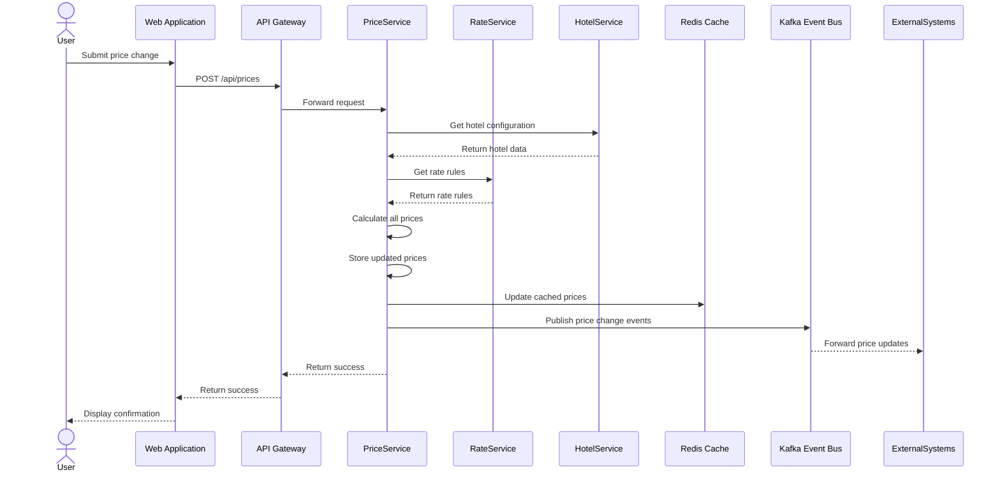
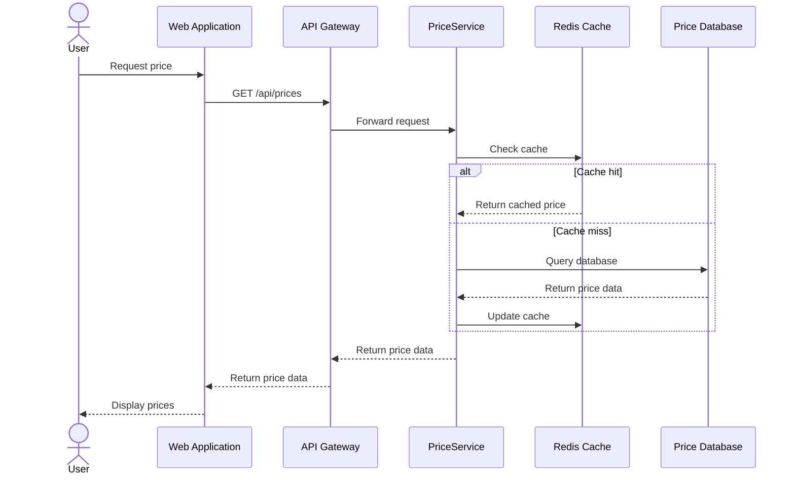

# Architecture Document for Hotel Pricing System (HPS)

## 1. Introduction

This document describes the architecture for the Hotel Pricing System (HPS) for AD&D Hotels. The architecture has been designed to address the business needs, functional requirements, quality attributes, and constraints outlined in the Architectural Drivers document.

The Hotel Pricing System is a critical component in AD&D Hotels' IT infrastructure that enables sales managers and commercial representatives to establish and manage room prices across the hotel chain. The system calculates prices for different rates and room types, and distributes these prices to other systems within the company's ecosystem.

## 2. Context Diagram

The following diagram illustrates the context of the Hotel Pricing System and its interactions with external systems:

## 3. Architectural Drivers

### User Stories

The primary user stories that drive the architecture are:

1. **HPS-1: Log In** - User authentication through the cloud provider's identity service
2. **HPS-2: Change Prices** - Core functionality to modify base/fixed rates and calculate derived rates
3. **HPS-3: Query Prices** - Allow users and external systems to retrieve current prices
4. **HPS-4: Manage Hotels** - Administrative functionality to maintain hotel data
5. **HPS-5: Manage Rates** - Administrative functionality to define rate calculation rules
6. **HPS-6: Manage Users** - Administrative functionality to manage user permissions

### Quality Attribute Scenarios

The primary quality attributes driving the architecture are:

1. **Performance (QA-1)** - Price calculations and publications completed in less than 100ms
2. **Reliability (QA-2)** - 100% successful publication of price changes
3. **Availability (QA-3)** - 99.9% uptime SLA for pricing queries
4. **Scalability (QA-4)** - Support for 100K to 1M price queries per day without significant performance degradation
5. **Security (QA-5)** - Proper authentication and authorization through the User Identity Service

Additional quality attributes include modifiability, testability, deployability, and monitorability.

### Constraints

Key constraints include:

1. **CON-1** - Web browser interface across multiple platforms/devices
2. **CON-2** - Cloud-hosted solution using cloud provider's identity service
3. **CON-3** - Integration with proprietary Git-based platform
4. **CON-4** - Delivery timeline of 6 months with 2-month MVP
5. **CON-5** - Initial REST API integration with potential for other protocols
6. **CON-6** - Cloud-native approach

### Architectural Concerns

1. **CRN-1** - Establish an overall initial system structure
2. **CRN-2** - Leverage team's knowledge of Java and Angular
3. **CRN-3** - Enable efficient allocation of work
4. **CRN-4** - Avoid technical debt
5. **CRN-5** - Set up continuous deployment infrastructure

## 4. Domain Model

### Domain Model Description

- **Hotel**: Represents a physical hotel property with its associated properties
- **RoomType**: Different types of rooms available at a hotel
- **Rate**: Different pricing rates offered (base rates, fixed rates, and calculated rates)
- **CalculationRule**: Business rules for calculating rates based on base rates
- **Price**: The actual price for a specific hotel, room type, rate, and date
- **User**: System users with permissions
- **Permission**: Access rights for specific hotels and operations

### Relationships

- A Hotel has many RoomTypes and offers many Rates
- A Rate may use a CalculationRule if it's not a fixed or base rate
- A Price belongs to a specific Hotel, RoomType, and Rate for a specific date
- A User has many Permissions which apply to specific Hotels

## 5. Container Diagram

### Container Responsibilities

1. **Web Application (Angular)**
   - Provides the user interface for all system functions
   - Implements responsive design for cross-platform compatibility
   - Communicates with backend services through the API Gateway

2. **API Gateway**
   - Single entry point for all client requests
   - Manages authentication and authorization with User Identity Service
   - Routes requests to appropriate microservices
   - Provides API documentation and discovery

3. **Price Service**
   - Manages price data for all hotels, room types, and rates
   - Implements price calculation business logic
   - Handles price queries and updates
   - Publishes price change events to the Event Bus

4. **Hotel Service**
   - Manages hotel information and room types
   - Provides hotel configuration operations
   - Reacts to events that impact hotel data

5. **Rate Service**
   - Manages rate definitions and calculation rules
   - Validates rate configurations
   - Publishes rate change events

6. **User Service**
   - Manages user permissions for hotels
   - Interfaces with the cloud provider's User Identity Service
   - Enforces access control at the application level

7. **Event Bus (Kafka)**
   - Enables asynchronous communication between services
   - Publishes price updates to external systems
   - Provides event sourcing capabilities for reliability

8. **Databases**
   - Separate databases for Price, Hotel, and Rate data
   - Ensures data isolation between services

9. **Cache (Redis)**
   - Improves query performance for frequently accessed data
   - Reduces database load for price queries

## 6. Component Diagrams

### Price Service Components

### Hotel Service Components

### Rate Service Components

## 7. Sequence Diagrams

### Change Price Sequence (HPS-2)

### Query Price Sequence (HPS-3)

## 8. Interfaces

### REST API Endpoints

| Endpoint | Method | Description | Authentication Required |
|----------|--------|-------------|------------------------|
| `/api/auth/login` | POST | Authenticate user | No |
| `/api/prices` | GET | Query prices | Yes (for admin features) |
| `/api/prices` | POST | Update prices | Yes |
| `/api/hotels` | GET | List hotels | Yes |
| `/api/hotels/{id}` | GET | Get hotel details | Yes |
| `/api/hotels` | POST | Create hotel | Yes (Admin) |
| `/api/hotels/{id}` | PUT | Update hotel | Yes (Admin) |
| `/api/rates` | GET | List rates | Yes |
| `/api/rates/{id}` | GET | Get rate details | Yes |
| `/api/rates` | POST | Create rate | Yes (Admin) |
| `/api/rates/{id}` | PUT | Update rate | Yes (Admin) |
| `/api/users/{id}/permissions` | GET | Get user permissions | Yes (Admin) |
| `/api/users/{id}/permissions` | PUT | Update user permissions | Yes (Admin) |

### Event Schemas

| Event | Schema | Description |
|-------|--------|-------------|
| `price-changed` | `{ hotelId, roomTypeId, rateId, date, amount }` | Published when a price is updated |
| `hotel-created` | `{ hotelId, name, ... }` | Published when a hotel is created |
| `hotel-updated` | `{ hotelId, changedFields, ... }` | Published when hotel data is updated |
| `rate-created` | `{ rateId, name, isFixed, ... }` | Published when a rate is created |
| `rate-updated` | `{ rateId, changedFields, ... }` | Published when rate data is updated |

## 9. Event Definitions

The system uses an event-driven architecture to decouple services and ensure reliable communication with external systems. Key events include:

1. **Price Events**
   - `price-changed`: Emitted when prices are modified
   - `price-calculated`: Internal event when derived rates are calculated
   - `price-published`: Emitted when prices are successfully published to external systems

2. **Hotel Events**
   - `hotel-created`: Emitted when a new hotel is added
   - `hotel-updated`: Emitted when hotel information is modified
   - `room-type-added`: Emitted when a room type is added to a hotel
   - `room-type-updated`: Emitted when room type information is modified

3. **Rate Events**
   - `rate-created`: Emitted when a new rate is defined
   - `rate-updated`: Emitted when rate information is modified
   - `calculation-rule-changed`: Emitted when a rate calculation rule is modified

## 10. Design Decisions

### Architectural Style: Microservices with Event-Driven Architecture

**Decision**: Adopt a microservices architecture with event-driven communication patterns

**Rationale**:
- Addresses QA-3 (Availability) by allowing services to operate independently
- Addresses QA-4 (Scalability) by enabling independent scaling of components
- Addresses QA-6 (Modifiability) by decoupling components
- Addresses CON-5 (Protocol support) by allowing different communication patterns
- Addresses CON-6 (Cloud-native approach) by following modern cloud architecture principles

### Technology Stack

**Decision**: Utilize Spring Boot for backend services, Angular for frontend, PostgreSQL for data storage, Redis for caching, and Kafka for event messaging

**Rationale**:
- Addresses CRN-2 by leveraging the team's Java and Angular knowledge
- Addresses QA-1 (Performance) through Redis caching
- Addresses QA-2 (Reliability) through Kafka's reliable messaging
- Addresses QA-7 (Deployability) through Spring Boot's containerization support

### Data Management

**Decision**: Implement database-per-service pattern with event sourcing for data consistency

**Rationale**:
- Addresses QA-3 (Availability) by eliminating single points of failure
- Addresses QA-6 (Modifiability) by decoupling data stores
- Avoids the anti-pattern of integration through shared database mentioned in the business case

### Authentication and Authorization

**Decision**: Utilize the cloud provider's User Identity Service with JWT tokens for authentication and role-based access control

**Rationale**:
- Addresses QA-5 (Security) by using established authentication mechanisms
- Addresses CON-2 by integrating with the cloud provider's identity service
- Enables Single Sign-On capabilities as mentioned in the business case

### Deployment Strategy

**Decision**: Implement containerization using Docker and orchestration with Kubernetes on the cloud provider's platform

**Rationale**:
- Addresses QA-7 (Deployability) through infrastructure as code
- Addresses QA-8 (Monitorability) through Kubernetes' monitoring capabilities
- Addresses CRN-5 by enabling continuous deployment infrastructure
- Addresses CON-6 by following cloud-native principles

### Cache Strategy

**Decision**: Implement Redis cache for frequently accessed price data

**Rationale**:
- Addresses QA-1 (Performance) by reducing database load
- Addresses QA-4 (Scalability) by enabling higher query throughput
- Enables the system to handle the specified 100K-1M queries per day

### API Gateway

**Decision**: Implement an API Gateway as the single entry point for client requests

**Rationale**:
- Addresses QA-5 (Security) by centralizing authentication
- Addresses QA-6 (Modifiability) by decoupling clients from service implementations
- Enables future support for different protocols (CON-5)
