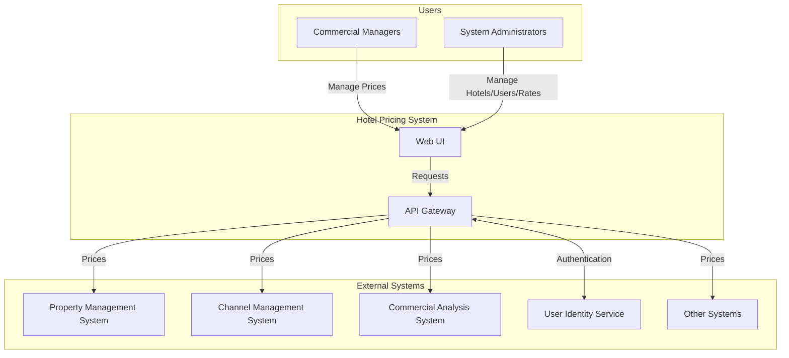
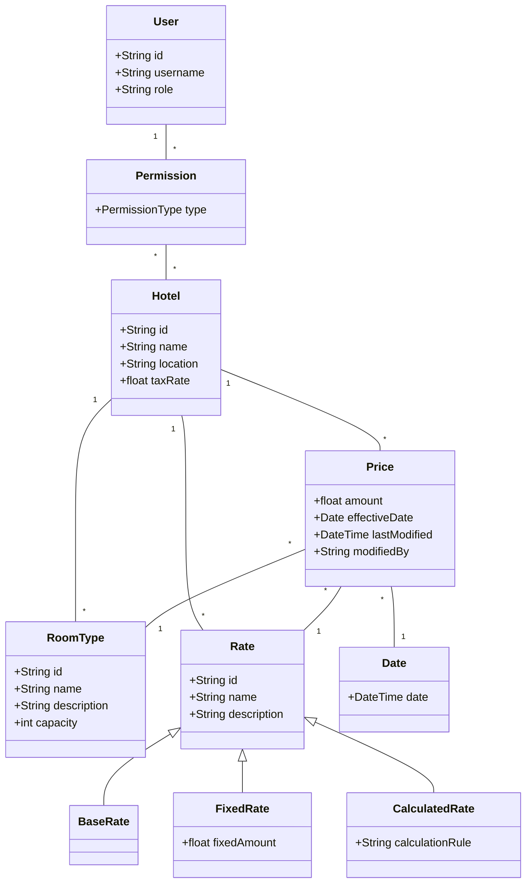
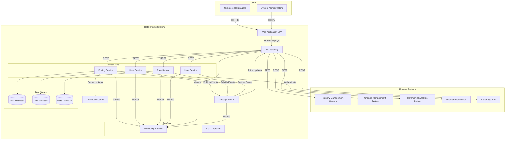
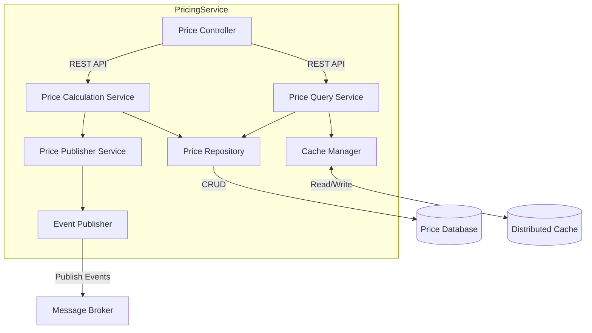
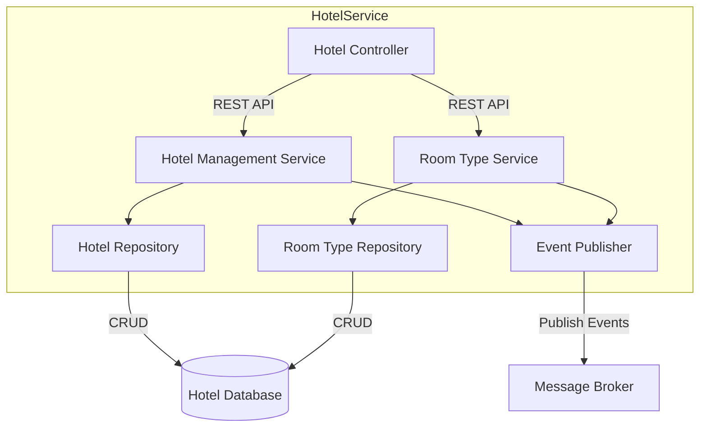
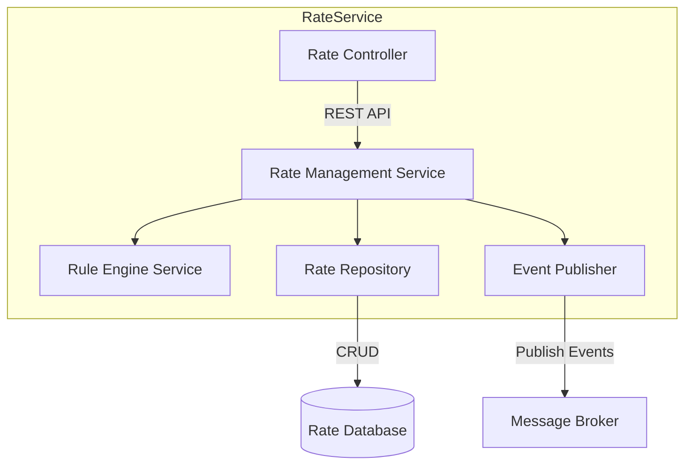
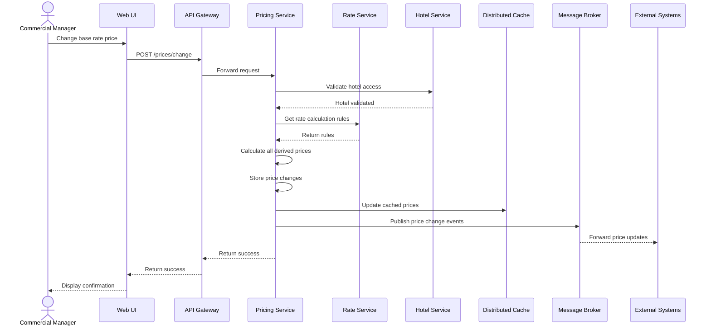
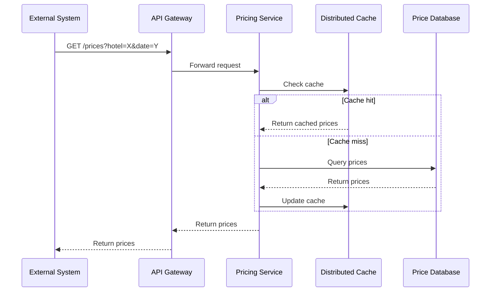

# Architecture Document

## 1. Introduction

This document describes the architecture design for AD&D Hotels' Hotel Pricing System (HPS). The HPS is a critical system responsible for establishing and managing room prices across all hotels in the company chain. The architecture is designed to address the key business needs and quality attribute requirements while adhering to the constraints specified by the stakeholders.

## 2. Context Diagram

## 3. Architectural Drivers

### User Stories

The primary user stories driving the architecture are:

1. **HPS-1: Log In** - Users authenticate through the system with credentials validated against the User Identity Service.
2. **HPS-2: Change Prices** - Users modify base or fixed rates for specific hotels and dates. The system calculates derivative prices and publishes them.
3. **HPS-3: Query Prices** - Users and external systems query hotel prices via UI or API.
4. **HPS-4: Manage Hotels** - Administrators manage hotel information including tax rates, available rates, and room types.
5. **HPS-5: Manage Rates** - Administrators define and modify rate calculation rules.
6. **HPS-6: Manage Users** - Administrators modify user permissions.

### Quality Attribute Scenarios

The primary quality attribute requirements are:

1. **Performance (QA-1)** - Price calculations and publication completed in <100ms.
2. **Reliability (QA-2)** - 100% of price changes successfully published and propagated.
3. **Availability (QA-3)** - 99.9% uptime SLA for pricing queries.
4. **Scalability (QA-4)** - Support 100,000 daily API queries, scalable to 1,000,000 with <20% latency increase.
5. **Security (QA-5)** - User authentication with appropriate access control.
6. **Modifiability (QA-6)** - Support for multiple API protocols without core component changes.
7. **Deployability (QA-7)** - Environment-agnostic deployment.
8. **Monitorability (QA-8)** - Comprehensive performance and reliability metrics collection.
9. **Testability (QA-9)** - Support for independent integration testing.

### Constraints

1. **CON-1** - Web-based interface compatible across multiple platforms and devices.
2. **CON-2** - Cloud-based hosting and identity service integration.
3. **CON-3** - Code hosted on the company's proprietary Git-based platform.
4. **CON-4** - Initial release in 6 months with MVP in 2 months.
5. **CON-5** - Initial REST API support with extensibility for other protocols.
6. **CON-6** - Cloud-native architecture approach.

### Architectural Concerns

1. **CRN-1** - Establish initial system structure.
2. **CRN-2** - Leverage team's Java and Angular expertise.
3. **CRN-3** - Enable effective team work allocation.
4. **CRN-4** - Avoid technical debt.
5. **CRN-5** - Establish continuous deployment infrastructure.

## 4. Domain Model

### Domain Model Description

| Entity | Description |
|--------|-------------|
| Hotel | Represents a physical hotel in the chain with details like name, location, and tax rates |
| RoomType | Different types of rooms available at a hotel (e.g., single, double, suite) |
| Rate | The different pricing rates that can be applied (base, fixed, calculated) |
| BaseRate | The foundational rate from which other rates may be calculated |
| FixedRate | A rate with a fixed price independent of the base rate |
| CalculatedRate | A rate derived from the base rate using business rules |
| Price | A specific price amount for a given room type, rate, and date |
| User | A system user (commercial manager or administrator) |
| Permission | Defines what actions a user can perform on which hotels |
| Date | Represents a calendar date for which prices are defined |

### Relationships

- A Hotel has multiple RoomTypes and Rates
- Each Rate can be a BaseRate, FixedRate, or CalculatedRate
- A Price is associated with a specific Hotel, RoomType, Rate, and Date
- Users have Permissions that determine which Hotels they can manage

## 5. Container Diagram

### Container Responsibilities

| Container | Responsibilities |
|-----------|------------------|
| Web Application (SPA) | Angular-based single-page application providing UI for all user interactions |
| API Gateway | Routes requests to appropriate microservices, handles protocol translation, API versioning, and serves as a facade for external systems |
| Pricing Service | Manages price calculations, price changes, and price queries |
| Hotel Service | Manages hotel information, room types, and related data |
| Rate Service | Handles rate definitions and calculation rules |
| User Service | Interfaces with User Identity Service for authentication and manages user permissions |
| Message Broker | Handles asynchronous event distribution between services and external systems |
| Distributed Cache | Caches frequently accessed pricing data to improve query performance |
| Databases | Persistent storage for pricing, hotel, and rate data |
| Monitoring System | Collects metrics and logs for system observability |
| CI/CD Pipeline | Automates building, testing, and deployment across environments |

## 6. Component Diagrams

### Pricing Service Components

### Hotel Service Components

### Rate Service Components

## 7. Sequence Diagrams

### Price Change Sequence

### Price Query Sequence

## 8. Interfaces

### REST API Endpoints

| Endpoint | Method | Description | Response Time SLA |
|----------|--------|-------------|-------------------|
| /api/auth/login | POST | Authenticate user | 500ms |
| /api/prices | GET | Query prices for specified criteria | 100ms |
| /api/prices | POST | Change prices | 100ms |
| /api/hotels | GET | List hotels | 200ms |
| /api/hotels | POST | Create hotel | 300ms |
| /api/hotels/{id} | PUT | Update hotel | 300ms |
| /api/rates | GET | List rates | 200ms |
| /api/rates | POST | Create rate | 300ms |
| /api/rates/{id} | PUT | Update rate | 300ms |
| /api/users/permissions | GET | Get user permissions | 200ms |
| /api/users/permissions | PUT | Update user permissions | 300ms |

### Event Messages

| Event Type | Description | Schema Reference |
|------------|-------------|------------------|
| price.changed | Published when prices are changed | PriceChangedEvent |
| price.published | Published when prices are available for querying | PricePublishedEvent |
| hotel.created | Published when a new hotel is created | HotelCreatedEvent |
| hotel.updated | Published when hotel information is updated | HotelUpdatedEvent |
| rate.created | Published when a new rate is created | RateCreatedEvent |
| rate.updated | Published when rate information is updated | RateUpdatedEvent |

## 9. Event Definitions

| Event | Attributes | Description |
|-------|------------|-------------|
| PriceChangedEvent | hotelId, roomTypeIds[], rateIds[], dates[], userId, timestamp | Fired when prices are changed by a user |
| PricePublishedEvent | hotelId, roomTypeIds[], rateIds[], dates[], timestamp | Fired when prices are available for external systems |
| HotelCreatedEvent | hotelId, hotelDetails, userId, timestamp | Fired when a new hotel is added to the system |
| HotelUpdatedEvent | hotelId, changedFields{}, userId, timestamp | Fired when hotel details are updated |
| RateCreatedEvent | rateId, rateDetails, userId, timestamp | Fired when a new rate is created |
| RateUpdatedEvent | rateId, changedFields{}, userId, timestamp | Fired when rate details are updated |

## 10. Design Decisions

This section describes the relevant design decisions that resulted in the current architecture.

| Driver | Decision | Rationale | Discarded Alternatives |
|--------|----------|-----------|------------------------|
| QA-1 (Performance), QA-4 (Scalability) | Implement distributed caching for price queries | Enables <100ms response times and supports handling 1M queries with minimal latency increase | Database-only approach would not meet performance requirements |
| QA-2 (Reliability), QA-3 (Availability) | Event-driven architecture with message broker | Decouples services, improves fault tolerance, enables high availability | Traditional request-response would propagate failures and reduce availability |
| QA-5 (Security) | Integrate with cloud provider identity service through adapter | Leverages existing enterprise SSO infrastructure while isolating its specifics from core services | Building custom authentication would violate CON-2 and increase development time |
| QA-6 (Modifiability) | API Gateway with protocol translation | Enables adding new protocols without modifying core services | Direct client-to-service communication would make protocol additions difficult |
| CON-2 (Cloud hosting), CON-6 (Cloud-native approach) | Containerized microservices with Kubernetes orchestration | Enables cloud-native deployment, scaling, and resilience | Monolithic architecture would not meet cloud-native requirements |
| CRN-2 (Team expertise) | Java (Spring Boot) backend with Angular frontend | Leverages team's existing knowledge for faster development | New technologies would create learning curve and slow development |
| QA-7 (Deployability), CRN-5 (CI/CD) | Infrastructure as Code with environment-specific configuration | Enables consistent deployments across environments without code changes | Manual configuration would be error-prone and slow |
| QA-8 (Monitorability) | Distributed tracing and centralized metrics collection | Provides comprehensive visibility into system performance and reliability | Isolated monitoring per service would not provide end-to-end visibility |
| QA-9 (Testability) | Service virtualization for external dependencies | Enables testing without real external systems | Direct dependency on external systems would complicate testing |
| CON-4 (Delivery timeline) | Incremental development starting with core pricing functionality | Enables MVP delivery in 2 months while building foundation for full system | Big-bang approach would risk missing the MVP milestone |
