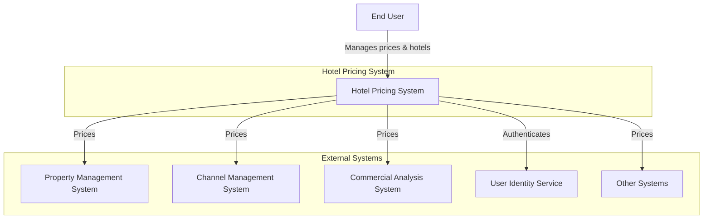
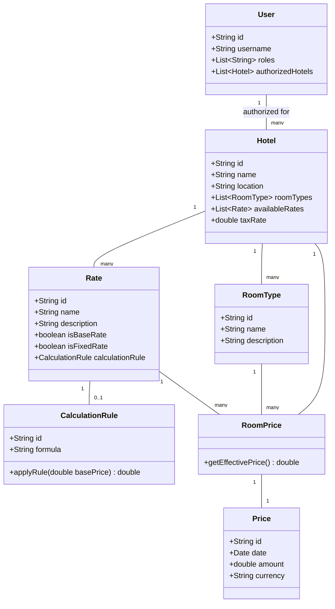
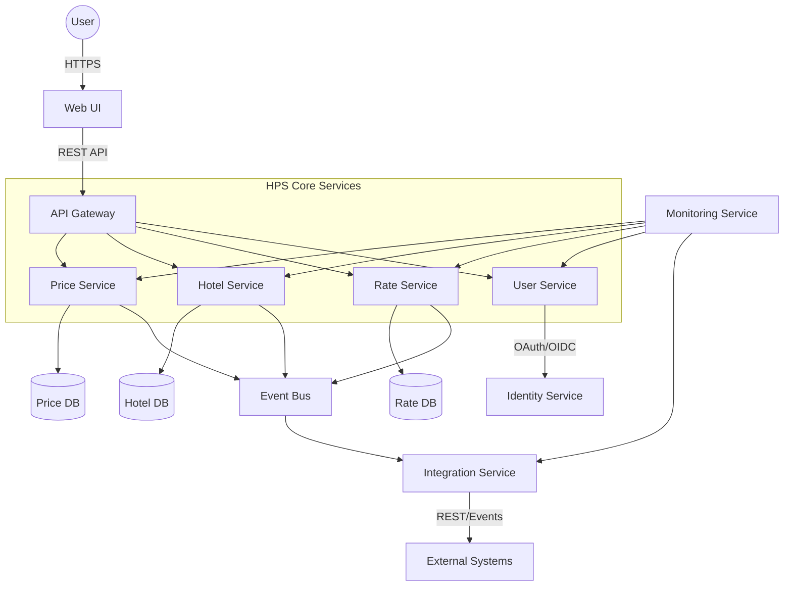
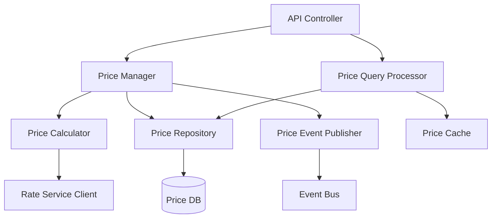
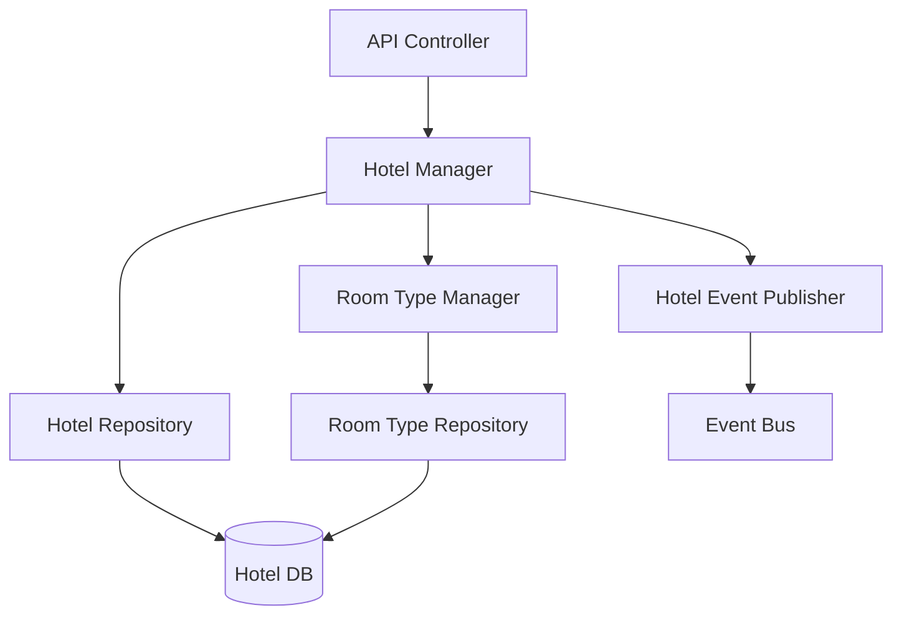
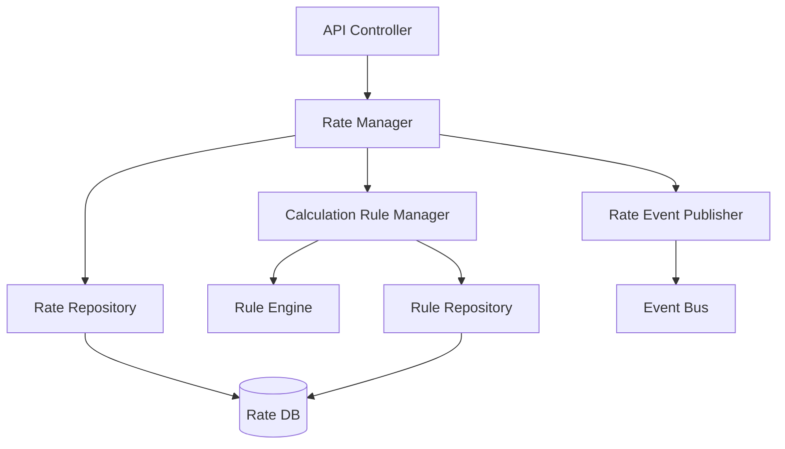
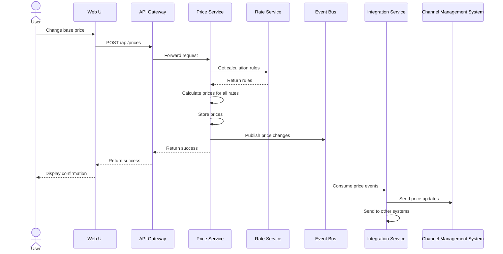
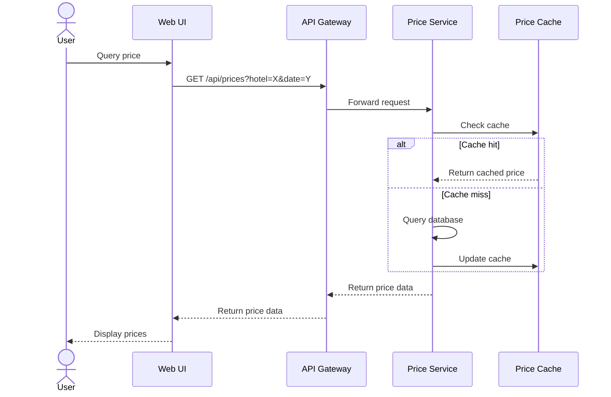

# Architecture Document for Hotel Pricing System (HPS)

## 1. Introduction

The Hotel Pricing System (HPS) is a critical application for AD&D Hotels, designed to replace the existing pricing system that has been experiencing reliability, performance, availability, and maintainability issues. This document outlines the architecture for the new HPS, which will allow sales managers and commercial representatives to establish prices for rooms at specific dates across the hotel chain.

The architecture is designed to meet the high-performance, reliability, scalability, and availability requirements while facilitating the company's transition toward a more decoupled system model. It embraces cloud-native principles and supports the organization's DevOps and Agile practices.

## 2. Context Diagram

## 3. Architectural Drivers

### User Stories

| ID     | Description                                                   | Priority |
|--------|---------------------------------------------------------------|----------|
| HPS-1  | Log In - Authenticate users via identity service              | Medium   |
| HPS-2  | Change Prices - Update and simulate price changes             | High     |
| HPS-3  | Query Prices - Retrieve prices via UI or API                  | High     |
| HPS-4  | Manage Hotels - Add/modify hotel information                  | High     |
| HPS-5  | Manage Rates - Add/modify rates and calculation rules         | Medium   |
| HPS-6  | Manage Users - Change user permissions                        | Medium   |

### Quality Attribute Scenarios

| ID    | Quality Attribute | Scenario                                                                       | Priority |
|-------|------------------|-------------------------------------------------------------------------------|----------|
| QA-1  | Performance      | Prices calculated and published in under 100ms after base rate change          | High     |
| QA-2  | Reliability      | 100% of price changes successfully published and received by CMS               | High     |
| QA-3  | Availability     | 99.9% uptime SLA for pricing queries outside maintenance windows               | High     |
| QA-4  | Scalability      | Support 100K-1M daily API queries with max 20% latency increase                | High     |
| QA-5  | Security         | Users only access authorized functions after identity validation               | High     |
| QA-6  | Modifiability    | New protocol endpoints can be added without core component changes             | Medium   |
| QA-7  | Deployability    | Move between environments without code changes                                 | Medium   |
| QA-8  | Monitorability   | Track performance and reliability metrics of price publication                 | Medium   |
| QA-9  | Testability      | Support integration testing independent of external systems                    | Medium   |

### Constraints

| ID     | Constraint                                                                    |
|--------|-------------------------------------------------------------------------------|
| CON-1  | Support web browser interface across Windows, OSX, Linux, and various devices |
| CON-2  | Use cloud provider identity service and cloud hosting                         |
| CON-3  | Host code on company's proprietary Git-based platform                         |
| CON-4  | Deliver MVP in 2 months and full release in 6 months                          |
| CON-5  | Initially support REST APIs, with potential for other protocols later         |
| CON-6  | Implement cloud-native approach                                               |

### Architectural Concerns

| ID     | Concern                                         |
|--------|------------------------------------------------|
| CRN-1  | Establish an overall initial system structure   |
| CRN-2  | Leverage team's Java and Angular knowledge      |
| CRN-3  | Allocate work to development team members       |
| CRN-4  | Avoid introducing technical debt                |
| CRN-5  | Set up continuous deployment infrastructure     |

## 4. Domain Model

### Class Diagram

### Domain Model Description

| Entity           | Description                                                                               |
|------------------|-------------------------------------------------------------------------------------------|
| Hotel            | Represents a hotel property with its basic information, room types, and available rates    |
| RoomType         | Defines a type of room available in a hotel (e.g., Standard, Suite, Deluxe)               |
| Rate             | Represents a pricing rate (base rate, fixed rate, or calculated rate)                     |
| CalculationRule  | Defines how a calculated rate is derived from the base rate                               |
| Price            | Represents a specific price amount for a given date                                       |
| RoomPrice        | Associates a price with a specific room type, rate, and hotel                             |
| User             | Represents a system user with roles and authorized hotels                                 |

### Relationships

- A Hotel has multiple RoomTypes, Rates, and RoomPrices
- Each Rate can be a base rate, fixed rate, or calculated rate (with a CalculationRule)
- RoomPrice links a specific RoomType, Rate, and Hotel to a Price
- Users have authorization to manage specific Hotels

## 5. Container Diagram

### Container Responsibilities

| Container           | Responsibilities                                                                        |
|---------------------|-----------------------------------------------------------------------------------------|
| Web UI              | Angular-based frontend providing user interface for all system functions                |
| API Gateway         | Routes requests, handles API versioning, authentication, rate limiting, and caching     |
| Price Service       | Manages price calculations, changes, and queries                                        |
| Hotel Service       | Manages hotel information, room types, and hotel-specific settings                      |
| Rate Service        | Manages rate definitions and calculation rules                                          |
| User Service        | Manages user authorization and handles integration with identity service                |
| Integration Service | Handles communication with external systems, protocol translation, and event publishing |
| Event Bus           | Provides asynchronous communication between services                                    |
| Monitoring Service  | Collects metrics, logs, and traces for monitoring system performance and reliability    |
| Databases           | Store service-specific data                                                             |
| Identity Service    | External cloud provider's service for authentication                                    |

## 6. Component Diagrams

### Price Service Components

| Component            | Responsibilities                                                           |
|----------------------|----------------------------------------------------------------------------|
| API Controller       | Exposes REST endpoints for price management and queries                     |
| Price Manager        | Orchestrates price changes, calculation, and publication                    |
| Price Calculator     | Applies calculation rules to determine prices for all rates                 |
| Price Query Processor| Optimizes and handles price queries with caching for high performance       |
| Price Repository     | Manages database operations for prices                                      |
| Price Event Publisher| Publishes price change events to the event bus                              |
| Price Cache          | Provides in-memory caching for frequently accessed prices                   |
| Rate Service Client  | Communicates with Rate Service to fetch calculation rules                   |

### Hotel Service Components

| Component            | Responsibilities                                                           |
|----------------------|----------------------------------------------------------------------------|
| API Controller       | Exposes REST endpoints for hotel management                                |
| Hotel Manager        | Orchestrates hotel creation, updates, and queries                          |
| Room Type Manager    | Manages room types for hotels                                              |
| Hotel Repository     | Manages database operations for hotels                                      |
| Room Type Repository | Manages database operations for room types                                  |
| Hotel Event Publisher| Publishes hotel change events to the event bus                             |

### Rate Service Components

| Component               | Responsibilities                                                        |
|-------------------------|-------------------------------------------------------------------------|
| API Controller          | Exposes REST endpoints for rate management                              |
| Rate Manager            | Orchestrates rate creation, updates, and queries                        |
| Calculation Rule Manager| Manages calculation rules for rates                                     |
| Rule Engine             | Evaluates calculation rules                                             |
| Rate Repository         | Manages database operations for rates                                    |
| Rule Repository         | Manages database operations for calculation rules                        |
| Rate Event Publisher    | Publishes rate change events to the event bus                           |

## 7. Sequence Diagrams

### Change Price Sequence (HPS-2)

This sequence diagram shows the flow when a user changes a base price. The Price Service calculates all derived prices using rules from the Rate Service, then publishes the changes via the Event Bus. The Integration Service consumes these events and forwards the updates to external systems like the Channel Management System.

### Query Price Sequence (HPS-3)

This sequence diagram illustrates how price queries are processed. The system first checks the cache for the requested price data. If found, it returns the cached data immediately, ensuring the sub-100ms response time. If not in cache, it retrieves from the database and updates the cache for future queries.

## 8. Interfaces

### External API Interfaces

| Interface | Type | Description | Endpoint Pattern |
|-----------|------|-------------|------------------|
| Price API | REST | Allows querying and changing prices | GET /api/v1/prices POST /api/v1/prices GET /api/v1/prices/{id} |
| Hotel API | REST | Manages hotel information | GET /api/v1/hotels POST /api/v1/hotels PUT /api/v1/hotels/{id} |
| Rate API | REST | Manages rates and calculation rules | GET /api/v1/rates POST /api/v1/rates PUT /api/v1/rates/{id} |
| User API | REST | Manages user permissions | GET /api/v1/users PUT /api/v1/users/{id}/permissions |

### Internal Component Interfaces

| Service | Interface | Description |
|---------|-----------|-------------|
| Price Service | IPriceCalculator | Calculates prices based on base rates and rules |
| Price Service | IPriceRepository | Manages price persistence |
| Rate Service | IRateManager | Manages rate definitions |
| Rate Service | ICalculationRuleEngine | Evaluates price calculation rules |
| Integration Service | IEventConsumer | Consumes events from the Event Bus |
| Integration Service | IExternalSystemAdapter | Adapts events for external system protocols |

## 9. Event Definitions

| Event | Properties | Publisher | Subscribers | Description |
|-------|------------|-----------|-------------|-------------|
| PriceChanged | hotelId, roomTypeId, rateId, date, newPrice | Price Service | Integration Service | Published when a price is changed |
| HotelChanged | hotelId, changeType, details | Hotel Service | Price Service, Integration Service | Published when hotel information changes |
| RateChanged | rateId, hotelId, changeType, details | Rate Service | Price Service, Integration Service | Published when a rate or calculation rule changes |

## 10. Design Decisions

| Driver | Decision | Rationale | Discarded Alternatives |
|--------|----------|-----------|------------------------|
| QA-1, QA-4 | Implement caching in Price Service | Caching frequently accessed prices ensures sub-100ms response time and supports high query volume | Database-only approach, which would not meet performance requirements |
| QA-2, QA-3 | Event-driven architecture with reliable messaging | Ensures reliable delivery of price updates and helps maintain system availability | Direct synchronous API calls between systems, which could lead to cascading failures |
| QA-3, QA-4 | Microservices architecture with independent scaling | Allows different components to scale according to their specific loads | Monolithic architecture, which would limit scalability and availability |
| QA-5, CON-2 | Integrate with cloud provider's identity service | Leverages cloud capabilities for secure authentication | Custom authentication system, which would increase development time |
| QA-6, CON-5 | API Gateway with protocol translation | Allows adding new protocol support without changing core services | Direct client-to-service communication, which would require protocol support in each service |
| QA-7, CRN-5 | Containerization with Kubernetes | Facilitates deployment across environments and supports DevOps practices | Traditional VM deployment, which would be less flexible |
| QA-8, QA-9 | Comprehensive monitoring and testing infrastructure | Ensures system performance can be tracked and components tested independently | Ad-hoc monitoring and testing, which would not provide consistent insights |
| CRN-2 | Java-based backend with Angular frontend | Leverages team's existing knowledge | Alternative technologies that would require training |
| CRN-4 | Clean architecture with separation of concerns | Avoids technical debt by clearly separating responsibilities | Shortcuts in design that might speed initial development but cause maintenance issues |