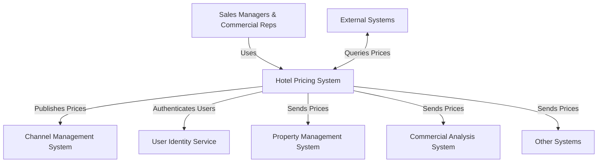
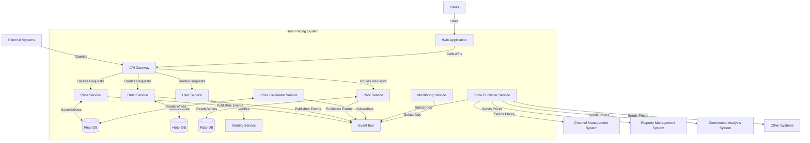
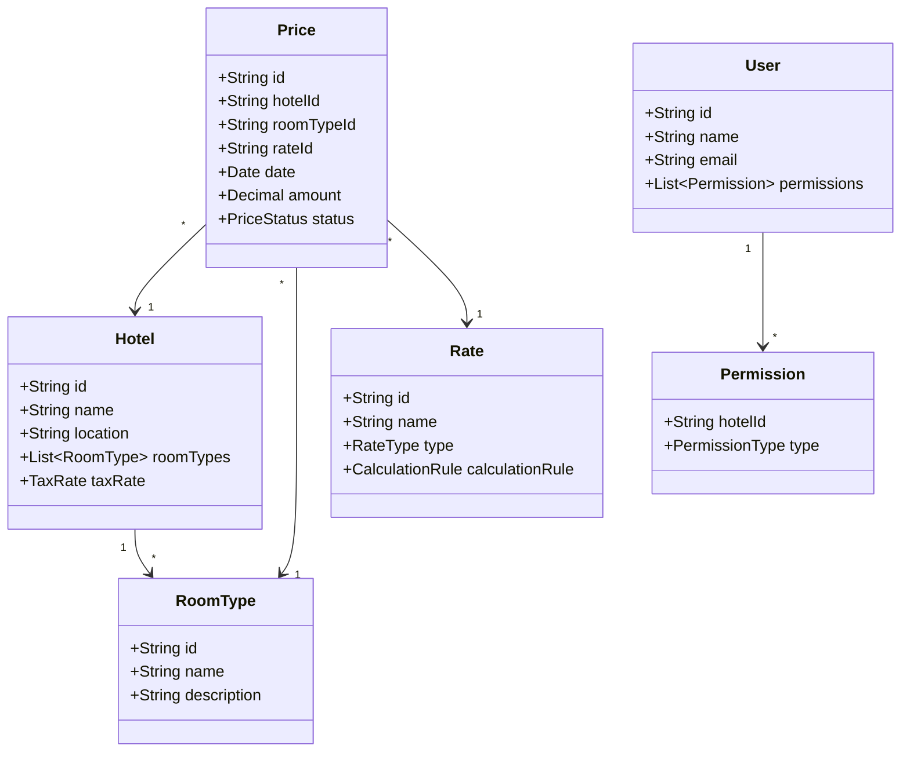
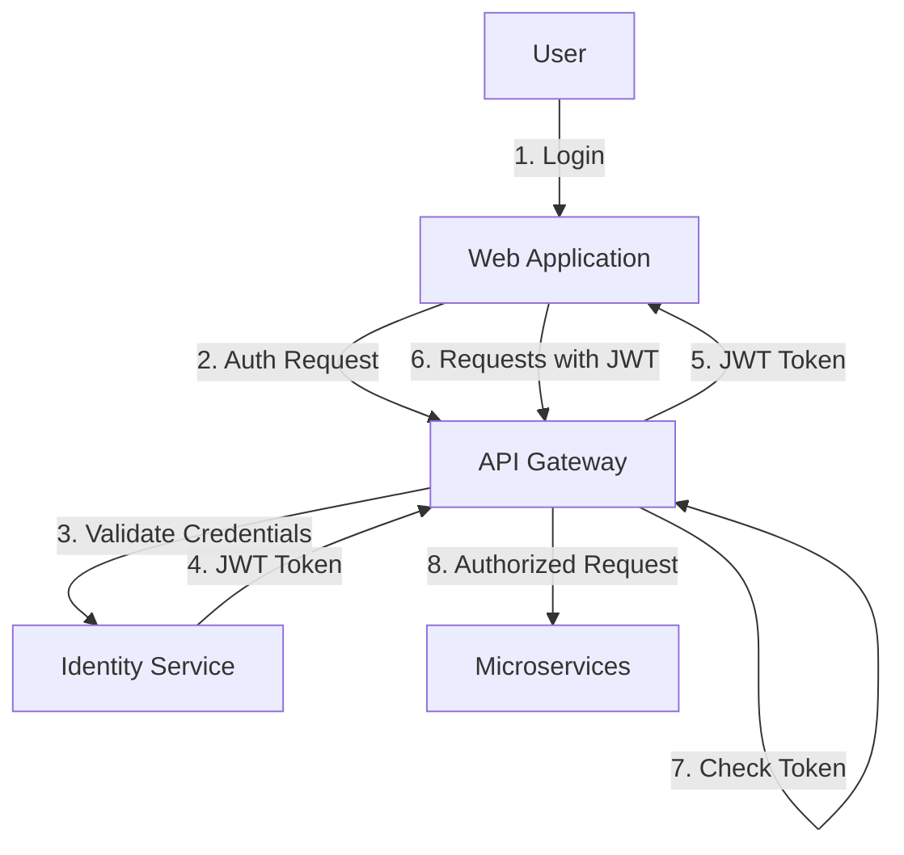
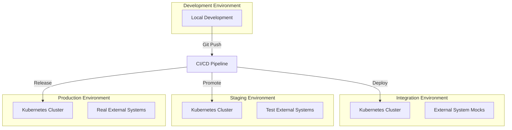

# Hotel Pricing System (HPS) Architecture

## 1. Introduction

This document describes the architecture for the Hotel Pricing System (HPS) for AD&D Hotels. The architecture has been designed to address the key business drivers, functional requirements, quality attributes, and constraints specified in the requirements document.

## 2. Architectural Approach

Based on the requirements, we have chosen an **Event-Driven Microservices Architecture** with a **Cloud-Native** approach. This architecture supports:

- Decoupling of system components to address the current integration issues
- High availability, reliability, and performance requirements
- Scalability for handling variable loads
- Simplified deployment and maintenance processes

## 3. High-Level Architecture

### 3.1 System Context

### 3.2 Container Diagram

## 4. Component Architecture

### 4.1 Web Application

A Single Page Application (SPA) built with Angular, providing user interfaces for:
- Hotel price management
- Hotel configuration management
- Rate management
- User management

### 4.2 API Gateway

Acts as a single entry point for client-side applications and external systems, providing:
- Request routing
- Protocol translation
- Authentication and authorization
- Rate limiting
- Request/response logging

### 4.3 Core Services

#### 4.3.1 Price Service
- Handles price modification requests
- Manages price data
- Publishes price change events

#### 4.3.2 Hotel Service
- Manages hotel information
- Handles hotel configurations
- Publishes hotel update events

#### 4.3.3 Rate Service
- Manages rate definitions
- Defines calculation rules
- Publishes rate update events

#### 4.3.4 User Service
- Manages user permissions
- Integrates with Identity Service
- Enforces hotel-level access control

### 4.4 Supporting Services

#### 4.4.1 Price Calculator Service
- Subscribes to price, hotel, and rate events
- Calculates derived prices based on business rules
- Publishes calculated price events

#### 4.4.2 Price Publisher Service
- Subscribes to price events
- Distributes prices to external systems
- Ensures reliable delivery
- Handles protocol transformations

#### 4.4.3 Monitoring Service
- Collects metrics from all services
- Provides operational insights
- Tracks performance and reliability metrics

## 5. Data Architecture

### 5.1 Data Model

### 5.2 Database Strategy

- Each microservice has its own database to ensure loose coupling
- PostgreSQL for relational data (Hotels, Rates, Users)
- Redis for caching frequently accessed data (Price queries)
- Event sourcing pattern for tracking price changes

## 6. Technology Stack

### 6.1 Backend
- Java with Spring Boot for microservices
- Spring Cloud for cloud-native patterns
- Spring Data JPA for data access
- Spring Security for authentication/authorization

### 6.2 Frontend
- Angular framework (as per CRN-2)
- Material UI for responsive design
- Redux for state management

### 6.3 Infrastructure
- Containerization with Docker
- Orchestration with Kubernetes
- Message broker: Apache Kafka for event bus
- API Gateway: Spring Cloud Gateway
- Service Mesh: Istio for advanced networking

### 6.4 DevOps
- CI/CD: Jenkins pipelines
- Infrastructure as Code: Terraform
- Monitoring: Prometheus and Grafana
- Logging: ELK Stack (Elasticsearch, Logstash, Kibana)

## 7. Cross-Cutting Concerns

### 7.1 Security

- JWT-based authentication
- Role-based access control
- Hotel-level permissions
- HTTPS for all communications
- Secrets management with a secure vault

### 7.2 Resilience

- Circuit breaker patterns to prevent cascading failures
- Retry mechanisms with exponential backoff
- Rate limiting to protect against traffic spikes
- Graceful degradation when external systems are unavailable
- Distributed tracing for issue identification

### 7.3 Scalability

- Horizontal scaling of individual services
- Auto-scaling based on traffic patterns
- Database read replicas for query-heavy services
- Caching for frequently accessed data
- Asynchronous processing for non-critical operations

## 8. Deployment Architecture

- Containerized deployment in Kubernetes
- Blue/Green deployment strategy for zero-downtime updates
- Infrastructure as Code for environment consistency
- Automated testing at all stages of the pipeline
- Canary releases for risk reduction

## 9. How the Architecture Addresses Requirements

### 9.1 Functional Requirements

| Requirement | Architectural Support |
|-------------|----------------------|
| HPS-1: Log In | Integration with User Identity Service via User Service |
| HPS-2: Change Prices | Price Service with event publication, calculation via Price Calculator |
| HPS-3: Query Prices | API Gateway with caching for high-performance queries |
| HPS-4: Manage Hotels | Hotel Service with dedicated API and database |
| HPS-5: Manage Rates | Rate Service with business rule management |
| HPS-6: Manage Users | User Service with permission management |

### 9.2 Quality Attributes

| Quality Attribute | Architectural Support |
|-------------------|----------------------|
| QA-1: Performance | Event-driven architecture, caching, asynchronous processing |
| QA-2: Reliability | Guaranteed message delivery, event sourcing, retry mechanisms |
| QA-3: Availability | Kubernetes orchestration, multiple replicas, circuit breakers |
| QA-4: Scalability | Horizontal scaling, auto-scaling, microservices isolation |
| QA-5: Security | JWT authentication, RBAC, hotel-level permissions |
| QA-6: Modifiability | Microservices isolation, API Gateway with protocol translation |
| QA-7: Deployability | Containerization, CI/CD automation, environment parity |
| QA-8: Monitorability | Centralized logging, metrics collection, distributed tracing |
| QA-9: Testability | Service isolation, mock integration, contract testing |

### 9.3 Constraints

| Constraint | Architectural Support |
|------------|----------------------|
| CON-1: Cross-platform web access | Angular SPA with responsive design |
| CON-2: Cloud hosting & identity | Cloud-native design with Identity Service integration |
| CON-3: Git platform | CI/CD integration with Git-based workflows |
| CON-4: Delivery timeline | Microservices allowing parallel development and incremental delivery |
| CON-5: Protocol support | API Gateway with protocol translation capabilities |
| CON-6: Cloud-native approach | Containerization, orchestration, managed services |

### 9.4 Architectural Concerns

| Concern | Architectural Support |
|---------|----------------------|
| CRN-1: System structure | Well-defined microservices with clear boundaries |
| CRN-2: Java & Angular | Technology stack selection aligned with team skills |
| CRN-3: Work allocation | Independent services allowing team allocation by domain |
| CRN-4: Technical debt | Clean architecture, automated testing, code quality tools |
| CRN-5: Continuous deployment | CI/CD pipeline with automated testing and deployment |

## 10. Implementation Strategy

### 10.1 Phased Approach

**Phase 1 (MVP - 2 months):**
- Core price management functionality
- Basic hotel management
- Essential API endpoints for price queries
- Simple UI for price changes
- Minimal integration with external systems

**Phase 2 (4 months):**
- Complete rate management
- Advanced calculation rules
- Full integration with all external systems
- Comprehensive UI
- Advanced monitoring and operations

### 10.2 Development Priorities

1. Set up CI/CD pipeline and infrastructure
2. Develop Price Service and Price Calculator
3. Create basic UI for price management
4. Implement API Gateway for price queries
5. Develop Hotel and Rate Services
6. Build monitoring and reliability features
7. Enhance security and access control

## 11. Conclusion

The proposed event-driven microservices architecture provides a robust solution for the Hotel Pricing System that addresses all functional requirements, quality attributes, and constraints. The architecture's focus on decoupling, event-driven communication, and cloud-native design principles will enable AD&D Hotels to overcome the challenges with their existing system while providing a foundation for future growth and enhancements. 