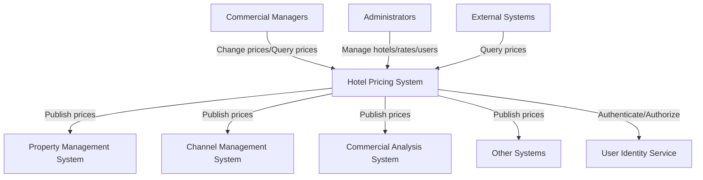
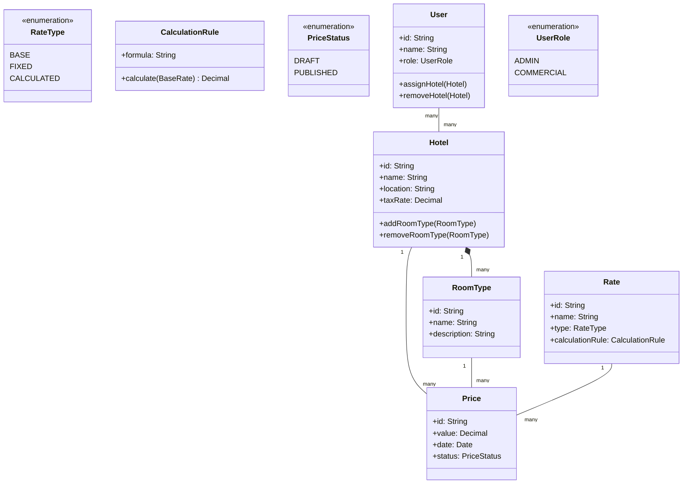
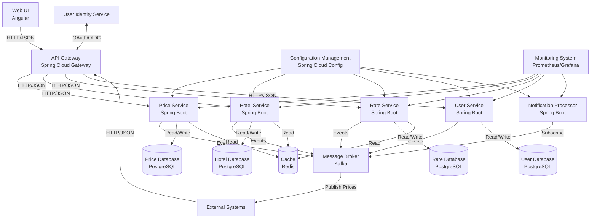
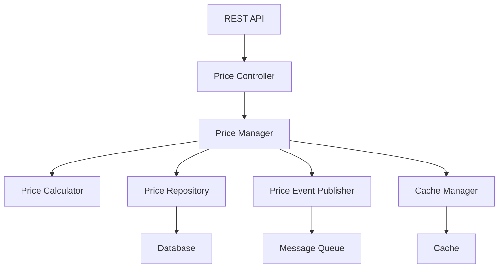
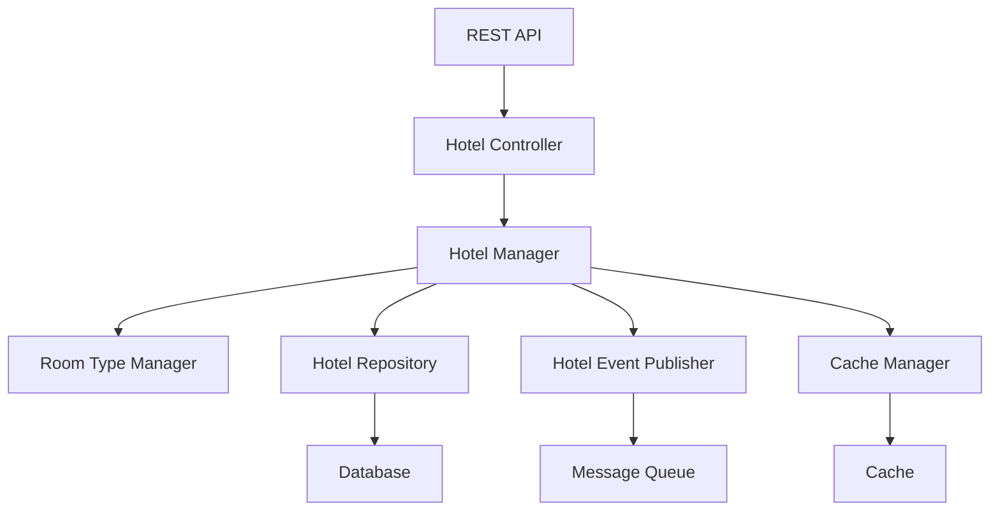
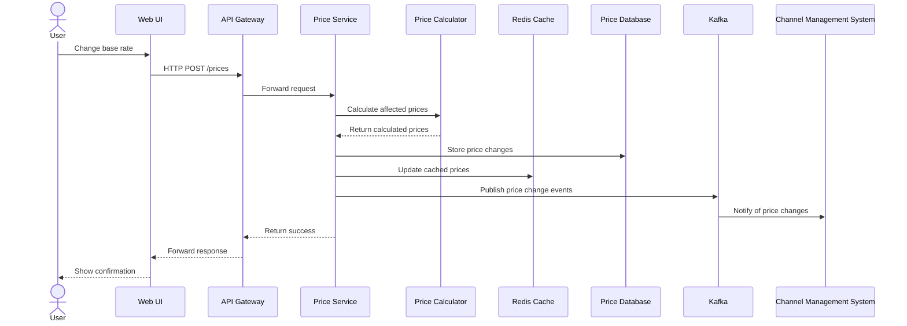
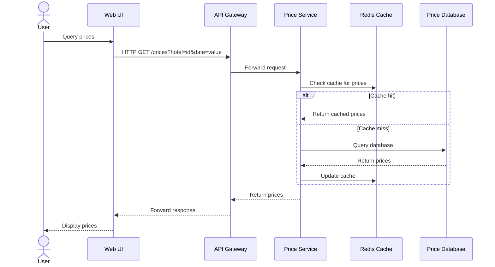

# Architecture Document

## 1. Introduction

This document presents the architectural design for the Hotel Pricing System (HPS) for AD&D Hotels. The system will replace the existing pricing system, addressing current reliability, performance, availability, and maintainability issues.

The architecture is designed to satisfy the functional requirements and quality attributes specified in the requirements document, while considering the identified constraints and concerns.

## 2. Context Diagram

The HPS interacts with several external systems and users as depicted in the following context diagram:

## 3. Architectural Drivers

### User Stories

The primary user stories driving the architecture design are:

1. **HPS-1: Log In** - Users authenticate through the User Identity Service
2. **HPS-2: Change Prices** - Users modify base or fixed rates for specific hotels and dates
3. **HPS-3: Query Prices** - Users and external systems query hotel prices
4. **HPS-4: Manage Hotels** - Administrators manage hotel information
5. **HPS-5: Manage Rates** - Administrators define and modify rates
6. **HPS-6: Manage Users** - Administrators manage user permissions

The primary user stories identified as highest priority are HPS-2, HPS-3, and HPS-4.

### Quality Attribute Scenarios

The primary quality attributes driving the architecture are:

1. **Performance (QA-1)**: Price changes must be published in less than 100ms
2. **Reliability (QA-2)**: 100% of price changes must be published successfully
3. **Availability (QA-3)**: 99.9% uptime SLA for pricing queries
4. **Scalability (QA-4)**: Support for up to 1,000,000 price queries per day
5. **Security (QA-5)**: User authentication and authorization

Additional quality attributes:
- **Modifiability (QA-6)**: Support for different protocols
- **Deployability (QA-7)**: Environment-independent deployment
- **Monitorability (QA-8)**: Performance and reliability monitoring
- **Testability (QA-9)**: Support for integration testing independent of external systems

### Constraints

1. **CON-1**: Web browser compatibility across platforms and devices
2. **CON-2**: Cloud-based hosting and identity service
3. **CON-3**: Proprietary Git-based platform for code hosting
4. **CON-4**: Initial release in 6 months, MVP in 2 months
5. **CON-5**: Initial REST API support with potential for other protocols
6. **CON-6**: Cloud-native approach

### Architectural Concerns

1. **CRN-1**: Establish initial system structure
2. **CRN-2**: Leverage team's knowledge of Java and Angular
3. **CRN-3**: Allocate work to team members
4. **CRN-4**: Avoid technical debt
5. **CRN-5**: Set up continuous deployment infrastructure

## 4. Domain Model

### Domain Model Description

- **Hotel**: Represents a hotel with its properties, including location and tax rate
- **RoomType**: Different types of rooms available in a hotel
- **Rate**: Different pricing rates (base, fixed, calculated)
- **CalculationRule**: Business rules for calculating derived rates
- **Price**: The actual price for a specific hotel, room, rate, and date
- **User**: System users with assigned roles and hotel permissions

### Relationships

- A Hotel has multiple RoomTypes
- A Hotel has multiple Prices for different dates, room types, and rates
- A Rate can be associated with multiple Prices
- Users are assigned to specific Hotels they can manage

## 5. Container Diagram

### Container Responsibilities

- **Web UI**: Angular-based frontend for user interaction
- **API Gateway**: Entry point for all client requests, handles routing, authentication, and load balancing
- **Services**:
  - **Price Service**: Core service for price management and calculations
  - **Hotel Service**: Manages hotel information, room types, and related data
  - **Rate Service**: Manages rate definitions and calculation rules
  - **User Service**: Manages user permissions for hotels
- **Message Broker**: Kafka for event-driven communication and price publication
- **Notification Processor**: Processes events and notifies external systems
- **Databases**: PostgreSQL databases for persistent storage, separated by domain
- **Cache**: Redis for caching frequently accessed data
- **Configuration Management**: Centralized configuration for all services
- **Monitoring System**: Prometheus and Grafana for system monitoring

## 6. Component Diagrams

### Price Service Components

### Hotel Service Components

## 7. Sequence Diagrams

### Price Change Sequence

### Price Query Sequence

## 8. Interfaces

The system provides the following interfaces:

1. **REST API for Web UI and External Systems**
   - `/api/v1/prices` - Price management
   - `/api/v1/hotels` - Hotel management
   - `/api/v1/rates` - Rate management
   - `/api/v1/users` - User management

2. **Event-Based Interface**
   - `price-changes` - Price change events for external systems
   - `hotel-updates` - Hotel information updates
   - `rate-updates` - Rate configuration updates

3. **Authentication Interface**
   - OAuth 2.0/OIDC integration with User Identity Service

## 9. Event Definitions

1. **PriceChanged**
   - `hotelId`: Hotel identifier
   - `roomTypeId`: Room type identifier
   - `rateId`: Rate identifier
   - `date`: Date of the price
   - `value`: New price value
   - `previousValue`: Previous price value
   - `timestamp`: Time of change
   - `userId`: User who made the change

2. **HotelUpdated**
   - `hotelId`: Hotel identifier
   - `changes`: Map of changed properties
   - `timestamp`: Time of change
   - `userId`: User who made the change

3. **RateUpdated**
   - `rateId`: Rate identifier
   - `changes`: Map of changed properties
   - `timestamp`: Time of change
   - `userId`: User who made the change

## 10. Design Decisions

1. **Microservices Architecture**
   - **Decision**: Adopt a microservices architecture
   - **Rationale**: Supports high availability, scalability, independent deployment, and enables compliance with QA-3, QA-4, QA-6, and QA-7
   - **Consequences**: Increased operational complexity, distributed transaction challenges

2. **Event-Driven Communication**
   - **Decision**: Use Kafka for event-driven communication between services and external systems
   - **Rationale**: Decouples systems, improves reliability, and addresses QA-2 and QA-3
   - **Consequences**: Eventual consistency model, potential message duplication

3. **Caching Strategy**
   - **Decision**: Implement Redis caching for frequently accessed price data
   - **Rationale**: Improves performance (QA-1), supports scalability (QA-4)
   - **Consequences**: Cache invalidation complexity, additional infrastructure

4. **API Gateway Pattern**
   - **Decision**: Implement an API Gateway as the single entry point
   - **Rationale**: Centralizes authentication, routing, and load balancing; supports QA-5, QA-6
   - **Consequences**: Potential single point of failure, requires high availability configuration

5. **Database per Service**
   - **Decision**: Each microservice has its own database
   - **Rationale**: Supports independent scaling and deployment, prevents coupling through shared database
   - **Consequences**: Data duplication, distributed query challenges

6. **Cloud-Native Deployment**
   - **Decision**: Deploy as containerized services with Kubernetes
   - **Rationale**: Supports CON-6, QA-7, enables horizontal scaling
   - **Consequences**: Additional complexity in infrastructure management

7. **Comprehensive Monitoring**
   - **Decision**: Implement distributed tracing, metrics collection, and logging
   - **Rationale**: Addresses QA-8, helps identify performance bottlenecks and reliability issues
   - **Consequences**: Additional infrastructure, potential performance impact

8. **Technology Stack**
   - **Decision**: Use Spring Boot for backend, Angular for frontend
   - **Rationale**: Aligns with team's expertise (CRN-2), supports required functionality
   - **Consequences**: Learning curve for team members not familiar with these technologies

