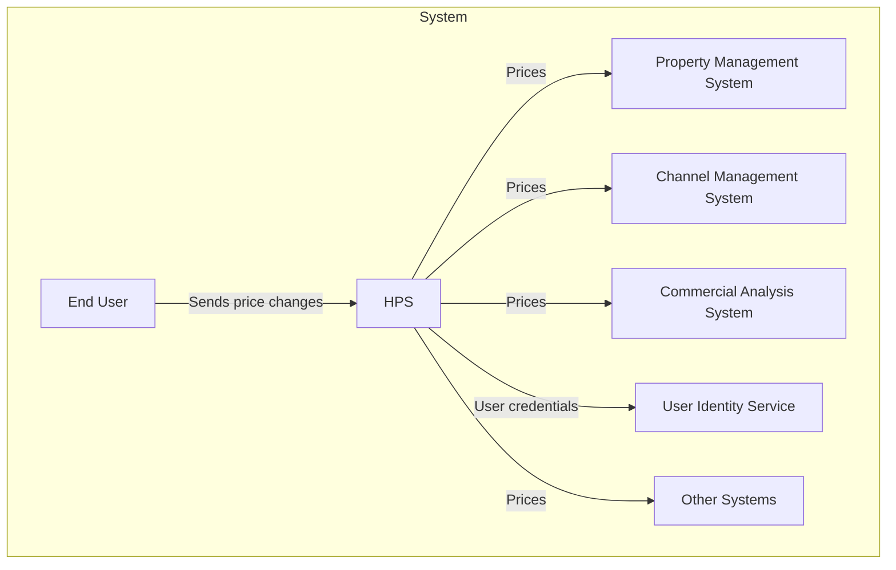

## Business Case

AD&D Hotels is a mid-sized business hotel chain (currently around 300 hotels) which has been experiencing robust growth in recent years. The IT infrastructure of the company is composed of many different applications such as a Property Management System, a Commercial Analysis System, an Enterprise Reservation System, a Channel Management System and, at the center of this system of systems, is the Hotel Pricing System, as seen in the following context diagram:

Context diagram for the Hotel Pricing System
   
The Hotel Pricing System (HPS) is used by sales managers and commercial representatives to establish prices for rooms at specific dates for the different hotels in the company. Prices are associated with different rates (for example a public rate, or a discount rate) and most of the prices for the different rates are calculated by taking a base rate and applying business rules to it (although some of the rates can also be fixed and not depend on the base rate). Managers typically change prices of the base and fixed rates, and using this information, the Hotel Pricing System calculates the prices of all the rates for all rooms in all hotels which also vary according to the types of rooms available in each hotel. Prices that are calculated by the HPS are used by other systems in the company to make reservations and they are also sent to different online travel agencies through the Channel Management System (CMS). The company’s systems are hosted with a cloud provider which offers a user identity service that manages users and provides Single Sign On functionalities.

AD&D Hotels wants to modernize its IT infrastructure, the first step being the complete replacement of the existing pricing system which was developed several years ago and is suffering from reliability, performance, availability and maintainability issues, and this has resulted in financial losses. Furthermore, the company has experienced difficulties because many of its systems are connected using traditional SOAP and REST request-response endpoints: changes to one application frequently impact other applications and complicate the deployment of individual updates to specific applications. Also, the failure of a particular application can propagate through the entire system. Furthermore, some of the applications interact using what are now well-known anti-patterns such as integration through a shared database. Recently revised Enterprise Architecture principles within the organization are mandating a migration of the system toward a more decoupled model.  

As part of the modernization effort, AD&D hotels also wants to integrate Agile (specifically Scrum) and DevOps practices in the development of the Hotel Pricing System. Artifacts in the development process move through four different environments:

-   Development: This is a local environment on the developers’ computers
-   Integration: This is an environment in the cloud where an integrated version of the HPS is tested. In this environment, the system is not connected with all of the external systems and so some of these external systems are substituted by mocks.
-   Staging: This is an environment in the cloud where the system’s final tests (including load testing) are performed prior to deployment. Here the system is connected to test versions of all the external systems. At the end of a sprint, the system is typically demonstrated from this environment.
 -   Production: This is the real-world execution environment.   

##  System Requirements

Requirement elicitation activities had been previously performed, and the following is a summary of the most important requirements collected.

### Primary functionality

The Hotel Pricing System’s functionality is conceptually simple; the main user stories for the system are shown using a Use Case diagram in Figure 8.2.

  
  

Figure 8.2: Initial Use Case Diagram for the Hotel Pricing System

  

Each of these user stories is described in the following table:

|User story  |Description  |
|--|--|
|HPS-1: Log In  |A user (commercial or administrator) provides their credentials in a login window. The system checks these credentials against a user identity service and, if successful, provides access to the system. Once logged in, a user can only make queries and changes to the hotels for which they have been authorized. |
|HPS-2: Change Prices|A user selects a specific hotel for which they are authorized to change prices and selects particular dates where they want to make price changes either to a base rate or a fixed rate. All of the prices for the rates that are calculated from the base rate are calculated at that point. The system allows price changes to be simulated before they are actually changed. When the prices are changed, they are pushed to the Channel Management System and they become available for querying by external systems.|
|HPS-3: Query Prices|A user or an external system queries prices for a given hotel through the user interface or a query API.|
|HPS-4: Manage Hotels|An administrator adds, changes or modifies hotel information. This includes editing the hotel’s tax rates, available rates, and room types.|
|HPS-5: Manage Rates|An administrator adds, changes or modifies rates. This includes defining the calculation business rules for the different rates.|
|HPS-6: Manage Users|An administrator changes permissions for a given user.|
 

### Quality attribute scenarios

In addition to the above use cases, a number of quality attribute scenarios were elicited and documented. The seven most relevant and important ones are presented in the following table. For each scenario we also identify the user story that it is associated with.

| ID  | Quality Attribute  | Scenario  | Associated User story  |
|---|---|---|---|
|QA-1|Performance|A base rate price is changed for a specific hotel and date during normal operation, the prices for all the rates and room types for the hotel are published (ready for query) in less than 100 ms.|HPS-2|
|QA-2|Reliability|A user performs multiple price changes on a given hotel. 100% of the price changes are published (available for query) successfully and they are also received by the channel management system.|HPS-2|
|QA-3|Availability|Pricing queries uptime SLA must be 99.9% outside of maintenance windows.|All|
|QA-4|Scalability|The system will initially support a minimum of 100,000 price queries per day through its API and should be capable of handling up to 1,000,000 without decreasing average latency by more than 20%.|HPS-3|
|QA-5|Security|A user logs into the system through the front-end. The credentials of the user are validated against the User Identity Service and, once logged in, they are presented with only the functions that they are authorized to use.|All|
|QA-6|Modifiability|Support for a price query endpoint with a different protocol than REST (e.g. gRPC) is added to the system. The new endpoint does not require changes to be made to the core components of the system.|All|
|QA-9|Testability|100% of the system and its elements should support integration testing independently of the external systems|All|
|QA-7|Deployability|The application is moved between non production environments as part of the development process. No changes in the code are needed.|All|
|QA-8|Monitorability|A system operator wishes to measure the performance and reliability of price publication during operation. The system provides a mechanism that allows 100% of these measures to be collected as needed.|HPS-2|

### Constraints

Finally, a set of constraints on the system and its implementation were collected. These are presented in the following table.

| ID  | Constraint  |
|---|---|
|CON-1|Users must interact with the system through a web browser in different platforms Windows, OSX, and Linux, and different devices.|
|CON-2|Manage users through cloud provider identity service and host resources in the cloud.|
|CON-3|Code must be hosted on a proprietary Git-based platform that is already in use by other projects in the company|
|CON-4|The initial release of the system must be delivered in 6 months, but an initial version of the system (MVP) must be demonstrated to internal stakeholders in at most 2 months.|
|CON-5|The system must interact initially with existing systems through REST APIs but may need to later support other protocols.|
|CON-6|A cloud-native approach should be favored when designing the system.|

### Architectural concerns

Since this is greenfield development, only a few general concerns were identified initially and these are shown in the following table.

| ID  | Concern  |
|---|---|
|CRN-1|Establish an overall initial system structure.|
|CRN-2|Leverage the team’s knowledge about Java technologies and the Angular framework.|
|CRN-3|Allocate work to members of the development team.|
|CRN-4|Avoid introducing technical debt|
|CRN-5|Set up a continuous deployment infrastructure.|

##  Priorities

The primary user stories were determined to be:

* HPS-2: Change Prices \- Because it directly supports the core business  
* HPS-3: Query Prices \- Because it directly supports the core business  
* HPS-4: Manage Hotels \- Because it establishes a basis for many other user stories

The scenarios for the HPS have been prioritized as follows:

| Scenario ID | Importance to the customer | Difficulty of implementation according to the architect |
| :---- | :---- | :---- |
| QA-1 \- Performance | High | High |
| QA-2 \- Reliability | High | High |
| QA-3 \- Availability | High | High |
| QA-4 \- Scalability  | High | High |
| QA-5 \- Security | High | Medium |
| QA-6 \- Modifiability | Medium | Medium |
| QA-7 \- Deployability | Medium | Medium |
| QA-8 \- Monitorability | Medium | Medium |
| QA-9 \- Testability | Medium | Medium |

From this list, QA-1, QA-2, QA-3, QA-4 and QA-5 are selected as primary drivers.
